# Deep-Research System Architecture Report

**버전**: v2.3 (2026-04-08 기준) **작성 배경**: v2.2 + Step 1 팀 구성 재설계(조사 패턴 기반, 관점-모드 독립 차원, R1~5 유연 규모). 향후 업그레이드 히스토리의 기준선(baseline)으로 현재 시스템 상태를 기록한다.

---

## 1. 시스템 개요

Claude Code의 멀티 에이전트 시스템을 활용한 **다각도 심층 리서치 도구**. 주제 하나를 입력하면 Researcher/Journal/Critic/Verifier 에이전트가 자동 협업하여 **검증된 보고서**를 생성한다.

| 항목 | 값 |
| --- | --- |
| 에이전트 수 | 5개 (Researcher, Critic, Journal, Verifier, Security-Auditor) |
| 스킬 수 | 5개 (deep-research, academic/web/community-research, create-presentation) |
| 검색 도구 | 4계층 앙상블 (WebSearch → Perplexity/Tavily → 원문확보 → 심층탐구) |
| 누적 리서치 | 18건 (2026-03-20 \~ 2026-04-08) |
| 실행 모드 | Agent Teams (권장) / Solo (폴백) |

---

## 2. 전체 아키텍처

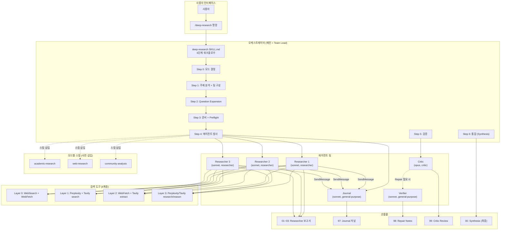

---

## 3. 에이전트 카탈로그

### 3.1 역할별 배치도

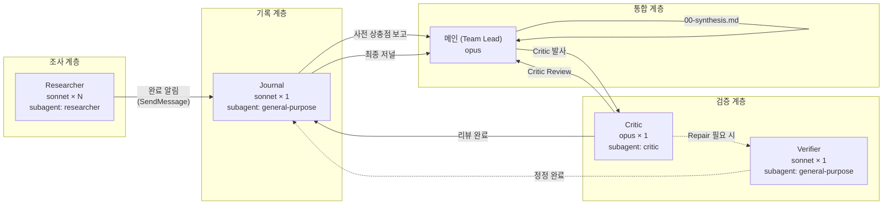

### 3.2 에이전트 상세

| 에이전트 | 파일 | 모델 | subagent_type | 검색 예산 | 핵심 역할 |
| --- | --- | --- | --- | --- | --- |
| **Researcher** | `researcher.md` (211줄) | sonnet | `researcher` | 22회/인 | 관점별·모드별 체계 조사, 6가지 사고 지침 |
| **Critic** | `critic.md` (113줄) | **opus** | `critic` | 0\~3회 | 6항목 체크리스트, 교차 검증 등급, Repair 판정 |
| **Journal** | `journal.md` (183줄) | sonnet | `general-purpose` | **0회** (검색 금지) | 실시간 요약, 사전 상충점 감지, 메타 분석 |
| **Verifier** | `verifier.md` (148줄) | sonnet | `general-purpose` | 9회 | 원문 대조 검증, 1회 Repair Pass 전용 |
| **Security-Auditor** | `security-auditor.md` (18줄) | \- | \- | N/A | 코드 보안 감사 |

> **Note**: Presentation-Builder 에이전트는 v2.2에서 `create-presentation` 스킬의 `phases/`로 통합되어 삭제됨.

### 3.3 Researcher 6가지 사고 지침

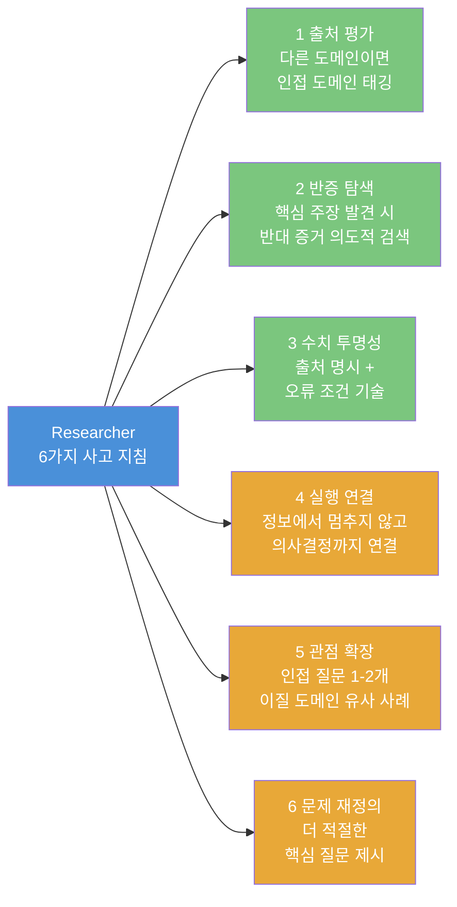

### 3.4 Critic 6항목 체크리스트 + 교차 검증 등급

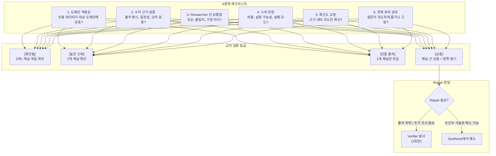

---

## 4. 스킬 카탈로그

### 4.1 스킬 관계도

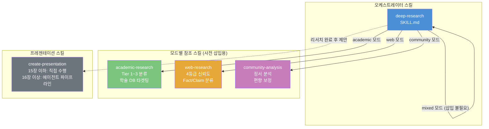

### 4.2 모드별 확신도 매핑

| 모드 | 최고 등급 | 매핑 기준 |
| --- | --- | --- |
| **academic** | ★★★ | Tier 1 (피어리뷰 저널, 주요 학회) → ★★★ / Tier 2 (프리프린트, 기관 보고서) → ★★☆ / Tier 3 (백서, 블로그) → ★☆☆ |
| **web** | ★★★ | official (당사자 발표) → ★★★ / reliable (제3자 보도) → ★★☆ / **stakeholder** (이해당사자) → ★☆☆ / unverified → ★☆☆ |
| **community** | **★★☆ (상한)** | 신호(복수 플랫폼) → ★★☆ / 신호(단일) → ★☆☆ / 노이즈 → 미부여 |
| **mixed** | ★★★ | 출처 유형에 따라 web/academic/community 기준 중 적절한 것 적용 |

---

## 5. 워크플로우 상세

### 5.1 전체 파이프라인 (Agent Teams 모드)

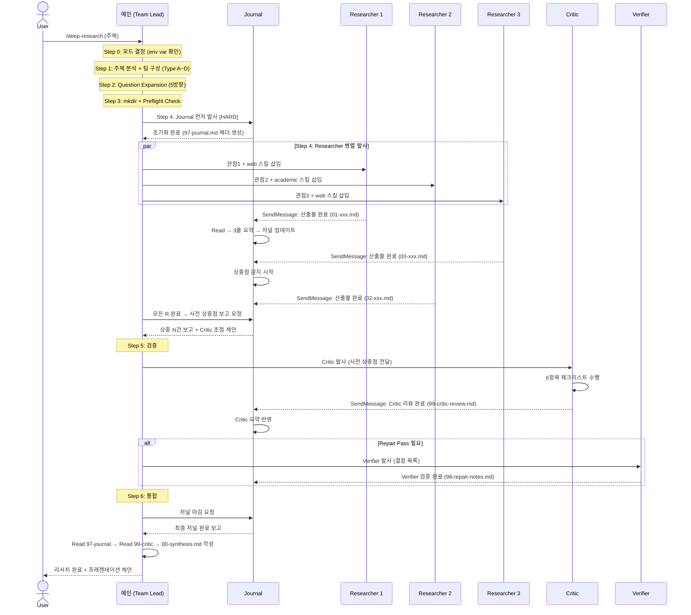

### 5.2 Solo 모드 (폴백)

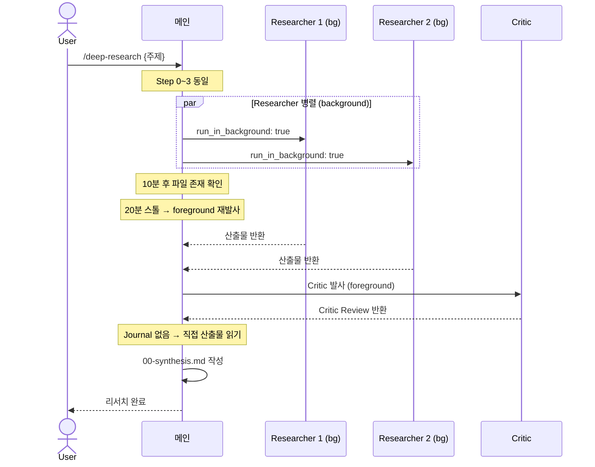

### 5.3 Preflight Check 분기

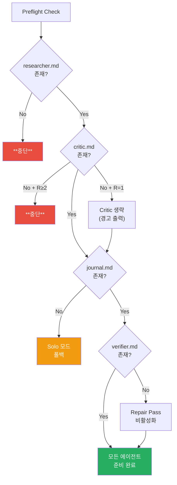

---

## 6. 검색 전략 체계

### 6.1 4계층 앙상블 에스컬레이션

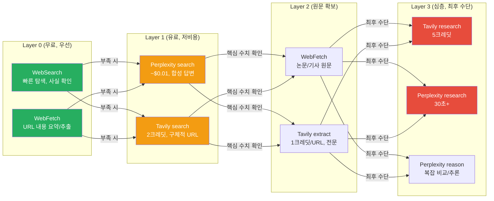

### 6.2 모드별 Layer 우선순위

| 모드 | Layer 0 | Layer 1 | Layer 2 | Layer 3 |
| --- | --- | --- | --- | --- |
| **academic** | `allowed_domains`로 학술 DB 타겟팅 (scholar.google, arxiv, ieee) | arXiv/IEEE 키워드 검색 보충 | 논문 원문 확보 | SoTA 비교 (최후 수단) |
| **web** | 공식 채널 → 신뢰 미디어 순 | 최신 동향/구체적 URL 발견 | 기사/보고서 원문 | 심층 분석 |
| **community** | **제한적** (크롤러 차단) | **주력** (Perplexity 합성) | 스레드 원문 | 거의 미사용 |
| **mixed** | 우선 사용 | 학술 수치는 `allowed_domains`, 커뮤니티는 Perplexity | 필요 시 | 필요 시 |

### 6.3 Researcher 검색 예산 (per-agent)

| 도구 | 상한 | 용도 |
| --- | --- | --- |
| WebSearch | 5회 | Layer 0 탐색 |
| WebFetch | 5회 | Layer 0/2 URL 확인 |
| search.sh search (Perplexity + Tavily) | 8회 합산 | Layer 1 보충 |
| search.sh extract | 3회 | Layer 2 원문 |
| search.sh research/reason | 1회 | Layer 3 최후 수단 |
| **전체 합산** | **22회 이하** | per-agent 상한 |

---

## 7. 산출물 구조

### 7.1 디렉토리 레이아웃

```
docs/research/{YYYY-MM-DD}-{topic-slug}/
├── 01-{researcher-1-topic}.md     # R1 산출물
├── 02-{researcher-2-topic}.md     # R2 산출물
├── 03-{researcher-3-topic}.md     # R3 산출물 (있으면)
├── 97-journal.md                  # Journal 저널 (Agent Teams만)
├── 98-repair-notes.md             # Verifier 정정 (Repair Pass 시만)
├── 99-critic-review.md            # Critic 리뷰
└── 00-synthesis.md                # 최종 통합 보고서
```

### 7.2 Researcher 산출물 필수 섹션

```markdown
# {관점} — {주제}
## 개요
## 핵심 발견                    # 주제별 핵심 분석/데이터
## 구현/실행 참고사항            # (해당 시)
## 관점 확장 / 문제 재정의
## 타임라인                      # (web 모드)
## 정서 분석                     # (community 모드)
## 편향 보정                     # (community 모드)
## 상충 정보                     # 양쪽 출처 병기
## 자기 점검                     # 모드별 품질 기준 체크
## 출처 목록                     # [출처, 연도] URL + 확신도
## 검색 비용 보고                # 도구별 호출 수
```

### 7.3 Synthesis 필수 섹션

1. **근거 신뢰도 매트릭스** — 핵심 주장별 출처, 도메인 일치, 확신도, 교차 검증 (표)
2. **상충점 해결 테이블** — 각 측 주장 + 판단 근거 (표)
3. **역방향 의사결정 가이드** — "결과가 X이면 → Y를 조정하라" (최대 4행)
4. **예상 밖 핵심 발견** — 질문 범위 밖이지만 의사결정 영향 (최대 3개)
5. **후속 탐색 질문** — 다음 조사할 질문 2\~3개

---

## 8. 성능 분석 (2026-04-08 세션 기준)

### 8.1 wiki-llm 리서치 세션 스코어카드

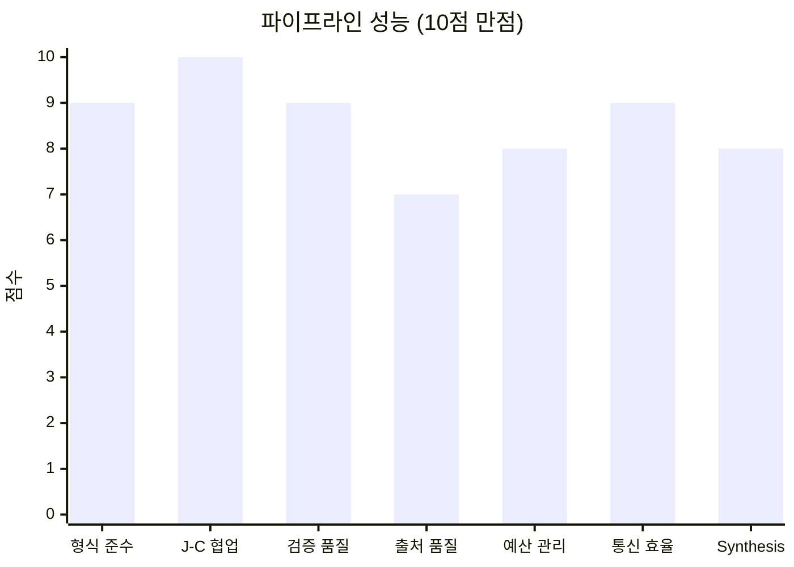

| 차원 | 점수 | 근거 |
| --- | --- | --- |
| 에이전트 형식 준수 | **9/10** | R1/R2 완벽, R3 사고지침 부분 미준수 |
| Journal-Critic 협업 | **10/10** | 상충점 100% 일치, 요약 완벽 반영 |
| 교차 검증 품질 | **9/10** | Critic 6항목 완전 수행, 등급 8/8 정합 |
| 출처 품질 | **7/10** | 학술(R2) 우수, web(R1/R3) 이해당사자 편향 보정 미흡 |
| 검색 예산 관리 | **8/10** | 개별 에이전트 준수, 합산 표기 혼란 |
| 팀 통신 효율 | **9/10** | 비동기 원활, Journal 실시간 반영 |
| Synthesis 완성도 | **8/10** | 필수 섹션 충족, Critic 권고 7개 중 6개 반영 |
| **종합** | **8.6/10** |  |

### 8.2 세션 통계

- **Researcher 배치**: R1(web) + R2(academic) + R3(web)
- **총 검색 호출**: R1(5) + R2(10) + R3(9) = 24회 (개별 상한 내 준수)
- **상충점**: Journal 사전 감지 6건 → Critic 최종 7건 (1건 추가 발견)
- **교차 검증 등급**: \[확인됨\] 4 / \[높은 신뢰\] 2 / \[단일 출처\] 1 / \[상충\] 2
- **Repair Pass**: 불필요 (5건 모두 Synthesis에서 해소)

---

## 9. 진화 히스토리

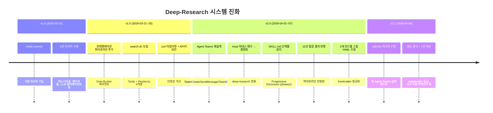

### 커밋 히스토리 (주요 변경)

| 커밋 | 설명 | 영향 |
| --- | --- | --- |
| `6389358` | Initial commit | 프로젝트 생성 |
| `c5a1c5b` | Agent Teams 재설계 + moai 하네스 설치 | Team 모드 도입 |
| `2ebf79a` | moai 하네스 제거, deep-research 전용 경량화 | 불필요한 의존성 제거 |
| `b58951f` | SKILL.md 단계별 분리 (Progressive Disclosure) | phases/ 구조 도입 |
| `7b44ea0` | 파이프라인 15건 점검 결과 반영 | 안정화 |
| `bbeacf9` | 3개 모드별 스킬 YAML frontmatter 수정 | 메타데이터 정규화 |
| *(미커밋)* | v2.1 개선 7건 적용 | 이해당사자 등급, 리마인더, 예산 명확화 등 |
| `50bb629` | v2.2 presentation 리팩토링 | builder 에이전트 삭제, 스킬 phases/ 통합, frontmatter 수정 |
| *(미커밋)* | v2.3 Step 1 팀 구성 재설계 | 조사 패턴 기반 분류, 관점-모드 독립, R1~5 유연, content-strategy 참조 갭 수정 |

---

## 10. v2.1 개선 사항 (이번 세션에서 적용)

| \# | 개선 | 대상 파일 | 해결 문제 |
| --- | --- | --- | --- |
| C1 | 검색 예산 "각 Researcher 개별 상한 22회" 명확화 | `SKILL.md`, `05-synthesis.md` | 합산 vs per-agent 혼란 |
| C2 | `stakeholder` 출처 등급 추가 | `web-research/SKILL.md` | 이해당사자 편향 미구분 |
| C3 | 사고 지침 리마인더 블록 삽입 | `03-team-launch.md`, `03-solo-launch.md` | R3 사고지침 누락 방지 |
| C4 | mixed 모드 기본 가이드 추가 | `researcher.md` | 가이드 부재로 비효율 |
| C5 | Synthesis 필수 섹션 예시 추가 | `05-synthesis.md` | 메인 해석 의존 제거 |
| C6 | Preflight Check Critic 조건 분기 | `SKILL.md` | R1명일 때 불필요한 중단 |
| C7 | Solo 모드 팀 통신 불필요 명시 | `03-solo-launch.md` | Researcher 혼란 방지 |

### v2.2 추가 변경 (create-presentation 리팩토링)

| # | 개선 | 대상 파일 | 해결 문제 |
|---|------|---------|---------|
| P1 | presentation-builder.md → phases/ 통합 | `phases/01~03*.md` 신규 | 에이전트-스킬 중복 제거 |
| P2 | SKILL.md Step 0 분기를 phases/로 변경 | `create-presentation/SKILL.md` | 단일 스킬로 소규모+대규모 처리 |
| P3 | YAML frontmatter 정상화 (쌍따옴표 감싸기) | `create-presentation/SKILL.md` | linter 내성 + 트리거링 정상화 |
| P4 | 시각적 규칙 15개로 통합 (2개 추가) | `create-presentation/SKILL.md` | 대면적 accent fill 금지, 경고 슬라이드 |
| P5 | presentation-builder.md 삭제 | `.claude/agents/` | 394줄 중복 에이전트 제거 |

### v2.3 추가 변경 (Step 1 팀 구성 재설계 + content-strategy 갭 수정)

| # | 개선 | 대상 파일 | 해결 문제 |
|---|------|---------|---------|
| T1 | Type A~D → 조사 패턴(단일/다관점/다차원/간단) 재분류 | `deep-research/SKILL.md` | 도메인 편향 제거, 범용화 |
| T2 | 관점과 모드를 독립 차원으로 명시 | `deep-research/SKILL.md` | 같은 web 모드에서 다른 관점 병렬 가능 |
| T3 | R1~5 유연 규모 + 5명 초과 시 2라운드 분할 | `deep-research/SKILL.md` | 복잡 주제 커버 |
| T4 | 소규모 경로에 content-strategy + narrative-beats Read 지시 | `create-presentation/SKILL.md` | 참조 갭 수정 |
| T5 | 대규모 Phase 1에 content-strategy.md Read 추가 | `phases/01-content-strategy.md` | 피라미드 원칙/6x6 규칙 누락 수정 |
| T6 | Phase 2에 pptxgenjs-patterns/slide-layouts 주입 지시 | `phases/02-slide-build.md` | Slide Builder references 갭 수정 |

---

## 11. 누적 리서치 산출물 목록

| \# | 날짜 | 주제 | 비고 |
| --- | --- | --- | --- |
| 1 | 2026-03-20 | 아노다이징 견고성 지수 v3 | 제조 |
| 2 | 2026-03-20 | 레이저 흄/파티클 제어 | 레이저 |
| 3 | 2026-03-20 | LLM 멀티에이전트 오케스트레이션 | AI |
| 4 | 2026-03-20 | Mason 온톨로지 백서 | 온톨로지 |
| 5 | 2026-03-20 | 온톨로지 에이전트 레시피 제어 | 온톨로지 |
| 6 | 2026-03-20 | 주식 패턴 ML 방법론 | 트레이딩 |
| 7 | 2026-03-21 | AI 재난 대응 AssiEye | AI |
| 8 | 2026-03-23 | OpenClaw AI 에이전트 | AI |
| 9 | 2026-03-23 | Palantir 온톨로지 | 온톨로지 |
| 10 | 2026-03-24 | 레이저 기초 가이드 | 레이저 |
| 11 | 2026-03-25 | 글라스/메탈 에칭 | 레이저 |
| 12 | 2026-03-25 | 초고속 레이저 응용 | 레이저 |
| 13 | 2026-03-30 | 제조 AI 시스템 LLM 전환 | 제조/AI |
| 14 | 2026-04-01 | 기어 설계 수학 | 제조 |
| 15 | 2026-04-01 | 제조 디지털 트윈 ROI | 제조 |
| 16 | 2026-04-07 | Obsidian AI 지식 관리 | PKM |
| 17 | 2026-04-08 | Karpathy wiki-llm (초안) | AI/PKM |
| 18 | 2026-04-08 | **wiki-llm 지식 시스템** (Agent Teams 첫 실전) | AI/PKM |

---

## 12. 핵심 규칙 체계 \[HARD\]

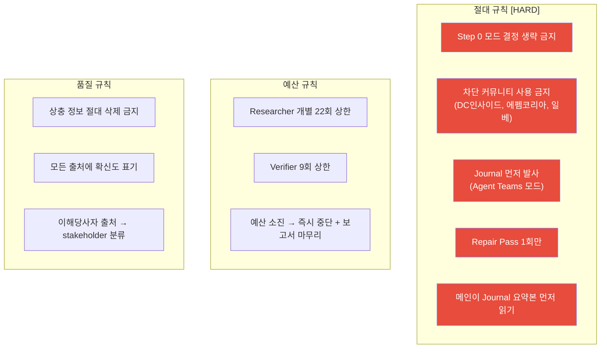

---

## 13. 파일 인벤토리

```
.claude/
├── agents/
│   ├── researcher.md          (211줄) — 범용 리서치, 4계층 검색, 6가지 사고 지침
│   ├── critic.md              (113줄) — 6항목 체크리스트, 교차 검증, Repair 판정
│   ├── journal.md             (183줄) — 실시간 요약, 상충 감지, 메타 분석
│   ├── verifier.md            (148줄) — 원문 대조, 1회 Repair Pass
│   └── security-auditor.md     (18줄) — 보안 감사
├── skills/
│   ├── deep-research/
│   │   ├── SKILL.md           (102줄) — 6단계 오케스트레이터
│   │   └── phases/
│   │       ├── 03-team-launch.md   — Agent Teams 발사 지침
│   │       ├── 03-solo-launch.md   — Solo 폴백 발사 지침
│   │       ├── 04-verification.md  — Critic + Repair Pass
│   │       └── 05-synthesis.md     — Journal 마감 + 통합
│   ├── academic-research/
│   │   └── SKILL.md           (136줄) — Tier 분류, 학술 DB 타겟팅
│   ├── web-research/
│   │   └── SKILL.md           (109줄) — 4등급 신뢰도, Fact/Claim 분류
│   ├── community-analysis/
│   │   └── SKILL.md           (135줄) — 정서 분석, 편향 보정
│   └── create-presentation/
│       ├── SKILL.md           (301줄) — 단일 진입점 (소규모 직접 + 대규모 phases/)
│       └── phases/
│           ├── 01-content-strategy.md (100줄) — Content Strategist 프롬프트
│           ├── 02-slide-build.md      (127줄) — Slide Builder 프롬프트 + 코드 규칙
│           └── 03-assemble.md          (68줄) — 합치기 + 검증 + 실행
├── settings.json              (73줄) — 환경변수, 권한, MCP 설정
scripts/
└── search.sh                  (275줄) — Tavily + Perplexity 통합 검색
```

---

*이 문서는 deep-research 시스템의 v2.3 기준선이다. 향후 업그레이드 시 이 문서를 기준으로 변경 사항을 추적한다.*

**변경 로그:**
- v2.1 (2026-04-08): 성능 분석 후 7건 개선 (C1~C7)
- v2.2 (2026-04-08): create-presentation 리팩토링 — builder 에이전트 삭제, phases/ 통합, frontmatter 정상화
- v2.3 (2026-04-08): Step 1 팀 구성 재설계 — 조사 패턴 기반 분류, 관점-모드 독립 차원, R1~5 유연 규모, content-strategy 참조 갭 수정