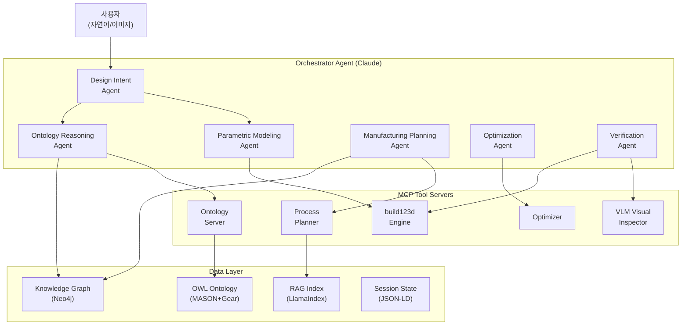
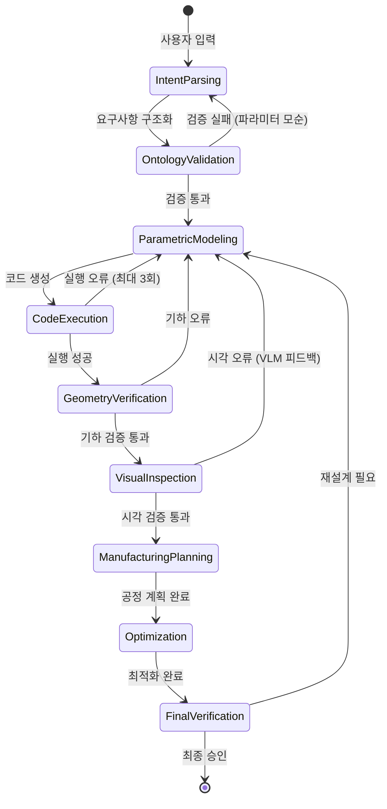
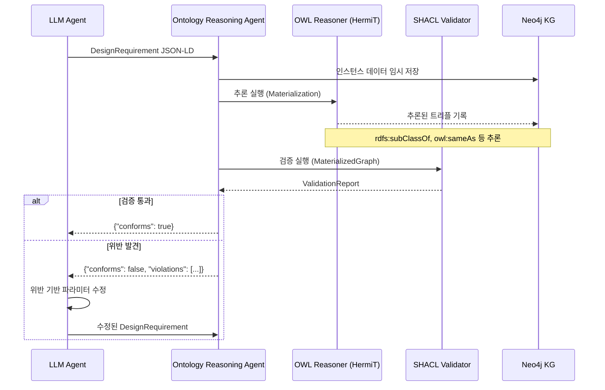
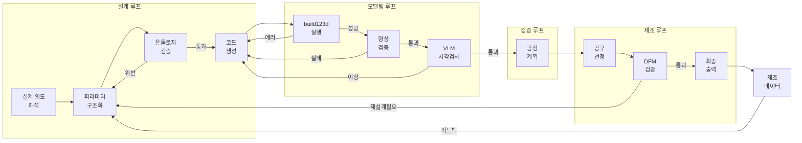
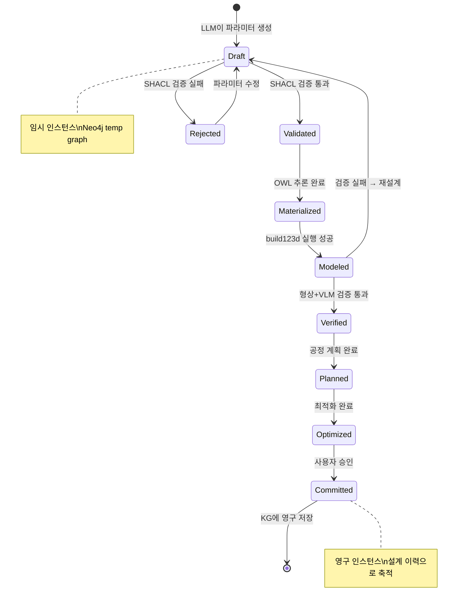

# LLM + 온톨로지 + build123d 통합 기어 설계-제조 시스템 아키텍처

**날짜**: 2026-03-18
**문서 유형**: 상세 아키텍처 설계서
**선행 리서치**: `../2026-03-18-gear-system/` (CadQuery, 온톨로지, LLM+CAD/CAM, 기어 제조 실무)

---

## 목차

1. [시스템 개요 및 아키텍처 원칙](#1-시스템-개요-및-아키텍처-원칙)
2. [Multi-Agent 아키텍처 상세 설계](#2-multi-agent-아키텍처-상세-설계)
3. [LLM Tool Calling 인터페이스 구체 설계](#3-llm-tool-calling-인터페이스-구체-설계)
4. [온톨로지 기반 Grounding 메커니즘](#4-온톨로지-기반-grounding-메커니즘)
5. [Closed-Loop Feedback 아키텍처](#5-closed-loop-feedback-아키텍처)
6. [데이터 흐름 및 상태 관리](#6-데이터-흐름-및-상태-관리)
7. [최신 관련 연구 및 프로젝트](#7-최신-관련-연구-및-프로젝트)
8. [출처 목록](#8-출처-목록)

---

## 1. 시스템 개요 및 아키텍처 원칙

### 1.1 시스템 목적

자연어로 기어 설계 의도를 표현하면, 검증된 파라메트릭 3D 모델(STEP)과 제조 공정 계획이 자동 생성되는 시스템. LLM은 orchestrator이며 수치 계산을 직접 수행하지 않는다.

### 1.2 핵심 원칙

| # | 원칙 | 근거 |
|---|------|------|
| 1 | **LLM은 수치를 생성하지 않는다** | Text-to-CadQuery 69.3% 정확도; 수치 환각은 제조에서 치명적 |
| 2 | **실행 기반 검증** | 코드를 실행해야만 형상 오류를 포착할 수 있다 (CADCodeVerify, ICLR 2025) |
| 3 | **온톨로지가 제약 조건의 단일 진실 원천** | OWL+SHACL로 설계 파라미터 유효성을 형식적으로 검증 |
| 4 | **MCP 기반 도구 통합** | MADA (arXiv:2603.11515)가 입증한 패턴: MCP로 에이전트-도구 분리 |
| 5 | **Closed-loop 피드백** | 설계→모델링→검증→교정 루프가 성공률을 53%→85%로 향상 |

### 1.3 전체 아키텍처 다이어그램



### 1.4 ASCII 아키텍처 다이어그램

```
┌─────────────────────────────────────────────────────────────────┐
│                        사용자 인터페이스                           │
│              (자연어 입력 / 이미지 / 도면 / 피드백)                  │
└──────────────────────────┬──────────────────────────────────────┘
                           │
┌──────────────────────────▼──────────────────────────────────────┐
│                   Orchestrator Agent (Claude)                    │
│  ┌──────────┐ ┌──────────┐ ┌──────────┐ ┌──────────┐          │
│  │ Design   │ │Parametric│ │Ontology  │ │Manufactur│          │
│  │ Intent   │→│ Modeling │→│Reasoning │→│ing Plan  │          │
│  │ Agent    │ │ Agent    │ │ Agent    │ │ Agent    │          │
│  └──────────┘ └──────────┘ └──────────┘ └──────────┘          │
│  ┌──────────┐ ┌──────────┐                                     │
│  │Optimiza- │ │Verifica- │  ← Feedback Loop ←──────────────┐  │
│  │tion Agent│ │tion Agent│────────────────────────────────→ │  │
│  └──────────┘ └──────────┘                                  │  │
└────────┬────────────┬────────────┬──────────────────────────┘  │
         │            │            │                              │
    ┌────▼────┐  ┌────▼────┐  ┌───▼─────┐                       │
    │MCP Tool │  │MCP Tool │  │MCP Tool │                        │
    │Server:  │  │Server:  │  │Server:  │                        │
    │build123d│  │Ontology │  │Process  │                        │
    │Engine   │  │+KG      │  │Planning │                        │
    └────┬────┘  └────┬────┘  └────┬────┘                        │
         │            │            │                              │
    ┌────▼────────────▼────────────▼────┐                        │
    │           Data Layer              │                        │
    │  ┌────────┐ ┌────────┐ ┌────────┐ │                        │
    │  │OWL/    │ │Neo4j   │ │RAG     │ │                        │
    │  │SHACL   │ │KG      │ │Index   │ │                        │
    │  └────────┘ └────────┘ └────────┘ │                        │
    │  ┌────────┐ ┌────────┐            │                        │
    │  │Session │ │STEP/   │────────────┼────────────────────────┘
    │  │State   │ │STL     │  (검증 결과 → 피드백)
    │  └────────┘ └────────┘            │
    └───────────────────────────────────┘
```

---

## 2. Multi-Agent 아키텍처 상세 설계

### 2.1 Agent 정의

#### 2.1.1 Design Intent Agent (DIA)

**역할**: 자연어 입력을 구조화된 설계 요구사항으로 변환

| 항목 | 내용 |
|------|------|
| **입력** | 자연어 문장, 참조 이미지, 기존 설계 컨텍스트 |
| **출력** | `DesignRequirement` JSON-LD 객체 |
| **사용 도구** | `ontology_query` (기존 유사 설계 검색), RAG (표준 규격 조회) |
| **실패 복구** | 모호한 입력 → 사용자에게 확인 질문 생성 |

**출력 스키마 예시:**

```json
{
  "@context": "https://gear-ontology.org/context.jsonld",
  "@type": "DesignRequirement",
  "gear_type": "spur",
  "module": 2.0,
  "teeth_count": 20,
  "face_width": 15.0,
  "pressure_angle": 20.0,
  "material": "20MnCr5",
  "quality_grade": "AGMA_Q10",
  "application": "automotive_transmission",
  "constraints": {
    "max_center_distance": 120.0,
    "min_safety_factor_contact": 1.3,
    "min_safety_factor_bending": 1.5
  },
  "confidence": 0.92,
  "unresolved": ["gear_ratio_not_specified"]
}
```

#### 2.1.2 Parametric Modeling Agent (PMA)

**역할**: 설계 요구사항을 build123d 코드로 변환하고 실행

| 항목 | 내용 |
|------|------|
| **입력** | `DesignRequirement` JSON-LD + 온톨로지 검증 결과 |
| **출력** | build123d Python 코드 + 실행된 STEP/STL 파일 + 형상 메트릭 |
| **사용 도구** | `gear_create`, `gear_assembly`, `execute_build123d` |
| **실패 복구** | 실행 오류 → 에러 메시지 분석 → 코드 수정 (최대 3회) |

**코드 생성 템플릿 패턴:**

```python
# PMA가 생성하는 build123d 코드 예시
from build123d import *
from math import radians, tan, cos, sin, acos, pi, sqrt

def create_involute_spur_gear(
    module: float,
    teeth: int,
    width: float,
    pressure_angle: float = 20.0,
    bore_diameter: float = 0.0,
    hub_diameter: float = 0.0,
    hub_length: float = 0.0,
) -> Part:
    """파라메트릭 인볼류트 스퍼 기어 생성.

    수학적 계산은 Python으로 수행하며, LLM이 수치를 직접 생성하지 않는다.
    """
    alpha = radians(pressure_angle)
    pitch_radius = module * teeth / 2
    base_radius = pitch_radius * cos(alpha)
    addendum = module
    dedendum = 1.25 * module
    tip_radius = pitch_radius + addendum
    root_radius = pitch_radius - dedendum

    # Involute curve parametric generation
    def involute_point(base_r: float, t: float):
        x = base_r * (cos(t) + t * sin(t))
        y = base_r * (sin(t) - t * cos(t))
        return (x, y)

    # Generate tooth profile
    num_points = 40
    t_max = sqrt((tip_radius / base_radius) ** 2 - 1)

    with BuildPart() as gear:
        with BuildSketch() as sk:
            # Build involute tooth profile
            tooth_pts = []
            for i in range(num_points):
                t = t_max * i / (num_points - 1)
                tooth_pts.append(involute_point(base_radius, t))

            with BuildLine():
                Spline(*tooth_pts)
                # Mirror for other side of tooth
                # Add root fillet arc
                # Pattern for all teeth
            make_face()

        extrude(amount=width)

        if bore_diameter > 0:
            with BuildSketch() as bore_sk:
                Circle(bore_diameter / 2)
            extrude(amount=width, mode=Mode.SUBTRACT)

    return gear.part
```

#### 2.1.3 Ontology Reasoning Agent (ORA)

**역할**: 온톨로지 쿼리/추론, 설계 파라미터 검증, KG-augmented 프롬프트 생성

| 항목 | 내용 |
|------|------|
| **입력** | `DesignRequirement` JSON-LD, SPARQL 쿼리 요청 |
| **출력** | 검증 결과 (SHACL ValidationReport), KG 서브그래프, 추천 사항 |
| **사용 도구** | `ontology_query`, `ontology_validate`, `kg_search` |
| **실패 복구** | 온톨로지 미존재 개념 → RAG fallback → 사용자 확인 |

#### 2.1.4 Manufacturing Planning Agent (MPA)

**역할**: 기어 파라미터 기반 공정 순서 결정, 공구 선정, 절삭 조건 추천

| 항목 | 내용 |
|------|------|
| **입력** | 기어 파라미터 + 소재 + 품질 등급 |
| **출력** | `ProcessPlan` JSON-LD (공정 체인, 공구, 절삭 조건) |
| **사용 도구** | `process_plan`, `tool_select`, `ontology_query` |
| **실패 복구** | KG에 매칭 공정 없음 → RAG(핸드북) 검색 → ARKNESS 패턴 |

#### 2.1.5 Optimization Agent (OPA)

**역할**: 다목적 최적화 (중량/강도/비용/소음 등)

| 항목 | 내용 |
|------|------|
| **입력** | 목적 함수 정의, 제약 조건, 현재 설계 파라미터 |
| **출력** | Pareto 최적 해 집합, 추천 설계 변형 |
| **사용 도구** | `optimize`, `gear_create` (후보 평가), `ontology_validate` |
| **실패 복구** | 수렴 실패 → 탐색 범위 축소 / 제약 완화 제안 |

#### 2.1.6 Verification Agent (VA)

**역할**: 형상 검증 (기하학적 정합성), VLM 시각 검사, 표준 적합성 확인

| 항목 | 내용 |
|------|------|
| **입력** | STEP 파일, 설계 요구사항, 렌더링 이미지 |
| **출력** | `VerificationReport` JSON-LD (합격/불합격, 발견된 이슈) |
| **사용 도구** | `validate_geometry`, `vlm_inspect`, `ontology_validate` |
| **실패 복구** | 검증 실패 → PMA에 구체적 교정 지시 전달 |

### 2.2 Agent 간 통신 프로토콜

#### 메시지 스키마

```json
{
  "@type": "AgentMessage",
  "id": "msg_20260318_001",
  "from_agent": "design_intent",
  "to_agent": "parametric_modeling",
  "message_type": "task_request",
  "payload": {
    "@type": "DesignRequirement",
    "...": "..."
  },
  "context": {
    "session_id": "sess_abc123",
    "iteration": 1,
    "parent_message_id": null
  },
  "metadata": {
    "timestamp": "2026-03-18T10:30:00Z",
    "priority": "normal",
    "timeout_ms": 60000
  }
}
```

#### 메시지 타입

| 타입 | 설명 | 발신 → 수신 예시 |
|------|------|------------------|
| `task_request` | 작업 요청 | DIA → PMA |
| `task_result` | 작업 결과 | PMA → Orchestrator |
| `validation_request` | 검증 요청 | PMA → ORA |
| `validation_result` | 검증 결과 | ORA → PMA |
| `feedback` | 교정 피드백 | VA → PMA |
| `escalation` | 사용자 개입 필요 | 모든 Agent → Orchestrator |

### 2.3 상태 관리



### 2.4 실패 복구 전략

| 실패 유형 | 탐지 방법 | 복구 전략 | 최대 재시도 |
|-----------|----------|----------|------------|
| 코드 실행 오류 | Python traceback | 에러 메시지를 LLM에 피드백 → 코드 수정 | 3회 |
| 온톨로지 검증 실패 | SHACL ValidationReport | 위반 제약 조건 명시 → 파라미터 수정 | 2회 |
| VLM 시각 검증 실패 | CADCodeVerify 패턴 | 구체적 형상 차이 기술 → 코드 교정 | 3회 |
| KG 쿼리 무결과 | 빈 결과 셋 | RAG fallback → 사용자 에스컬레이션 | 1회+사용자 |
| 최적화 미수렴 | 반복 한도 초과 | 탐색 범위 축소 / 제약 완화 제안 | 사용자 결정 |
| 타임아웃 | 도구 응답 시간 초과 | 재시도 → 단순화 → 에스컬레이션 | 2회 |

---

## 3. LLM Tool Calling 인터페이스 구체 설계

### 3.1 MCP 기반 아키텍처

MADA(arXiv:2603.11515) 패턴을 차용하여, 각 도구를 독립적 MCP 서버로 구현한다. MCP는 JSON-RPC over stdio/SSE를 사용하며, 도구 발견(discovery)과 호출을 표준화한다.

```
┌─────────────┐     JSON-RPC      ┌─────────────────┐
│  LLM Agent  │◄──── stdio ──────►│ MCP Server:     │
│  (Claude)   │                   │ build123d Engine│
│             │     JSON-RPC      ├─────────────────┤
│  MCP Client │◄──── stdio ──────►│ MCP Server:     │
│             │                   │ Ontology        │
│             │     JSON-RPC      ├─────────────────┤
│             │◄──── stdio ──────►│ MCP Server:     │
│             │                   │ Process Planner │
└─────────────┘                   └─────────────────┘
```

### 3.2 도구 정의 (Claude tool_use JSON Schema)

#### 3.2.1 `gear_create` — 기어 3D 모델 생성

```json
{
  "name": "gear_create",
  "description": "build123d를 사용하여 파라메트릭 기어 3D 모델을 생성한다. 수학적 계산(involute profile, 치수)은 내부 Python 함수가 수행하며, LLM은 파라미터만 지정한다.",
  "input_schema": {
    "type": "object",
    "properties": {
      "gear_type": {
        "type": "string",
        "enum": ["spur", "helical", "herringbone", "bevel", "worm", "rack", "ring"],
        "description": "기어 종류"
      },
      "module": {
        "type": "number",
        "minimum": 0.1,
        "maximum": 50.0,
        "description": "모듈 (mm). 이 크기를 결정하는 핵심 파라미터"
      },
      "teeth_count": {
        "type": "integer",
        "minimum": 6,
        "maximum": 500,
        "description": "잇수"
      },
      "face_width": {
        "type": "number",
        "minimum": 1.0,
        "description": "이 너비 (mm)"
      },
      "pressure_angle": {
        "type": "number",
        "default": 20.0,
        "enum": [14.5, 20.0, 25.0],
        "description": "압력각 (도)"
      },
      "helix_angle": {
        "type": "number",
        "default": 0.0,
        "minimum": 0.0,
        "maximum": 45.0,
        "description": "비틀림각 (도). spur=0, helical>0"
      },
      "profile_shift": {
        "type": "number",
        "default": 0.0,
        "description": "전위계수. 언더컷 방지용"
      },
      "bore_diameter": {
        "type": "number",
        "default": 0.0,
        "description": "보어 직경 (mm). 0이면 보어 없음"
      },
      "quality_grade": {
        "type": "string",
        "enum": ["AGMA_Q7", "AGMA_Q8", "AGMA_Q9", "AGMA_Q10", "AGMA_Q11", "AGMA_Q12", "ISO_5", "ISO_6", "ISO_7", "ISO_8"],
        "description": "목표 품질 등급"
      },
      "export_format": {
        "type": "string",
        "enum": ["step", "stl", "both"],
        "default": "step",
        "description": "출력 파일 형식"
      }
    },
    "required": ["gear_type", "module", "teeth_count", "face_width"]
  }
}
```

**출력 스키마:**

```json
{
  "type": "object",
  "properties": {
    "success": { "type": "boolean" },
    "file_path": { "type": "string", "description": "생성된 STEP/STL 파일 경로" },
    "geometry_metrics": {
      "type": "object",
      "properties": {
        "pitch_diameter": { "type": "number" },
        "tip_diameter": { "type": "number" },
        "root_diameter": { "type": "number" },
        "base_circle_diameter": { "type": "number" },
        "tooth_thickness_at_pitch": { "type": "number" },
        "volume_mm3": { "type": "number" },
        "bounding_box": {
          "type": "object",
          "properties": {
            "x": { "type": "number" },
            "y": { "type": "number" },
            "z": { "type": "number" }
          }
        }
      }
    },
    "build123d_code": { "type": "string", "description": "실행된 Python 소스코드" },
    "execution_time_ms": { "type": "integer" },
    "error": { "type": "string", "description": "오류 시 에러 메시지" }
  }
}
```

#### 3.2.2 `gear_assembly` — 기어 어셈블리 구성

```json
{
  "name": "gear_assembly",
  "description": "여러 기어를 조합하여 어셈블리를 구성한다. 기어 간 맞물림, 축 배치, 중심거리를 자동 계산한다.",
  "input_schema": {
    "type": "object",
    "properties": {
      "gears": {
        "type": "array",
        "items": {
          "type": "object",
          "properties": {
            "gear_id": { "type": "string" },
            "file_path": { "type": "string", "description": "기어 STEP 파일 경로" },
            "position": {
              "type": "object",
              "properties": {
                "x": { "type": "number" },
                "y": { "type": "number" },
                "z": { "type": "number" }
              }
            },
            "rotation_axis": {
              "type": "string",
              "enum": ["X", "Y", "Z"],
              "default": "Z"
            }
          },
          "required": ["gear_id", "file_path"]
        },
        "minItems": 2
      },
      "mesh_pairs": {
        "type": "array",
        "items": {
          "type": "object",
          "properties": {
            "driver_gear_id": { "type": "string" },
            "driven_gear_id": { "type": "string" },
            "center_distance": { "type": "number", "description": "자동 계산 또는 수동 지정" }
          },
          "required": ["driver_gear_id", "driven_gear_id"]
        }
      },
      "shafts": {
        "type": "array",
        "items": {
          "type": "object",
          "properties": {
            "shaft_id": { "type": "string" },
            "gear_ids": { "type": "array", "items": { "type": "string" } },
            "diameter": { "type": "number" },
            "length": { "type": "number" }
          }
        }
      },
      "export_format": { "type": "string", "default": "step" }
    },
    "required": ["gears", "mesh_pairs"]
  }
}
```

#### 3.2.3 `ontology_query` — 온톨로지 쿼리

```json
{
  "name": "ontology_query",
  "description": "기어 제조 온톨로지에 SPARQL 쿼리를 실행한다. MASON 기반 기어 확장 온톨로지 + Neo4j KG를 대상으로 한다.",
  "input_schema": {
    "type": "object",
    "properties": {
      "query_type": {
        "type": "string",
        "enum": ["sparql", "cypher", "natural_language"],
        "description": "쿼리 언어. natural_language는 LLM이 SPARQL/Cypher로 변환"
      },
      "query": {
        "type": "string",
        "description": "SPARQL/Cypher 쿼리 문자열 또는 자연어 질문"
      },
      "target": {
        "type": "string",
        "enum": ["owl_ontology", "knowledge_graph", "both"],
        "default": "both"
      },
      "limit": {
        "type": "integer",
        "default": 20,
        "description": "최대 결과 수"
      }
    },
    "required": ["query"]
  }
}
```

**SPARQL 쿼리 예시:**

```sparql
PREFIX gear: <https://gear-ontology.org/schema#>
PREFIX mason: <https://mason-ontology.org/schema#>

SELECT ?process ?tool ?condition
WHERE {
  ?gear a gear:SpurGear ;
        gear:module ?m ;
        gear:material ?mat .
  FILTER(?m = 2.0)
  ?process mason:operatesOn ?gear ;
           mason:requires ?tool .
  ?tool a mason:CuttingTool ;
        gear:toolCondition ?condition .
}
```

#### 3.2.4 `ontology_validate` — 온톨로지 기반 검증

```json
{
  "name": "ontology_validate",
  "description": "설계 파라미터를 온톨로지 제약 조건(SHACL)으로 검증한다. 위반 사항과 심각도를 반환한다.",
  "input_schema": {
    "type": "object",
    "properties": {
      "instance_data": {
        "type": "object",
        "description": "검증할 기어/공정/공구 인스턴스 데이터 (JSON-LD)"
      },
      "validation_profile": {
        "type": "string",
        "enum": ["design_feasibility", "manufacturing_constraints", "standard_compliance", "full"],
        "default": "full",
        "description": "검증 프로파일 선택"
      }
    },
    "required": ["instance_data"]
  }
}
```

**출력 예시:**

```json
{
  "conforms": false,
  "violations": [
    {
      "severity": "violation",
      "focus_node": "gear:SpurGear_001",
      "path": "gear:teethCount",
      "value": 8,
      "message": "잇수 8은 모듈 3.0에서 언더컷 발생. 최소 잇수 17 권장 (α=20°). 전위계수 적용 시 최소 12.",
      "constraint": "gear:MinTeethForNoUndercutShape",
      "suggested_fix": { "teethCount": 17, "or": { "profileShift": 0.4, "teethCount": 12 } }
    },
    {
      "severity": "warning",
      "focus_node": "gear:SpurGear_001",
      "path": "gear:faceWidth",
      "value": 8.0,
      "message": "이폭/모듈 비율 2.67. 일반적 범위 6-12. 하중 분포 불균일 가능.",
      "constraint": "gear:FaceWidthRatioShape"
    }
  ],
  "info": [
    {
      "message": "피치원 지름 24.0mm 계산 완료 (m=3.0, z=8). 이끝원 30.0mm, 이뿌리원 16.5mm."
    }
  ]
}
```

#### 3.2.5 `process_plan` — 공정 계획 생성

```json
{
  "name": "process_plan",
  "description": "기어 파라미터와 소재로부터 제조 공정 체인을 생성한다. ARKNESS 패턴(KG+RAG)으로 검증된 공정/조건을 추천한다.",
  "input_schema": {
    "type": "object",
    "properties": {
      "gear_params": {
        "type": "object",
        "properties": {
          "gear_type": { "type": "string" },
          "module": { "type": "number" },
          "teeth_count": { "type": "integer" },
          "face_width": { "type": "number" },
          "quality_grade": { "type": "string" },
          "material": { "type": "string" },
          "hardness_target": { "type": "string" },
          "production_volume": { "type": "string", "enum": ["prototype", "small_batch", "medium", "mass"] }
        },
        "required": ["gear_type", "module", "teeth_count", "material", "quality_grade"]
      },
      "constraints": {
        "type": "object",
        "properties": {
          "available_machines": { "type": "array", "items": { "type": "string" } },
          "max_lead_time_days": { "type": "integer" },
          "budget_constraint": { "type": "string" }
        }
      }
    },
    "required": ["gear_params"]
  }
}
```

**출력 예시:**

```json
{
  "process_chain": [
    {
      "step": 1,
      "operation": "turning",
      "description": "블랭크 외경/내경/단면 기준 가공",
      "machine_type": "CNC_lathe",
      "estimated_time_min": 15
    },
    {
      "step": 2,
      "operation": "hobbing",
      "description": "기어 치형 절삭 (호빙)",
      "machine_type": "gear_hobbing_machine",
      "tool": {
        "type": "hob",
        "module": 2.0,
        "pressure_angle": 20.0,
        "material": "HSS-PM_TiAlN"
      },
      "cutting_conditions": {
        "cutting_speed_m_min": 80,
        "feed_mm_rev": 2.5,
        "axial_feed_mm_stroke": 1.8,
        "coolant": "flood"
      },
      "estimated_time_min": 8
    },
    {
      "step": 3,
      "operation": "heat_treatment",
      "description": "침탄담금질 + 템퍼링",
      "process": "carburizing",
      "temperature_carburizing_c": 920,
      "temperature_quench_c": 830,
      "temperature_temper_c": 170,
      "target_surface_hardness": "58-62 HRC",
      "case_depth_mm": 0.8
    },
    {
      "step": 4,
      "operation": "grinding",
      "description": "치형 연삭 (AGMA Q10+ 달성)",
      "machine_type": "profile_grinding_machine",
      "tool": {
        "type": "grinding_wheel",
        "specification": "CBN_vitrified",
        "diameter_mm": 300
      },
      "estimated_time_min": 12
    }
  ],
  "total_estimated_time_min": 95,
  "quality_achievable": "AGMA_Q10",
  "sources": ["ARKNESS_KG:hob_selection_rule_42", "handbook:machinery_handbook_30th_ch32"]
}
```

#### 3.2.6 `tool_select` — 공구 추천

```json
{
  "name": "tool_select",
  "description": "가공 공정과 기어 파라미터에 적합한 공구를 추천한다. KG + 공구 카탈로그 RAG 기반.",
  "input_schema": {
    "type": "object",
    "properties": {
      "process": {
        "type": "string",
        "enum": ["hobbing", "shaping", "grinding", "shaving", "skiving", "broaching", "turning", "milling"]
      },
      "gear_params": {
        "type": "object",
        "properties": {
          "module": { "type": "number" },
          "teeth_count": { "type": "integer" },
          "pressure_angle": { "type": "number" },
          "helix_angle": { "type": "number" },
          "material": { "type": "string" },
          "hardness": { "type": "string" }
        },
        "required": ["module", "pressure_angle", "material"]
      },
      "optimization_target": {
        "type": "string",
        "enum": ["cost", "quality", "productivity", "tool_life"],
        "default": "quality"
      }
    },
    "required": ["process", "gear_params"]
  }
}
```

#### 3.2.7 `validate_geometry` — 형상 검증

```json
{
  "name": "validate_geometry",
  "description": "생성된 기어 STEP 파일의 기하학적 정합성을 검증한다. 체적, 치수, 치형 프로파일 정확도를 확인한다.",
  "input_schema": {
    "type": "object",
    "properties": {
      "file_path": {
        "type": "string",
        "description": "STEP 파일 경로"
      },
      "expected_params": {
        "type": "object",
        "description": "기대되는 기어 파라미터 (비교 대상)",
        "properties": {
          "pitch_diameter": { "type": "number" },
          "tip_diameter": { "type": "number" },
          "root_diameter": { "type": "number" },
          "teeth_count": { "type": "integer" },
          "face_width": { "type": "number" }
        }
      },
      "checks": {
        "type": "array",
        "items": {
          "type": "string",
          "enum": ["dimensional", "topology", "watertight", "tooth_profile", "symmetry", "interference"]
        },
        "default": ["dimensional", "topology", "watertight"]
      }
    },
    "required": ["file_path"]
  }
}
```

#### 3.2.8 `vlm_inspect` — VLM 시각 검사

```json
{
  "name": "vlm_inspect",
  "description": "CADCodeVerify 패턴: 기어 3D 렌더링을 VLM(Claude Vision)으로 시각 검사한다. 형상 이상, 치형 불량, 대칭성 등을 검출한다.",
  "input_schema": {
    "type": "object",
    "properties": {
      "file_path": {
        "type": "string",
        "description": "STEP/STL 파일 경로"
      },
      "render_views": {
        "type": "array",
        "items": {
          "type": "string",
          "enum": ["front", "top", "isometric", "tooth_closeup", "section"]
        },
        "default": ["isometric", "tooth_closeup"]
      },
      "design_description": {
        "type": "string",
        "description": "기어 설계 의도 자연어 설명 (VLM 비교 기준)"
      },
      "validation_questions": {
        "type": "array",
        "items": { "type": "string" },
        "description": "VLM에 물어볼 구체적 검증 질문들",
        "default": [
          "치형(tooth profile)이 인볼류트 곡선을 따르는가?",
          "모든 이가 균일한 크기와 간격을 가지는가?",
          "보어 구멍이 기어 중심에 정확히 위치하는가?",
          "이끝과 이뿌리의 전이부가 매끄러운가?"
        ]
      }
    },
    "required": ["file_path"]
  }
}
```

#### 3.2.9 `optimize` — 다목적 최적화

```json
{
  "name": "optimize",
  "description": "기어 설계의 다목적 최적화를 실행한다. DEAP/scipy 기반 유전 알고리즘 또는 Bayesian 최적화.",
  "input_schema": {
    "type": "object",
    "properties": {
      "objectives": {
        "type": "array",
        "items": {
          "type": "object",
          "properties": {
            "name": { "type": "string", "enum": ["weight", "contact_stress", "bending_stress", "noise", "cost", "efficiency"] },
            "direction": { "type": "string", "enum": ["minimize", "maximize"] }
          }
        },
        "minItems": 1
      },
      "design_variables": {
        "type": "array",
        "items": {
          "type": "object",
          "properties": {
            "name": { "type": "string" },
            "lower_bound": { "type": "number" },
            "upper_bound": { "type": "number" },
            "type": { "type": "string", "enum": ["continuous", "integer", "discrete"] }
          }
        }
      },
      "constraints": {
        "type": "array",
        "items": {
          "type": "object",
          "properties": {
            "expression": { "type": "string", "description": "제약 조건 표현식" },
            "type": { "type": "string", "enum": ["<=", ">=", "=="] },
            "value": { "type": "number" }
          }
        }
      },
      "method": {
        "type": "string",
        "enum": ["nsga2", "bayesian", "differential_evolution"],
        "default": "nsga2"
      },
      "max_evaluations": {
        "type": "integer",
        "default": 200
      }
    },
    "required": ["objectives", "design_variables"]
  }
}
```

### 3.3 MCP 서버 구현 구조

```python
# MCP Server: build123d Engine (mcp_build123d_server.py)
import json
import sys
from typing import Any

class Build123dMCPServer:
    """build123d 기어 생성 MCP 서버.

    JSON-RPC over stdio로 통신한다.
    각 도구 호출은 독립적인 Python 프로세스에서 build123d 코드를 실행한다.
    """

    def __init__(self):
        self.tools = {
            "gear_create": self.handle_gear_create,
            "gear_assembly": self.handle_gear_assembly,
            "validate_geometry": self.handle_validate_geometry,
            "vlm_inspect": self.handle_vlm_inspect,
        }

    def handle_gear_create(self, params: dict) -> dict:
        """gear_create 도구 핸들러.

        1. 파라미터 검증 (범위, 타입)
        2. build123d 코드 생성 (템플릿 + 파라미터)
        3. 격리된 환경에서 코드 실행
        4. STEP/STL export
        5. 형상 메트릭 추출
        """
        gear_type = params["gear_type"]
        module = params["module"]
        teeth = params["teeth_count"]
        width = params["face_width"]

        # 수학적 계산은 여기서 Python으로 수행
        from math import cos, radians
        alpha = radians(params.get("pressure_angle", 20.0))
        pitch_d = module * teeth
        tip_d = pitch_d + 2 * module
        root_d = pitch_d - 2.5 * module
        base_d = pitch_d * cos(alpha)

        # build123d 코드 생성 및 실행
        code = self._generate_gear_code(params)
        result = self._execute_in_sandbox(code)

        return {
            "success": result["success"],
            "file_path": result.get("file_path"),
            "geometry_metrics": {
                "pitch_diameter": pitch_d,
                "tip_diameter": tip_d,
                "root_diameter": root_d,
                "base_circle_diameter": base_d,
                "volume_mm3": result.get("volume"),
                "bounding_box": result.get("bbox"),
            },
            "build123d_code": code,
            "execution_time_ms": result.get("time_ms"),
        }

    def _generate_gear_code(self, params: dict) -> str:
        """파라미터로부터 build123d Python 코드를 생성한다.

        LLM이 아닌, 검증된 코드 템플릿에 파라미터를 주입하는 방식.
        """
        # 검증된 기어 생성 코드 템플릿 라이브러리에서 선택
        pass

    def _execute_in_sandbox(self, code: str) -> dict:
        """격리 환경에서 build123d 코드를 실행한다."""
        pass

    def run(self):
        """JSON-RPC over stdio 메인 루프."""
        for line in sys.stdin:
            request = json.loads(line)
            method = request.get("method")
            params = request.get("params", {})

            if method == "tools/list":
                # MCP 도구 발견
                response = {"tools": list(self.tools.keys())}
            elif method == "tools/call":
                tool_name = params.get("name")
                tool_args = params.get("arguments", {})
                handler = self.tools.get(tool_name)
                if handler:
                    result = handler(tool_args)
                    response = {"content": [{"type": "text", "text": json.dumps(result)}]}
                else:
                    response = {"error": f"Unknown tool: {tool_name}"}

            sys.stdout.write(json.dumps({
                "jsonrpc": "2.0",
                "id": request.get("id"),
                "result": response
            }) + "\n")
            sys.stdout.flush()
```

---

## 4. 온톨로지 기반 Grounding 메커니즘

### 4.1 3계층 온톨로지 아키텍처

SHACL+OWL 결합 모범 사례(ACM 2025)에 기반하여 T-Box/A-Box/S-Box를 분리한다.

```
┌─────────────────────────────────────────────────┐
│  T-Box (OWL 온톨로지)                             │
│  ┌─────────────────────────────────────────────┐ │
│  │ MASON 상위 온톨로지                           │ │
│  │  ├── Entity (제품 개념)                       │ │
│  │  ├── Operation (제조 공정)                    │ │
│  │  └── Resource (제조 자원)                     │ │
│  ├─────────────────────────────────────────────┤ │
│  │ 기어 도메인 확장                               │ │
│  │  ├── gear:InvoluteGear ⊂ mason:Entity       │ │
│  │  ├── gear:Hobbing ⊂ mason:Operation         │ │
│  │  ├── gear:Hob ⊂ mason:CuttingTool           │ │
│  │  └── gear:CuttingCondition                   │ │
│  └─────────────────────────────────────────────┘ │
├─────────────────────────────────────────────────┤
│  S-Box (SHACL Shapes) — 검증 규칙                 │
│  ┌─────────────────────────────────────────────┐ │
│  │ DesignFeasibilityShape                       │ │
│  │ ManufacturingConstraintShape                 │ │
│  │ StandardComplianceShape (ISO/AGMA)           │ │
│  └─────────────────────────────────────────────┘ │
├─────────────────────────────────────────────────┤
│  A-Box (인스턴스 데이터)                           │
│  ┌─────────────────────────────────────────────┐ │
│  │ 설계 인스턴스, 공정 인스턴스, 공구 인스턴스       │ │
│  │ → Neo4j Property Graph에 런타임 저장           │ │
│  └─────────────────────────────────────────────┘ │
└─────────────────────────────────────────────────┘
```

### 4.2 LLM 출력 검증 파이프라인



**핵심: 반드시 추론(Materialization) 후에 SHACL 검증을 실행한다.** OWL 추론을 먼저 실행하지 않으면, 하위 클래스 인스턴스가 상위 클래스 Shape에 매칭되지 않는 치명적 오류가 발생한다.

### 4.3 SHACL Shape 예시

```turtle
@prefix gear: <https://gear-ontology.org/schema#> .
@prefix sh: <http://www.w3.org/ns/shacl#> .
@prefix xsd: <http://www.w3.org/2001/XMLSchema#> .

# 스퍼 기어 설계 타당성 검증
gear:SpurGearDesignShape
    a sh:NodeShape ;
    sh:targetClass gear:SpurGear ;

    # 모듈 범위 제약
    sh:property [
        sh:path gear:module ;
        sh:datatype xsd:decimal ;
        sh:minExclusive 0.1 ;
        sh:maxInclusive 50.0 ;
        sh:message "모듈은 0.1~50.0 mm 범위여야 한다" ;
    ] ;

    # 잇수 최소값 (언더컷 방지)
    sh:property [
        sh:path gear:teethCount ;
        sh:datatype xsd:integer ;
        sh:minInclusive 6 ;
        sh:message "잇수는 6개 이상이어야 한다" ;
    ] ;

    # 이폭/모듈 비율 제약
    sh:sparql [
        sh:select """
            SELECT $this ?fw ?m
            WHERE {
                $this gear:faceWidth ?fw ;
                       gear:module ?m .
                FILTER(?fw / ?m < 3.0 || ?fw / ?m > 15.0)
            }
        """ ;
        sh:message "이폭/모듈 비율({?fw}/{?m})이 일반적 범위(3~15)를 벗어남" ;
        sh:severity sh:Warning ;
    ] .

# 언더컷 조건 검증 (압력각 + 잇수 + 전위계수)
gear:UndercutPreventionShape
    a sh:NodeShape ;
    sh:targetClass gear:SpurGear ;
    sh:sparql [
        sh:select """
            SELECT $this ?z ?alpha ?x
            WHERE {
                $this gear:teethCount ?z ;
                       gear:pressureAngle ?alpha ;
                       gear:profileShift ?x .
                BIND(2.0 / (SIN(?alpha * 3.14159 / 180.0) * SIN(?alpha * 3.14159 / 180.0)) AS ?zMin)
                FILTER(?x = 0 && ?z < ?zMin)
            }
        """ ;
        sh:message "잇수 {?z}은 압력각 {?alpha}°에서 언더컷 발생. 전위계수 적용 또는 잇수 증가 필요" ;
        sh:severity sh:Violation ;
    ] .

# 제조 공정 적합성 검증
gear:ManufacturingFeasibilityShape
    a sh:NodeShape ;
    sh:targetClass gear:GearManufacturingPlan ;

    # 품질 등급과 공정의 매칭 검증
    sh:sparql [
        sh:select """
            SELECT $this ?grade ?process
            WHERE {
                $this gear:targetQualityGrade ?grade ;
                       gear:finalProcess ?process .
                FILTER(
                    (?grade IN ("AGMA_Q11", "AGMA_Q12") && ?process != "grinding") ||
                    (?grade IN ("ISO_5", "ISO_6") && ?process != "grinding")
                )
            }
        """ ;
        sh:message "품질 등급 {?grade} 달성에는 연삭(grinding) 공정이 필수" ;
        sh:severity sh:Violation ;
    ] .
```

### 4.4 KG-Augmented Prompt 구성

```python
def build_kg_augmented_prompt(
    user_query: str,
    design_params: dict,
    kg_client,  # Neo4j client
) -> str:
    """온톨로지 KG에서 관련 지식을 추출하여 프롬프트를 보강한다.

    ARKNESS 패턴: 최소한의 evidence-linked 서브그래프만 주입하여
    토큰 사용을 80% 절약하면서 환각을 억제한다.
    """

    # 1. 유사 설계 사례 검색
    similar_designs = kg_client.run("""
        MATCH (g:SpurGear)-[:HAS_PROCESS]->(p:Process)
        WHERE g.module = $module AND g.material = $material
        RETURN g, p,
               [(p)-[:REQUIRES_TOOL]->(t) | t] AS tools,
               [(p)-[:HAS_CONDITION]->(c) | c] AS conditions
        LIMIT 5
    """, module=design_params["module"], material=design_params["material"])

    # 2. 관련 제약 조건 검색
    constraints = kg_client.run("""
        MATCH (c:DesignConstraint)
        WHERE c.applies_to = $gear_type
        RETURN c.rule, c.source, c.severity
    """, gear_type=design_params["gear_type"])

    # 3. 프롬프트 구성
    kg_context = format_kg_results(similar_designs, constraints)

    prompt = f"""## Knowledge Graph Context (Verified Manufacturing Data)
{kg_context}

## User Query
{user_query}

## Instructions
- 위 KG 데이터는 검증된 제조 데이터이다. 이를 우선적으로 참조하라.
- KG에 없는 수치는 추측하지 말고 "데이터 부재"로 명시하라.
- 공구 선정과 절삭 조건은 반드시 KG 또는 RAG 근거를 인용하라.
"""
    return prompt
```

---

## 5. Closed-Loop Feedback 아키텍처

### 5.1 전체 피드백 루프



### 5.2 VLM 기반 시각 검증 상세 방법

CADCodeVerify(ICLR 2025) 패턴을 기어 도메인에 특화하여 적용한다.

```python
class GearVisualVerifier:
    """VLM(Claude Vision)을 사용한 기어 형상 시각 검증.

    CADCodeVerify 패턴:
    1. 다중 뷰 렌더링
    2. 검증 질문 생성
    3. VLM 답변
    4. 교정 피드백 생성
    """

    def verify(self, step_file: str, design_intent: dict) -> dict:
        # 1. 다중 뷰 렌더링
        views = self._render_views(step_file, [
            "isometric",      # 전체 형상
            "front",          # 정면 (이형 확인)
            "tooth_closeup",  # 치형 확대
            "section_xz",     # 단면도
        ])

        # 2. 기어 특화 검증 질문 생성
        questions = self._generate_questions(design_intent)
        # 예시 질문:
        # - "기어의 이(tooth) 수가 {teeth_count}개인가?"
        # - "이끝(tip)이 균일한 높이를 가지는가?"
        # - "이뿌리(root) 전이부에 필렛이 있는가?"
        # - "보어가 기어 중심에 대칭으로 위치하는가?"
        # - "헬리컬 기어인 경우 비틀림이 관찰되는가?"

        # 3. VLM에 이미지 + 질문 전송
        vlm_response = self._query_vlm(views, questions)

        # 4. 교정 피드백 생성
        if vlm_response["issues_found"]:
            feedback = self._generate_correction_feedback(
                vlm_response["issues"],
                design_intent
            )
            return {
                "passed": False,
                "issues": vlm_response["issues"],
                "correction_feedback": feedback,
                # PMA에 전달될 구체적 교정 지시
                "suggested_code_changes": feedback["code_suggestions"]
            }

        return {"passed": True, "confidence": vlm_response["confidence"]}

    def _render_views(self, step_file: str, view_names: list) -> list:
        """STEP 파일을 여러 각도에서 렌더링한다.

        build123d + ocp-vscode의 show() 또는
        OpenCASCADE 뷰어로 오프스크린 렌더링.
        """
        from OCP.Graphic3d import Graphic3d_Camera
        # ... 렌더링 로직
        pass

    def _generate_questions(self, design_intent: dict) -> list:
        """설계 의도에 맞는 검증 질문을 동적으로 생성한다."""
        base_questions = [
            f"이 기어의 이(tooth)는 총 {design_intent['teeth_count']}개여야 한다. 실제로 그러한가?",
            "모든 이(tooth)의 형상이 균일한가? 비정상적으로 크거나 작은 이가 있는가?",
            "기어의 외형이 원형(circular)인가?",
        ]

        if design_intent.get("helix_angle", 0) > 0:
            base_questions.append(
                f"이(tooth)에 약 {design_intent['helix_angle']}°의 비틀림이 관찰되는가?"
            )

        if design_intent.get("bore_diameter", 0) > 0:
            base_questions.append(
                "중심 보어 구멍이 기어 중심에 정확히 위치하는가?"
            )

        return base_questions
```

### 5.3 실행 오류 자동 교정 파이프라인

```python
class CodeExecutionRecovery:
    """build123d 코드 실행 오류 시 자동 교정 파이프라인.

    Text-to-CadQuery (arXiv:2505.06507) 피드백 루프 패턴:
    성공률 53% → 85% (피드백 루프 적용 후)
    """

    MAX_RETRIES = 3

    def execute_with_recovery(
        self, code: str, params: dict, llm_client
    ) -> dict:
        for attempt in range(self.MAX_RETRIES):
            result = self._execute_code(code)

            if result["success"]:
                return result

            # 에러 분류
            error_type = self._classify_error(result["error"])

            if error_type == "import_error":
                # 빠른 수정: 임포트 경로 교정
                code = self._fix_imports(code, result["error"])
            elif error_type == "geometry_error":
                # LLM에 에러 컨텍스트와 함께 코드 수정 요청
                code = llm_client.fix_code(
                    original_code=code,
                    error_message=result["error"],
                    params=params,
                    attempt=attempt + 1,
                    hint=self._generate_hint(error_type, result["error"])
                )
            elif error_type == "value_error":
                # 파라미터 범위 오류 → 온톨로지 재검증
                code = self._adjust_parameters(code, result["error"])
            else:
                # 분류 불가 → LLM에 전체 컨텍스트 전달
                code = llm_client.fix_code(
                    original_code=code,
                    error_message=result["error"],
                    params=params,
                    attempt=attempt + 1
                )

        return {"success": False, "error": "최대 재시도 횟수 초과", "last_error": result["error"]}
```

### 5.4 제조 데이터 → 설계 개선 피드백

```
┌─────────────────┐
│ 제조 실행 데이터  │
│ (실측 치수,      │
│  가공 시간,      │
│  공구 마모,      │
│  품질 검사 결과)  │
└────────┬────────┘
         │
    ┌────▼─────────────────────┐
    │ 제조 피드백 수집기          │
    │ - CMM 측정 데이터 파싱     │
    │ - 공구 수명 데이터 기록     │
    │ - 품질 편차 통계           │
    └────────┬─────────────────┘
             │
    ┌────────▼─────────────────┐
    │ KG 업데이트                │
    │ - 실제 달성 품질 등급       │
    │ - 실제 가공 시간           │
    │ - 공구 수명 실측값          │
    │ - 공차 달성률              │
    └────────┬─────────────────┘
             │
    ┌────────▼─────────────────┐
    │ 설계 규칙 자동 갱신         │
    │ - 반복 편차 패턴 감지       │
    │ - SHACL Shape 제약 조정    │
    │ - 공구 추천 가중치 갱신      │
    └──────────────────────────┘
```

---

## 6. 데이터 흐름 및 상태 관리

### 6.1 전체 파이프라인 데이터 포맷

```
사용자 입력 (자연어/이미지)
       │
       ▼
  JSON-LD (DesignRequirement)
       │
       ├──► OWL/RDF (온톨로지 인스턴스)
       │       │
       │       ▼
       │    SHACL ValidationReport (Turtle/JSON-LD)
       │
       ▼
  Python 코드 (build123d)
       │
       ├──► STEP AP242 (3D 모델)
       ├──► STL (시각화/3D프린팅)
       ├──► PNG (다중 뷰 렌더링)
       │
       ▼
  JSON-LD (GeometryMetrics)
       │
       ▼
  JSON-LD (ProcessPlan)
       │
       ├──► 공정 체인 (JSON-LD)
       ├──► 공구 목록 (JSON-LD)
       └──► 절삭 조건 (JSON-LD)

       ▼
  JSON-LD (VerificationReport) ──► 최종 출력 패키지
```

### 6.2 세션 상태 관리

```python
from dataclasses import dataclass, field
from typing import Optional
from datetime import datetime
import json

@dataclass
class DesignSession:
    """설계 세션의 전체 상태를 관리한다.

    모든 의사결정, 검증 결과, 피드백 이력을 추적하여
    설계 근거의 완전한 추적성(traceability)을 보장한다.
    """

    session_id: str
    created_at: datetime
    user_id: str

    # 현재 설계 상태
    current_requirement: Optional[dict] = None
    current_design_params: Optional[dict] = None
    current_step_file: Optional[str] = None
    current_process_plan: Optional[dict] = None

    # 이력 관리
    decision_log: list = field(default_factory=list)
    validation_history: list = field(default_factory=list)
    feedback_history: list = field(default_factory=list)
    code_versions: list = field(default_factory=list)

    # 반복 카운터
    design_iteration: int = 0
    modeling_retry_count: int = 0

    # 상태 머신
    state: str = "idle"  # idle → parsing → validating → modeling → verifying → planning → complete

    def log_decision(self, decision: str, rationale: str, alternatives: list = None):
        """의사결정을 기록한다."""
        self.decision_log.append({
            "timestamp": datetime.now().isoformat(),
            "iteration": self.design_iteration,
            "decision": decision,
            "rationale": rationale,
            "alternatives_considered": alternatives or [],
            "state_at_decision": self.state,
        })

    def log_validation(self, result: dict):
        """검증 결과를 기록한다."""
        self.validation_history.append({
            "timestamp": datetime.now().isoformat(),
            "iteration": self.design_iteration,
            "conforms": result.get("conforms"),
            "violations_count": len(result.get("violations", [])),
            "violations": result.get("violations", []),
        })

    def to_jsonld(self) -> dict:
        """세션 상태를 JSON-LD로 직렬화한다."""
        return {
            "@context": "https://gear-ontology.org/session-context.jsonld",
            "@type": "DesignSession",
            "@id": f"session:{self.session_id}",
            "created": self.created_at.isoformat(),
            "iteration": self.design_iteration,
            "state": self.state,
            "decisions": self.decision_log,
            "validations": self.validation_history,
        }
```

### 6.3 온톨로지 인스턴스 생명주기



---

## 7. 최신 관련 연구 및 프로젝트

### 7.1 Agentic CAD 시스템

| 프로젝트 | 연도 | 핵심 기여 | 관련성 |
|----------|------|----------|--------|
| **MADA** (arXiv:2603.11515) | 2026.3 | MCP 기반 multi-agent 설계 탐색. Job Management/Geometry/Inverse Design Agent. HPC 시뮬레이션 통합 | 우리 아키텍처의 직접적 참조 모델. MCP+Multi-Agent 패턴 |
| **CADCodeVerify** (ICLR 2025) | 2025 | VLM으로 CAD 코드 생성물 시각 검증. Point Cloud 거리 7.3% 개선 | Verification Agent 설계의 핵심 참조 |
| **Text-to-CadQuery** (arXiv:2505.06507) | 2025 | LLM→CadQuery 코드. 피드백 루프로 53%→85% 성공률 | 코드 생성+자동 교정 패턴 |
| **CAD-MLLM** | 2024 | 멀티모달(텍스트+이미지+점군) CAD 생성. 95.71% 성공률 | 멀티모달 입력 처리 참조 |
| **CA-MCP** (arXiv:2601.18442) | 2026.1 | Context-Aware MCP: 공유 컨텍스트 스토어로 multi-agent 효율 향상 | MCP 확장 패턴. LLM 호출 수 감소 |
| **Multi-agent code-compliant structural design** (ScienceDirect 2025) | 2025 | Multi-agent LLM으로 구조 설계 자동화. 97% 정확도 | Agent 간 교차 검증 패턴 |
| **CAD-Editor** (ICML 2025) | 2025 | 텍스트 기반 CAD 편집 locate-then-infill | 기존 설계 수정 워크플로우 참조 |
| **CadVLM** (ECCV 2024, Autodesk) | 2024 | 최초 멀티모달 LLM for 파라메트릭 CAD 스케치 생성 | VLM+CAD 결합 선행 연구 |

### 7.2 MCP 기반 도구 연동 패턴

MADA(2026.3)가 입증한 MCP 활용 패턴:

1. **도구 발견(Discovery)**: MCP 서버가 사용 가능한 도구 목록을 동적으로 제공
2. **통일 인터페이스**: JSON-RPC over stdio로 모든 도구 호출 표준화
3. **에이전트-도구 분리**: 에이전트 로직과 도구 구현을 독립적으로 개발/배포
4. **공유 컨텍스트(CA-MCP)**: Shared Context Store로 에이전트 간 중간 결과 공유, LLM 호출 수 감소

### 7.3 LLM 코드 생성 + 실행 최신 패턴

| 패턴 | 설명 | 성과 |
|------|------|------|
| **피드백 루프** | 실행 에러를 LLM에 피드백 → 코드 수정 | 성공률 +32pp (Text-to-CadQuery) |
| **VLM 시각 피드백** | 렌더링을 VLM이 검사 → 교정 지시 | Point Cloud 거리 7.3% 감소 (CADCodeVerify) |
| **KG Grounding** | KG에서 검증된 값을 프롬프트에 주입 | 수치 환각 22pp 감소 (ARKNESS) |
| **템플릿 기반 생성** | 자유 코드 생성 대신 검증된 템플릿+파라미터 주입 | 정밀도 대폭 향상 |
| **CoT + Geometric Reward** | Chain-of-Thought + 기하학적 보상 RL | CAD-Coder (NeurIPS 2025) |
| **진화적 탐색** | LLM + 진화 알고리즘 결합 | AlphaEvolve 패턴 |

### 7.4 온톨로지 + LLM Grounding 최신 연구

| 연구 | 성과 | 핵심 메커니즘 |
|------|------|-------------|
| Ontology-grounded KG for Clinical QA (2025) | 환각률 63%→1.7% | KG에서 triple 검색 + constrained decoding |
| ARKNESS (arXiv:2506.13026) | 3B 모델이 GPT-4o급 | 자동 KG 구축 + minimal evidence subgraph |
| GraphRAG for Finance (ACL 2025) | 환각 6% 감소, 토큰 80% 절약 | KG 서브그래프를 직접 프롬프트에 주입 |
| OWL+SHACL 결합 개발 (ACM 2025) | 온톨로지 모델링+검증 통합 | T-Box(OWL)/S-Box(SHACL) 분리 |
| Digital Twin + KG for Manufacturing (2024) | 합격률 81.3%→85.2% | 실시간 KG 업데이트 + 추론 |

---

## 8. 출처 목록

### 핵심 논문

- **MADA**: Alon et al. (2026). "Multi-Agent Collaboration for Automated Design Exploration on High Performance Computing." arXiv:2603.11515. [Link](https://arxiv.org/abs/2603.11515)
- **CADCodeVerify**: Alrashedy et al. (2025). "Generating CAD Code with Vision-Language Models for 3D Designs." ICLR 2025. [Link](https://arxiv.org/abs/2410.05340)
- **Text-to-CadQuery**: arXiv:2505.06507 (2025). [Link](https://arxiv.org/abs/2505.06507)
- **ARKNESS**: arXiv:2506.13026 (2025). "Knowledge Graph Fusion with Large Language Models for Accurate CNC Process Planning." [Link](https://arxiv.org/abs/2506.13026)
- **CA-MCP**: arXiv:2601.18442 (2026). "Enhancing Model Context Protocol with Context-Aware Shared Context Store." [Link](https://arxiv.org/abs/2601.18442)
- **CadVLM**: ECCV 2024, Autodesk Research. [Link](https://www.research.autodesk.com/publications/cad-vlm/)
- **CAD-MLLM**: (2024). [Link](https://cad-mllm.github.io/)
- **Multi-agent structural design**: ScienceDirect (2025). [Link](https://www.sciencedirect.com/science/article/abs/pii/S0926580525003711)
- **OWL+SHACL combined development**: ACM (2025). [Link](https://dl.acm.org/doi/10.1145/3731443.3771340)
- **VLMs for engineering design**: Springer (2025). [Link](https://link.springer.com/article/10.1007/s10462-025-11290-y)

### 온톨로지 및 Knowledge Graph

- **MASON OWL**: [SourceForge](https://sourceforge.net/projects/mason-onto/)
- **SHACL Specification**: [W3C](https://www.w3.org/TR/shacl/)
- **Manufacturing Ontologies Survey (2024)**: Sapel et al. [Springer](https://link.springer.com/article/10.1007/s10845-024-02425-z)
- **OntoSTEP/STP2OWL**: [NIST GitHub](https://github.com/usnistgov/STP2OWL)

### 도구 및 프레임워크

- **build123d**: [GitHub](https://github.com/gumyr/build123d), [Documentation](https://build123d.readthedocs.io/)
- **build123d CAD Modeling MCP Skill**: [MCP Market](https://mcpmarket.com/tools/skills/build123d-cad-modeling)
- **MCP Specification**: [Anthropic](https://modelcontextprotocol.io/)
- **Owlready2**: [PyPI](https://pypi.org/project/owlready2/)
- **RDFlib**: [Documentation](https://rdflib.readthedocs.io/)
- **Neo4j**: [Official](https://neo4j.com/)

### MCP 관련

- **MCP overview (Thoughtworks)**: [Link](https://www.thoughtworks.com/en-us/insights/blog/generative-ai/model-context-protocol-mcp-impact-2025)
- **Anthropic Advanced Tool Use**: [Link](https://www.anthropic.com/engineering/advanced-tool-use)
- **MCP for multi-agent systems (InfoQ)**: [Link](https://www.infoq.com/articles/mcp-connector-for-building-smarter-modular-ai-agents/)

---

**핵심 메시지**: 이 아키텍처는 LLM을 "수치를 계산하는 엔진"이 아니라 "검증된 도구를 올바르게 호출하는 orchestrator"로 배치한다. 온톨로지(OWL+SHACL)가 설계 규칙의 형식적 단일 진실 원천이며, MCP가 에이전트와 도구 간의 표준 통신 계층을 제공한다. Closed-loop 피드백(코드 실행 검증 + VLM 시각 검증 + 온톨로지 검증)이 환각 리스크를 1.7% 수준으로 억제하는 핵심 메커니즘이다.
