# 리서치 프로세스 기록

**날짜**: 2026-03-18
**주제**: build123d + LLM + 온톨로지 기어 설계-제조 통합 시스템

이 문서는 본 리서치가 어떤 과정으로 수행되었는지를 기록한다. 멀티에이전트 오케스트레이션의 실제 동작, 검색 도구 사용 패턴, 자체 평가 결과를 포함한다.

---

## 1. 전체 프로세스 흐름

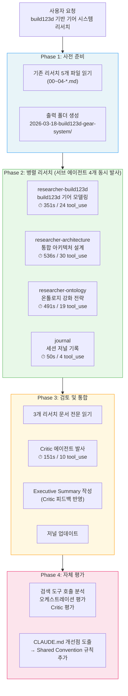

---

## 2. 에이전트 타임라인

```mermaid
gantt
    title 에이전트 실행 타임라인
    dateFormat X
    axisFormat %s초

    section 사전 준비
    기존 리서치 읽기          :done, read, 0, 30
    폴더 생성                 :done, mkdir, 30, 32

    section 병렬 리서치
    journal                   :done, j, 32, 82
    researcher-build123d      :done, r1, 32, 383
    researcher-ontology       :done, r3, 32, 523
    researcher-architecture   :done, r2, 32, 568

    section 검토/통합
    3개 문서 읽기              :done, read2, 568, 590
    Critic                    :done, critic, 590, 741
    Executive Summary 작성     :done, exec, 741, 780
    저널 업데이트              :done, j2, 780, 806

    section 자체 평가
    검색 패턴 분석             :done, eval, 806, 840
    CLAUDE.md 반영             :done, claude, 840, 860
```

---

## 3. 에이전트 간 데이터 흐름

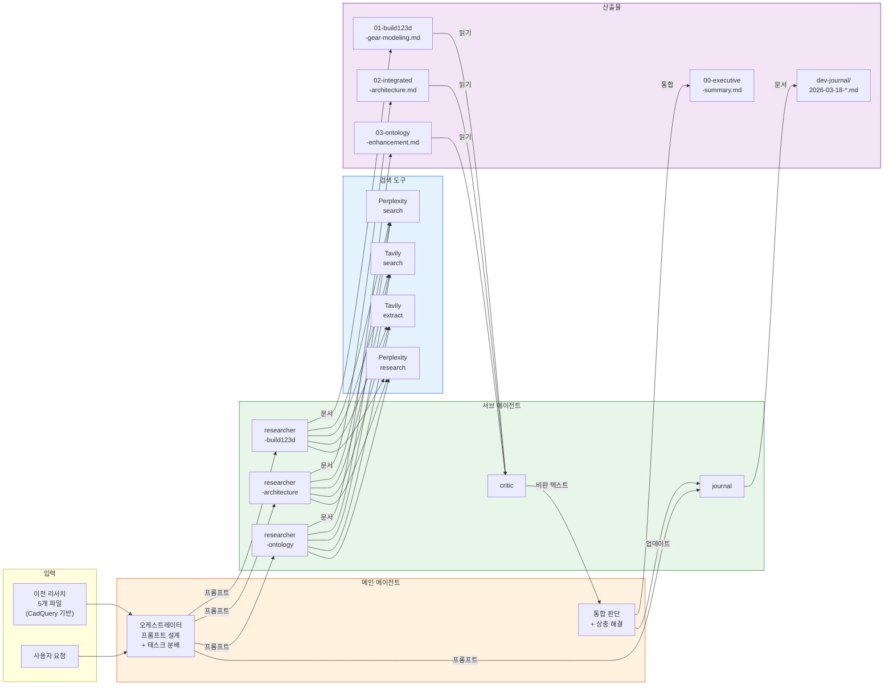

---

## 4. 검색 도구 사용 분석

### 4.1 에이전트별 호출 횟수

```mermaid
xychart-beta
    title "에이전트별 검색 도구 호출 횟수"
    x-axis ["build123d", "architecture", "ontology"]
    y-axis "호출 횟수" 0 --> 20
    bar [7, 18, 7]
    bar [7, 9, 5]
    bar [13, 2, 2]
    bar [1, 1, 1]
```

| 에이전트 | perplexity search | tavily search | tavily extract | perplexity research | **합계** |
|---------|:-:|:-:|:-:|:-:|:-:|
| researcher-build123d | 7 | 7 | 13 | 1 | **28** |
| researcher-architecture | 18 | 9 | 2 | 1 | **30** |
| researcher-ontology | 7 | 5 | 2 | 1 | **15** |
| **합계** | **32** | **21** | **17** | **3** | **73** |

### 4.2 CLAUDE.md 조사 흐름 준수 여부

CLAUDE.md는 "얕은 곳 → 깊은 곳" 3단계 흐름을 정의한다:

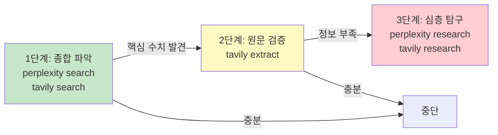

**준수 평가:**

| 에이전트 | 1단계 (search) | 2단계 (extract) | 3단계 (research) | 평가 |
|---------|:-:|:-:|:-:|------|
| build123d | 14회 | 13회 | 1회 | 원문 검증 충분 |
| architecture | 27회 | 2회 | 1회 | **extract 부족** — 인용 수치 미검증 |
| ontology | 12회 | 2회 | 1회 | **extract 부족** — 코드 구문 미검증 |

### 4.3 도구 혼용 비율

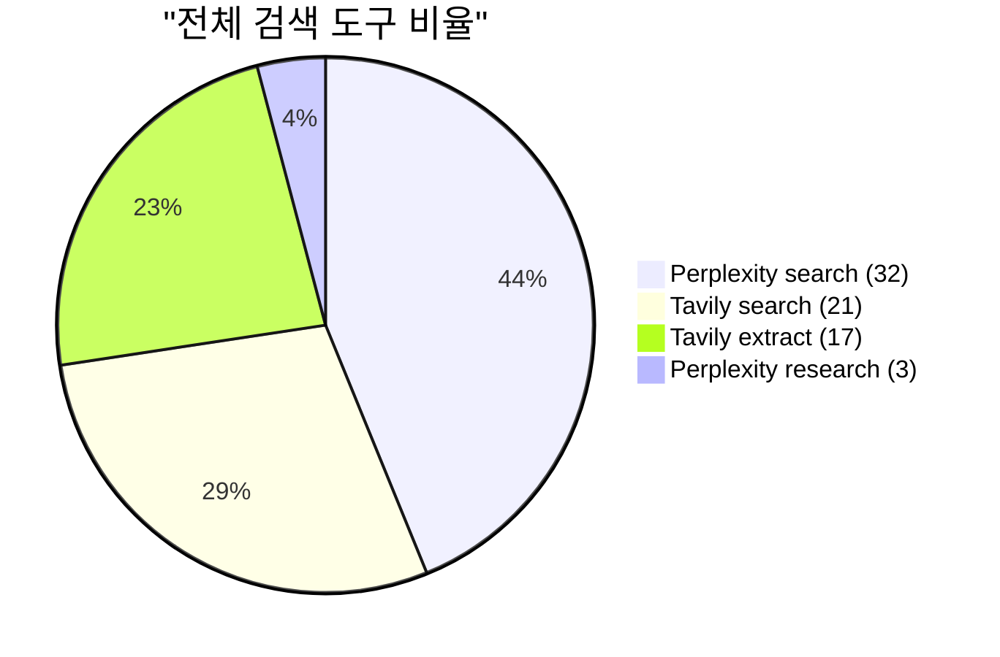

CLAUDE.md 원칙 "한 도구에 편중하지 말고 섞어 쓴다" — **Perplexity 35 vs Tavily 38로 균등 혼용, 준수.**

### 4.4 비용 추정

| 도구 | 호출수 | 단가 | 추정 비용 |
|------|:------:|------|:---------:|
| Perplexity search | 32 | ~$0.01 | $0.32 |
| Perplexity research | 3 | ~$0.05 | $0.15 |
| Tavily search (advanced) | 21 | 2 크레딧 | 42 크레딧 |
| Tavily extract | 17 | 1 크레딧 | 17 크레딧 |
| **합계** | **73** | | **~$0.47 + 59 크레딧** |

---

## 5. Critic 에이전트 동작 분석

### 5.1 Critic 프로세스

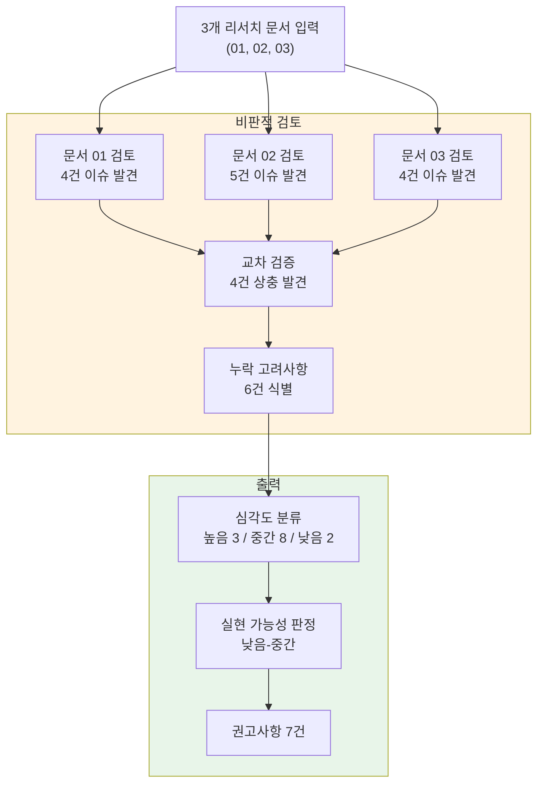

### 5.2 Critic이 발견한 이슈 매트릭스

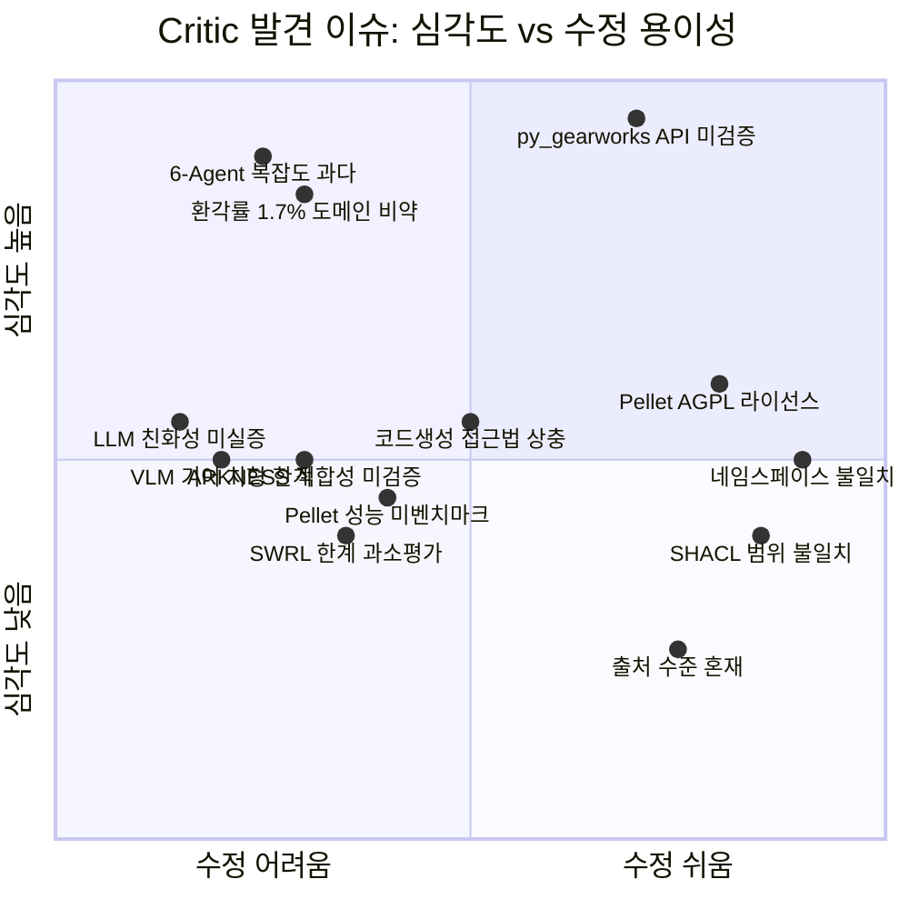

### 5.3 Critic의 한계

| 항목 | 수행 여부 | 비고 |
|------|:---------:|------|
| 문서 간 교차 검증 | O | 4건 상충 발견 |
| 논리적 일관성 검토 | O | 도메인 이전 비약 지적 |
| 과도한 일반화 탐지 | O | 환각률 수치 한정 |
| 누락 고려사항 | O | 라이선스, 비용, 오프라인 등 6건 |
| **원문 검증 (extract)** | **X** | **search.sh 0회 호출** |
| **코드 실행 검증** | **X** | Owlready2/SHACL 코드 미실행 |
| 긍정적 확인 | △ | 문제 지적에 편중 |

---

## 6. 통합 프로세스

### 6.1 메인 에이전트의 통합 흐름

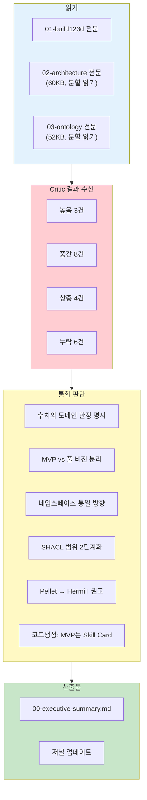

### 6.2 Critic 피드백 → Executive Summary 반영 추적

| Critic 지적 | 반영 여부 | 반영 위치 | 반영 방식 |
|------------|:---------:|----------|----------|
| 환각률 1.7% 도메인 한정 | O | "수치의 도메인 한정" 표 | "미검증" 명시 |
| 6-Agent 복잡도 | O | "MVP vs 풀 비전" 표 | 3컴포넌트 MVP 분리 |
| py_gearworks API 미검증 | O | "리스크" 표 | "PoC 전 반드시 테스트" |
| 네임스페이스 불일치 | O | "문서 간 상충" 섹션 | 통일 방향 제시 |
| Pellet AGPL | O | "기술 스택" 표 | HermiT(BSD) 권고 |
| 코드생성 접근법 상충 | O | "문서 간 상충" 섹션 | MVP=Skill Card |
| SHACL 범위 불일치 | O | "문서 간 상충" 섹션 | 2단계 적용 |
| 라이선스/비용/오프라인 | △ | "실패 시나리오" | 일부만 반영 |
| **하위 문서 실제 수정** | **X** | — | **미수행** |

---

## 7. 자체 평가 요약

### 7.1 평점

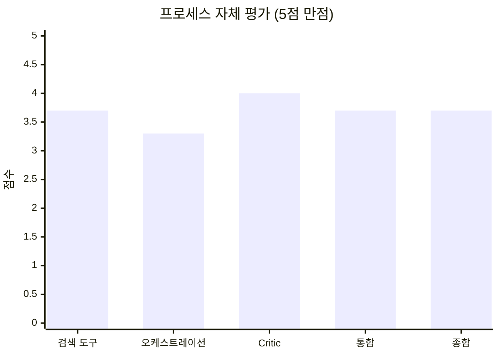

| 항목 | 평점 | 잘 된 점 | 핵심 이슈 |
|------|:---:|---------|----------|
| 검색 도구 | B+ | 3단계 흐름 준수, 도구 균등 혼용 | architecture의 extract 부족 |
| 오케스트레이션 | B | 병렬 발사, 역할 분리 명확 | 에이전트 간 컨벤션 미합의 |
| Critic | A- | 교차 검증 우수, 상충 4건 발견 | 원문 검증 미수행 |
| 통합 | B+ | Critic 피드백 전면 반영 | 하위 문서 미수정 |
| **종합** | **B+** | | |

### 7.2 도출된 개선점

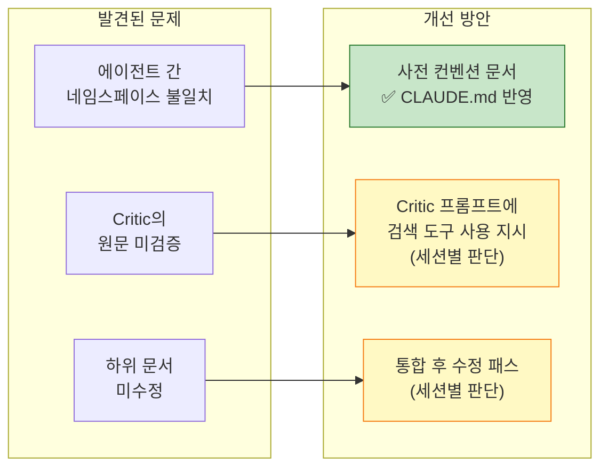

CLAUDE.md에는 **가장 효과 대비 비용이 낮은 "사전 컨벤션 문서" 규칙만 반영**했다. 나머지는 세션별 오케스트레이션 판단으로 둔다.

---

## 8. 전체 리소스 소비

| 항목 | 수치 |
|------|------|
| 서브 에이전트 수 | 5개 (Researcher 3 + Journal 1 + Critic 1) |
| 총 tool_use | 87회 (R1:24 + R2:30 + R3:19 + J:4+2 + C:10) |
| 총 토큰 | ~363K (R1:77K + R2:95K + R3:72K + J:34K + C:85K) |
| 검색 호출 | 73회 (P-search:32 + T-search:21 + T-extract:17 + P-research:3) |
| 추정 검색 비용 | ~$0.47 + 59 Tavily 크레딧 |
| 산출물 | 6개 파일 (연구 4 + 저널 1 + 프로세스 기록 1) |
| 총 소요 시간 | ~15분 (병렬 실행, 가장 긴 에이전트 기준) |
