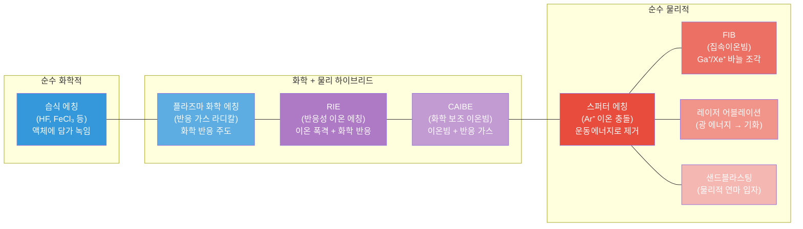
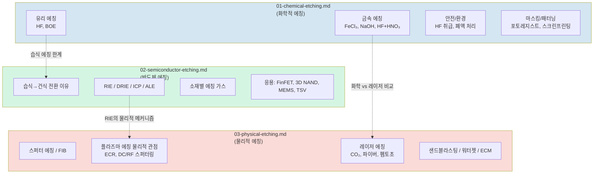
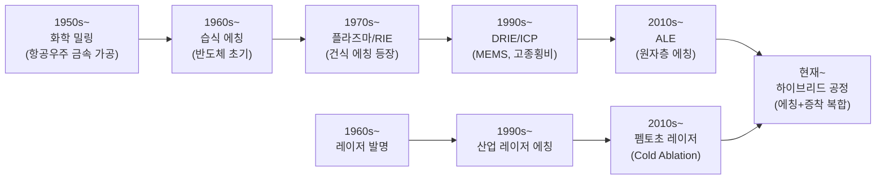
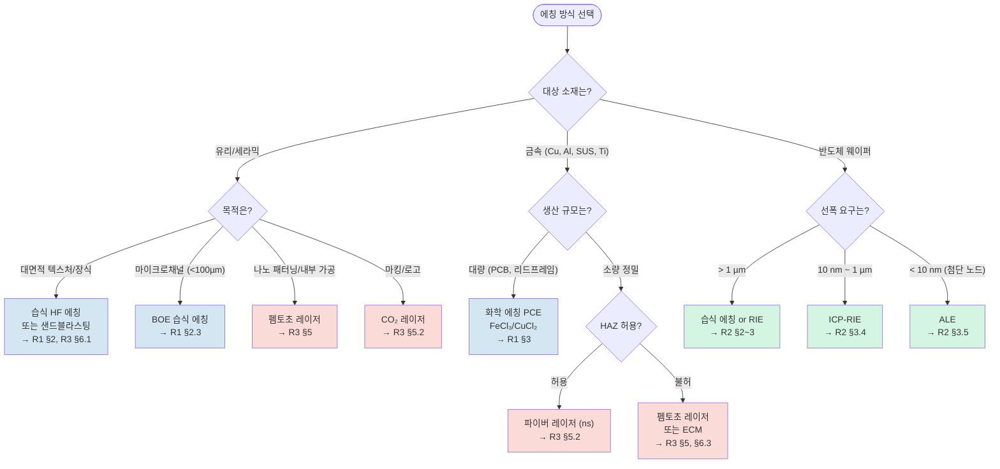

# 에칭 기술 종합 가이드 — 화학적/반도체/물리적 에칭의 통합 이해

> **대상 독자**: 제조업 현장 엔지니어 및 비전공 교육생
> **작성일**: 2026-03-25
> **역할**: Synthesizer — 3개 상세 보고서 + Critic Review 통합
> **읽는 순서**: 이 문서를 먼저 읽고, 관심 분야의 상세 보고서로 이동

---

## 이 문서의 구성

| 섹션 | 내용 | 핵심 질문 |
|------|------|----------|
| 1. 에칭 기술 전체 지도 | 모든 에칭 방식의 관계와 스펙트럼 | "에칭에는 뭐가 있고, 어떻게 연결되나?" |
| 2. 핵심 개념 통합 정리 | 선택비, 등방성/이방성 등 공통 개념 | "같은 용어가 방식마다 어떻게 다른가?" |
| 3. 에칭 방식 선택 가이드 | 소재x정밀도x비용 의사결정 프레임워크 | "내 상황에 어떤 방식을 써야 하나?" |
| 4. 비용 규모 비교표 | 방식별 투자/운영/폐수 비용 규모 | "돈이 얼마나 드나?" |
| 5. 실무 체크리스트 | 방식별 Top-3 실패 모드와 예방 | "뭘 조심해야 하나?" |
| 6. 에칭 후 검사와 클리닝 | 에칭 결과 확인과 후처리 | "에칭 후 뭘 해야 하나?" |
| 7~11. 신뢰도/상충점/발견/후속/용어집 | 메타 정보 | "이 정보를 얼마나 믿어도 되나?" |

---

## 1. 에칭 기술 전체 지도 (Overview Map)

### 1.1 에칭이란?

에칭(Etching)은 재료 표면의 일부를 **선택적으로 제거**하는 가공 기술이다. 마치 도장(stamp)을 찍기 위해 고무판을 칼로 파듯, 원하는 부분만 깎아낸다. 차이가 있다면, 에칭은 칼 대신 **화학물질, 이온, 레이저**를 사용한다는 점이다.

### 1.2 에칭 방식 스펙트럼 — 순수 화학에서 순수 물리까지

에칭 방식을 "화학적"과 "물리적"으로 이분법적으로 나누면 혼란이 생긴다. 실제로는 **연속 스펙트럼**이다. 왼쪽으로 갈수록 화학 반응이 지배적이고, 오른쪽으로 갈수록 물리적 충돌이 지배적이다.

**핵심 포인트**: RIE(반응성 이온 에칭)는 화학과 물리의 경계에 있는 **하이브리드 기술**이다. R2(반도체 에칭)에서는 "건식 에칭의 주력"으로, R3(물리적 에칭)에서는 "물리적 메커니즘 관점"으로 각각 다루었다. 같은 기술이지만, 가스 종류와 이온 에너지 비율에 따라 화학 쪽이나 물리 쪽으로 성격이 변한다.

> **Critic 지적 해소**: RIE가 R2와 R3에서 중복 등장하는 것은 분류 오류가 아니라, RIE가 스펙트럼 중앙에 위치하기 때문이다. 위 다이어그램이 이 관계를 정리한다.

### 1.3 보고서 커버리지 맵

3개 상세 보고서가 각각 어떤 영역을 다루는지 한눈에 확인하자.

**읽기 가이드**:
- **유리/금속 산업 에칭**이 관심이면 → R1(화학적 에칭)부터
- **반도체 공정(RIE, ALE, 3D NAND)**이 관심이면 → R2(반도체 에칭)부터
- **레이저 가공, 물리적 에칭 원리**가 관심이면 → R3(물리적 에칭)부터
- R1의 습식 에칭 한계가 왜 R2의 건식 에칭으로 이어지는지, R2의 RIE가 R3에서 어떻게 물리적으로 재해석되는지를 이해하면 전체 그림이 완성된다.

### 1.4 에칭 기술 발전 로드맵

---

## 2. 핵심 개념 통합 정리

3개 보고서에 공통으로 등장하는 핵심 개념을 한곳에 모았다. 같은 용어라도 방식에 따라 의미와 수치가 달라지므로, 아래 비교를 먼저 이해하면 각 보고서를 읽기 수월하다.

### 2.1 선택비 (Selectivity)

**정의**: 에칭하려는 재료의 에칭 속도 / 보호하려는 재료(마스크, 기저층)의 에칭 속도

비유하면, "손톱만 깎고 손가락은 안 다치게 하는 능력"이다. 숫자가 높을수록 정밀하다.

| 에칭 방식 | 선택비 특성 | 대표 수치 | 출처 |
|----------|-----------|----------|------|
| **습식 화학** (R1) | 에칭액-재료 화학 반응에 의존, 높은 선택비 가능 | HF의 SiO₂/포토레지스트 = 10:1 | R1 §1.4 |
| **RIE/건식** (R2) | 가스 조합으로 조절, 물리+화학 복합 | SiO₂/포토레지스트 = 20:1 | R2 §4.1 |
| **순수 물리적** (R3) | 매우 낮음 — 이온이 재료를 가리지 않고 때림 | 스퍼터 에칭 ~1:1 | R3 §2.3 |

> **주의**: R1의 10:1과 R2의 20:1은 모순이 아니다. 습식(R1)과 건식(R2)의 조건 차이이며, 건식 에칭이 가스 조합 최적화로 더 높은 선택비를 달성할 수 있다.

### 2.2 등방성 / 이방성 (Isotropic / Anisotropic)

**등방성**: 모든 방향으로 균일하게 에칭됨 (사과를 설탕물에 담그면 골고루 녹는 것)
**이방성**: 특정 방향(수직)으로만 에칭됨 (나무를 나뭇결 따라 쪼개는 것)

| 에칭 방식 | 방향성 | 원인 | 결과 |
|----------|--------|------|------|
| **습식 화학** | 등방성 | 액체가 모든 방향에서 접근 | 언더컷 발생, 미세 패턴 한계 |
| **RIE** | 이방성 | 이온이 수직으로 가속 | 수직 측벽, 미세 패턴 가능 |
| **스퍼터 에칭** | 강한 이방성 | 이온빔이 한 방향으로 입사 | 수직 프로파일, 재증착 주의 |
| **레이저** | 이방성 (빔 방향) | 빛이 직진 | 깊이 제어 가능, 3D 가공도 가능 |

### 2.3 에칭 속도 (Etch Rate)

단위 시간당 재료가 제거되는 깊이 (µm/min).

| 에칭 방식 | 속도 범위 | 조건 |
|----------|----------|------|
| 습식 HF (유리) | 0.1~8 µm/min | 농도/유리 종류 의존 |
| 습식 FeCl₃ (구리) | 25~50 µm/min | 온도 30~45°C |
| RIE (Si) | 수백 nm~수 µm/min | 가스/파워 의존 |
| ALE | ~0.1 nm/사이클 | 원자층 단위 |
| 스퍼터 (Ar⁺) | 수~수십 nm/min | 이온 에너지 의존 |
| 레이저 (펨토초) | 가변 (펄스당 수 nm~µm) | 펄스 에너지/반복률 |

**실무 포인트**: 습식 에칭이 압도적으로 빠르다. 속도가 중요하고 정밀도가 덜 중요하면 습식이 유리하다.

### 2.4 언더컷 (Undercut)

마스크 가장자리 아래로 에칭이 파고드는 현상. 등방성 에칭의 필연적 부산물이다.

- **습식 에칭** (R1): 에칭 깊이 ≈ 언더컷 거리. 에칭 팩터(EF = 깊이/언더컷)로 관리. EF 3.0 이상이 고정밀.
- **RIE** (R2): 이방성이므로 언더컷 최소. 단, 보잉(bowing), 노칭(notching) 같은 프로파일 결함 존재.
- **물리적 에칭** (R3): 이온빔 방향에 의존하므로 언더컷 거의 없음. 재증착이 대신 문제.

---

## 3. 에칭 방식 선택 가이드 (의사결정 프레임워크)

### 3.1 의사결정 흐름도

### 3.2 소재 × 에칭 방식 적합도 매트릭스

| | 습식 화학 | RIE/건식 | 스퍼터/FIB | 레이저 | 샌드블라스팅 |
|--|---------|---------|-----------|--------|-----------|
| **소다라임 유리** | ◎ HF | △ | △ | ○ CO₂ | ◎ |
| **보로실리케이트** | ◎ BOE | △ | △ | ○ CO₂/UV | ○ |
| **퓨즈드 실리카** | ◎ HF 49% | ○ | △ | ◎ 펨토초 | ○ |
| **구리** | ◎ FeCl₃ | △ (비휘발성) | ○ | ○ 파이버 | △ |
| **알루미늄** | ◎ NaOH | ◎ Cl₂ | ○ | ○ 파이버 | ○ |
| **스테인리스** | ○ FeCl₃+HCl | △ | ○ | ◎ 파이버 | ○ |
| **티타늄** | ○ HF+HNO₃ | △ | ○ | ○ | △ |
| **Si (반도체)** | ○ KOH | ◎ RIE/DRIE | ◎ | △ | × |
| **SiO₂** | ◎ HF/BOE | ◎ C₄F₈ | ○ | △ | × |
| **귀금속 (Pt, Au)** | × | × | ◎ 스퍼터 | ○ 펨토초 | △ |

◎ = 최적, ○ = 가능, △ = 제한적, × = 부적합

---

## 4. 비용 규모 비교표

정확한 금액은 지역, 시기, 규모에 따라 크게 달라진다. 아래는 **규모(order of magnitude) 수준의 참고치**로, 의사결정 초기 단계에서 "감잡기"용이다.

| 에칭 방식 | 초기 장비 투자 | 소모품/운영 (월) | 폐수 처리 | 비고 |
|----------|-------------|---------------|----------|------|
| **습식 에칭 (소규모)** | 수백만원 (탱크, 히터, 환기) | 수십만원 (에칭액, 마스크 재료) | 수십~수백만원/년 (중화, 위탁) | 진입 장벽 가장 낮음 |
| **습식 에칭 (산업)** | 수천만원 (자동화 라인) | 수백만원 | 수천만원/년 | PCB 대량 생산 기준 |
| **RIE (연구용)** | 수천만~1억원 | 수백만원 (가스, 진공 유지) | 최소 (가스 스크러버) | 대학/연구소 클린룸 |
| **ICP-RIE (산업용)** | 수억~수십억원 | 수천만원 | 중간 (가스 처리) | 반도체 팹 장비 |
| **DRIE** | 수억원 | 수백~수천만원 | 중간 | MEMS 전용 |
| **ALE** | 수십억원+ | 높음 | 중간 | 최첨단 반도체 |
| **FIB** | 수억~수십억원 | 수백만원 (Ga 소스 등) | 최소 | R&D, 단면 분석 |
| **파이버 레이저 (ns)** | 수천만원~1억원 | 수십만원 (전기, 광학계) | 없음 (건식) | 금속 마킹/에칭 |
| **펨토초 레이저** | 수억원~수십억원 | 수백만원 | 없음 | 나노 가공 |
| **CO₂ 레이저** | 수백만~수천만원 | 수십만원 | 없음 | 비금속 마킹 |
| **샌드블라스팅** | 수백만원 | 수십만원 (연마재) | 분진 처리 비용 | 가장 저비용 |

> **수치 투명성**: 위 비용은 한국 시장 기준 대략적 범위이다. 반도체 장비(ICP-RIE, ALE)는 제조사(Lam Research, Tokyo Electron, Applied Materials 등)에 따라 수배 차이가 날 수 있다. 레이저 장비는 출력/펄스 사양에 따라 가격 범위가 넓다. 실제 도입 시 벤더 견적이 필수다.

---

## 5. 실무 체크리스트: 방식별 Top-3 실패 모드

### 5.1 습식 화학 에칭

| 순위 | 실패 모드 | 원인 | 진단법 | 예방법 |
|------|---------|------|--------|--------|
| 1 | **과에칭 (Over-etch)** | 에칭 시간 초과, 온도 과다 | 단면 현미경으로 깊이 측정 | 타이머 설정, 온도 ±2°C 관리, 소형 쿠폰 사전 테스트 |
| 2 | **언더컷 과다** | 에칭 팩터 미달, 마스크 접착 불량 | 광학 현미경으로 마스크 아래 침식 확인 | 양면 에칭, 스프레이 방식, 아트워크 보정 설계 |
| 3 | **마스크 박리/손상** | 에칭액이 마스크 공격, 접착 불량 | 에칭 중 마스크 가장자리 들뜸 관찰 | 마스크 재료-에칭액 호환성 확인, 라미네이션 품질 관리 |

### 5.2 RIE/건식 에칭 (반도체)

| 순위 | 실패 모드 | 원인 | 진단법 | 예방법 |
|------|---------|------|--------|--------|
| 1 | **보잉 (Bowing)** | 측벽 보호막 부족, 이온 산란 | SEM 단면 관찰 | C₄F₈ 비율 증가, 저온 운전 |
| 2 | **노칭 (Notching)** | 바닥에서 이온 반사/과집중 | 에칭 프로파일 측정 | 압력 조절, 에칭 종점 검출(EPD) 활용 |
| 3 | **ARDE (종횡비 의존 에칭)** | 좁은 구멍에 가스/이온 공급 부족 | 서로 다른 크기 패턴의 깊이 비교 | 보쉬 사이클 최적화, 더미 패턴, 펄스 플라즈마 |

### 5.3 물리적 에칭 (스퍼터, FIB, 레이저)

| 순위 | 실패 모드 | 원인 | 진단법 | 예방법 |
|------|---------|------|--------|--------|
| 1 | **재증착 (Redeposition)** | 제거된 원자가 측벽/인접 영역에 재부착 | SEM으로 측벽 오염 확인 | 시료 각도 조절, 가스 보조 (CAIBE) |
| 2 | **열 영향부 (HAZ)** — 레이저 | 나노초 레이저의 열 확산 | 단면 현미경으로 변색/미세균열 관찰 | 펨토초 레이저 전환, 반복률/플루언스 최적화 |
| 3 | **이온빔 손상 / Ga 오염** — FIB | Ga⁺ 이온 시료 내 주입 | EDS/SIMS 분석 | Xe⁺ PFIB 사용, 저에너지 마무리 패스 |

---

## 6. 에칭 후 검사와 클리닝

> **Critic 지적 반영**: 3개 보고서에서 에칭 후 공정(검사, 클리닝)이 체계적으로 다뤄지지 않았다. 에칭은 독립 공정이 아니며, 결과 확인과 후처리가 품질의 마지막 방어선이다.

### 6.1 에칭 후 검사 (Metrology)

| 검사 항목 | 측정 방법 | 적용 에칭 방식 | 비고 |
|----------|----------|-------------|------|
| **에칭 깊이** | 프로파일로미터 (접촉식/비접촉식) | 모든 방식 | 목표 대비 ±% 확인 |
| **측벽 프로파일** | SEM 단면 관찰 | RIE, 스퍼터, FIB | 보잉/노칭/테이퍼 여부 |
| **패턴 치수 (CD)** | SEM (Top-down), OCD | 반도체 | ±0.3 nm 수준 관리 (첨단 노드) |
| **표면 거칠기** | AFM, 백색광 간섭계 | 모든 방식 | Ra 값으로 정량화 |
| **잔류 오염** | EDS, XPS, SIMS | FIB, 플라즈마 | Ga 오염, 폴리머 잔류 확인 |

### 6.2 에칭 후 클리닝

| 에칭 방식 | 주요 잔류물 | 클리닝 방법 |
|----------|-----------|-----------|
| **습식 화학** | 에칭액 잔류, 금속 이온 | DI water 수세 → N₂ 건조 |
| **RIE/플라즈마** | 측벽 폴리머, 할로겐 잔류 | O₂ 플라즈마 애싱 → 습식 스트립 |
| **스퍼터/FIB** | 재증착 금속, 이온 주입 | 저에너지 이온빔 마무리, 습식 세정 |
| **레이저** | 재주조층 (나노초), 데브리 | 초음파 세척, 화학 세정 |
| **포토레지스트 제거** | 경화된 PR | 유기 용제(NMP) 또는 O₂ 플라즈마 |

---

## 7. 근거 신뢰도 매트릭스

| 핵심 주장 | 출처 | 도메인 일치도 | 확신도 | 검증 필요 |
|----------|------|------------|--------|----------|
| HF 에칭 속도 0.1~8 µm/min (유리) | Iliescu et al. 2012, microfluidics | 인접 (실험실→산업) | 중간 | ±50% 오차 가정 필요 |
| FeCl₃ 구리 에칭 25~50 µm/min | R1 산업 문헌 종합 | 일치 (PCB 산업) | 중간 | 범위가 넓음, 조건 세분화 필요 |
| RIE가 반도체 주력 에칭 | Lam Research, 다수 문헌 | 정확 | 높음 | 불필요 |
| ALE EPC ~1 Å/사이클 | 반도체 공정 문헌 | 정확 | 높음 | 재료별 0.5~3 Å 변동 |
| 3D NAND 종횡비 100:1 | 업계 다수 문헌 | 정확 | 높음 | 세대별 90:1~120:1 |
| 펨토초 레이저 HAZ 최소 | 레이저 가공 문헌 | 일치 | 높음 | **조건부**: 고반복률(>MHz)에서 열 축적 가능 |
| 스퍼터링 수율 Si ≈ 0.5 at 500eV | HZDR 연구소 | 일치 (반도체) | 높음 | 입사각/표면에 따라 ±20% |
| CD 오차 ±0.3 nm (첨단 노드) | R2, 출처 미비 | 불확실 | 중간 | **출처 확인 필요** |
| 물리적 에칭 정밀도 ±0.005mm | Wevolver 2023 (커뮤니티) | 약함 | 낮음 | **어떤 방식인지 불명확** |

> **BOE 레시피 주의사항** (Critic 지적 반영): R1 §2.3의 BOE 레시피(NH₄F 40g + DI water 60ml + 49% HF 10ml)는 **출처가 명시되지 않은 일반적 예시**이다. BOE 조성은 목표 에칭 속도, 대상 재료에 따라 6:1, 10:1 등 다양한 비율이 존재한다. 실무에서는 반드시 대상 재료와 목표에 맞는 **검증된 표준 레시피**를 사용하고, 소형 쿠폰 테스트 후 적용하라.

---

## 8. 상충점 해결 테이블

| 상충 항목 | R2 주장 | R3 주장 | 판단 |
|----------|--------|--------|------|
| **RIE 분류** | 건식 에칭의 핵심 (반도체 공정 관점) | 물리적 관점에서 재해석 (스펙트럼 중앙) | **양측 모두 정확**. RIE는 화학+물리 하이브리드이며, 관점에 따라 분류가 달라진다. 본 synthesis §1.2 스펙트럼 다이어그램으로 통합 |
| **선택비 수치** (SiO₂/PR) | 20:1 (건식) | — | **조건 차이**. R1의 10:1은 습식(HF), R2의 20:1은 건식(RIE). 에칭 방식과 가스/액에 따라 선택비가 다른 것은 정상 |
| **플라즈마 설명 중복** | "고체→액체→기체→플라즈마" + 번개/네온/태양 | "물질의 4번째 상태" + 형광등 | 내용 정확, 중복 비효율. **Synthesis에서 통합**: 플라즈마 = 기체에 강한 에너지를 가해 이온+전자가 분리된 상태. 일상 예시로 번개, 형광등, 네온사인 |
| **ECR 데이터 도메인** | ECR 다루지 않음 | Pearton et al. 1994, III-V 반도체 기준 | R3의 ECR 이온밀도 수치(10¹¹-10¹² cm⁻³)는 III-V 도메인 기반. 일반 Si 공정에도 대체로 유효하나, 구체적 수치는 공정별 검증 필요 |

---

## 9. 예상 밖 핵심 발견

사용자의 직접 질문 범위 밖이지만, 의사결정에 영향을 줄 수 있는 발견들이다.

### 9.1 구리는 건식 에칭이 "불가능"하다
반도체 배선의 주력 재료인 구리(Cu)는 건식 에칭으로 패터닝하기 극히 어렵다. CuClx 등 에칭 부산물이 상온에서 비휘발성이기 때문이다. 이 때문에 **다마신(Damascene) 공정** — 먼저 홈을 파고 Cu를 채운 후 CMP로 평탄화 — 이 개발되었다. 이는 "에칭의 한계가 공정 구조 자체를 바꾼" 대표적 사례다. (R2 §5.4)

### 9.2 펨토초 레이저의 HAZ "없음"은 조건부
펨토초 레이저의 "열 영향부(HAZ) 없음"은 **단일 펄스** 조건에서 성립한다. 고반복률(>MHz)에서 다중 펄스를 조사하면 열이 축적되어 나노초 레이저와 유사한 열 효과가 발생할 수 있다. 실무에서 반복률과 플루언스를 동시에 관리해야 하는 이유다. (R3 §9 반증 탐색)

### 9.3 LIPSS — 의도치 않은 나노 구조
레이저 에칭 시 표면에 예상치 못한 나노 규모 줄무늬(LIPSS)가 형성될 수 있다. 이것이 불량일 수도 있고, 반대로 의도적으로 활용하면 반사방지, 소수성 제어, 구조색 생성 등에 응용할 수 있다. 레이저 가공 종사자에게 특히 관련성이 높다. (R3 §5.3)

### 9.4 친환경 에칭 전환은 단순 화학물질 교체가 아니다
CuCl₂ 재생 시스템, 전기화학 에칭 등 친환경 대안이 발전 중이지만, 폐수 처리 비용/에칭 정밀도/공정 속도의 3방향 최적화 문제이다. 현재 대형 PCB 공장에서 CuCl₂ 재생 도입이 가속화되고 있다. (R1 §4.4)

---

## 10. 후속 탐색 질문

이번 리서치에서 답하지 않았지만, 후속 조사가 필요한 질문들이다.

1. **레이저 에칭 vs 화학 에칭의 정량적 손익분기점**: 생산량 몇 개부터 레이저가 화학보다 경제적인가? 마스크 제작 비용 vs 레이저 가공 시간의 교차점은?

2. **에칭 후 표면 잔류 응력과 장기 신뢰성**: 특히 유리 레이저 어블레이션 후 잔류 응력이 의료기기/광학 소자의 수명에 미치는 영향은? 어닐링 처리 조건 최적화는?

3. **나노임프린트 리소그래피(NIL) vs 레이저 에칭**: 나노 패터닝 대량 생산에서 몰드 기반 NIL이 레이저보다 경제적인 조건은? 두 방식의 하이브리드 가능성은?

---

## 11. 용어집 (Glossary)

| 약어/용어 | 풀이 | 설명 |
|----------|------|------|
| **ALE** | Atomic Layer Etching | 원자층 에칭. 원자 1층씩 제거하는 초정밀 기술 |
| **ARDE** | Aspect Ratio Dependent Etching | 종횡비 의존 에칭. 좁고 깊은 구멍일수록 느려지는 현상 |
| **BEOL** | Back-End-of-Line | 반도체 공정 뒷단. 배선 형성 단계 |
| **BOE** | Buffered Oxide Etch | 완충 산화물 에칭액. HF + NH₄F 혼합 |
| **CAIBE** | Chemically Assisted Ion Beam Etching | 화학 보조 이온빔 에칭 |
| **CD** | Critical Dimension | 임계 치수. 소자의 핵심 패턴 폭 |
| **CMP** | Chemical Mechanical Polishing/Planarization | 화학기계적 연마/평탄화 |
| **DRIE** | Deep Reactive Ion Etching | 깊은 반응성 이온 에칭. 보쉬 프로세스가 대표적 |
| **ECM** | Electrochemical Machining | 전기화학적 가공 |
| **ECR** | Electron Cyclotron Resonance | 전자 사이클로트론 공명. 고밀도 플라즈마 생성 방식 |
| **EF** | Etch Factor | 에칭 팩터. 에칭 깊이 / 언더컷 거리 |
| **FEOL** | Front-End-of-Line | 반도체 공정 앞단. 트랜지스터 형성 단계 |
| **FIB** | Focused Ion Beam | 집속 이온빔. 나노미터 수준 직접 가공 도구 |
| **GAA** | Gate-All-Around | 게이트 올어라운드. 차세대 트랜지스터 구조 |
| **HAZ** | Heat-Affected Zone | 열 영향부. 레이저/열원 주변 의도치 않은 열 손상 영역 |
| **HF** | Hydrofluoric Acid | 불산. 유리/산화막 에칭의 핵심 화학물질 |
| **ICP** | Inductively Coupled Plasma | 유도결합 플라즈마. 고밀도 플라즈마 소스 |
| **LIPSS** | Laser-Induced Periodic Surface Structures | 레이저 유도 주기적 표면 구조 |
| **MEMS** | Micro-Electro-Mechanical Systems | 초소형 기계-전자 시스템 |
| **PCE** | Photo Chemical Etching | 포토화학 에칭. 포토리소그래피 + 화학 에칭 결합 |
| **RIE** | Reactive Ion Etching | 반응성 이온 에칭. 현대 반도체 에칭의 주력 |
| **TSV** | Through Silicon Via | 실리콘 관통 비아. 3D 칩 적층 연결 기술 |

---

## 검색 비용 보고

| 도구 | 호출 수 | 비용/크레딧 |
|------|---------|------------|
| Perplexity search | 5회 | ~$0.05 |
| Tavily search (advanced) | 4회 | 8 크레딧 |
| **합계** | **9회** | **Perplexity ~$0.10 / Tavily 8/1,000 크레딧** |

| 도구 | 호출 수 | 예상 비용 |
|------|--------|----------|
| Perplexity search | — | — |
| Tavily search | — | — |
| Tavily extract | — | — |
| **합계** | — | — |

---

## 참고 보고서

| 파일 | 내용 | 주 저자 |
|------|------|--------|
| `01-chemical-etching.md` | 습식 에칭 완전 가이드 (유리/금속, 안전, 환경) | Researcher 1 |
| `02-semiconductor-etching.md` | 반도체 에칭 기술 (습식→건식, RIE/DRIE/ALE, 응용) | Researcher 2 |
| `03-physical-etching.md` | 물리적 에칭 심층 가이드 (스퍼터/FIB/레이저/샌드블라스팅) | Researcher 3 |
| `99-critic-review.md` | 3개 보고서 교차 검증 (상충점, 누락, 개선사항) | Critic |

---

*Synthesizer 산출물 | 2026-03-25*
*저장 경로: `docs/research/2026-03-25-glass-metal-etching/00-synthesis.md`*
