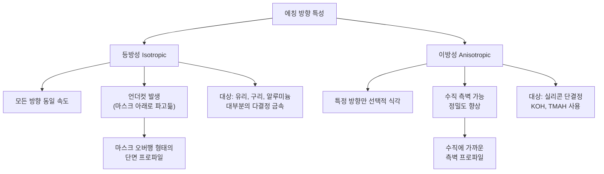
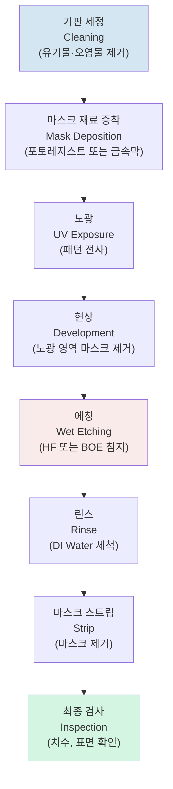
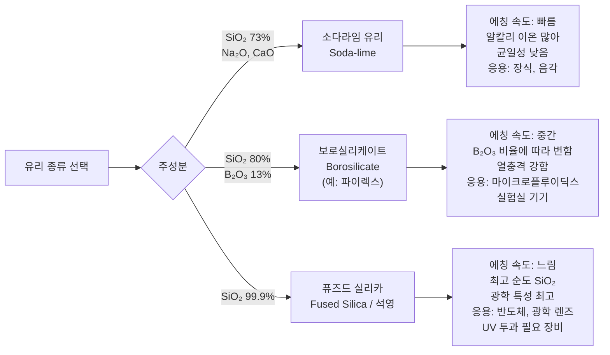
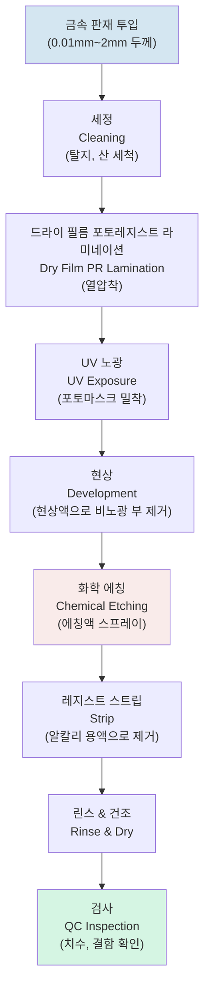
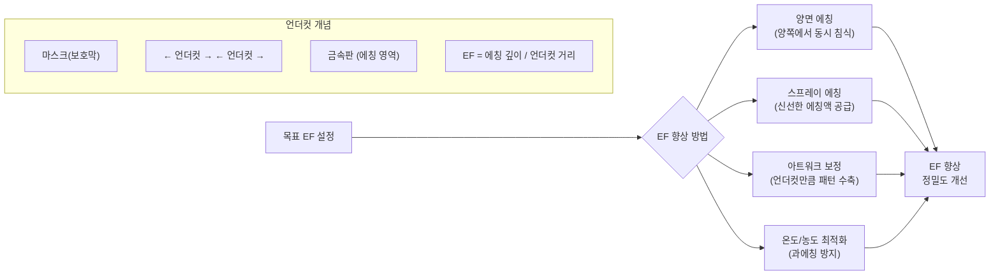
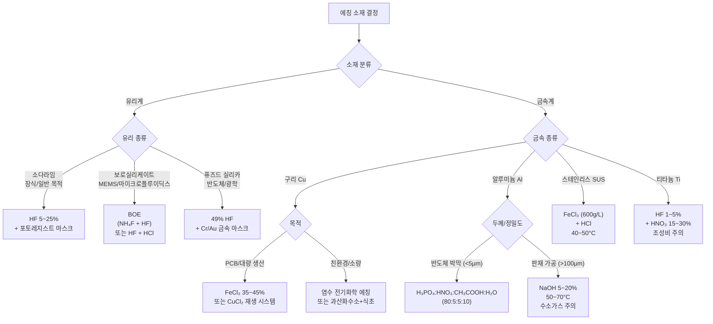
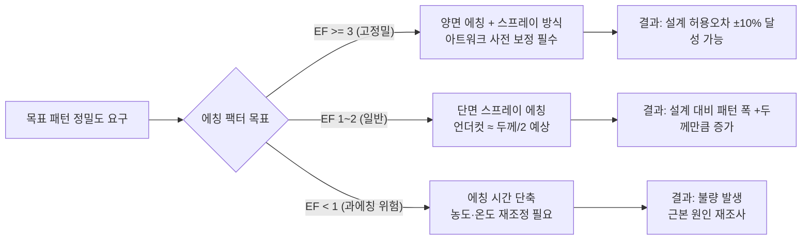

# 화학적 에칭(습식 에칭) 완전 가이드

> **대상 독자**: 제조업 현장 엔지니어 및 비전공 교육생
> **작성일**: 2026-03-25
> **역할**: Researcher 1 — 화학적 에칭(습식 에칭) 심층 조사

---

## 목차

1. [화학적 에칭의 기본 원리](#1-화학적-에칭의-기본-원리)
2. [글라스(유리) 에칭](#2-글라스유리-에칭)
3. [메탈(금속) 에칭](#3-메탈금속-에칭)
4. [안전 및 환경](#4-안전-및-환경)
5. [공정 파라미터 요약표](#5-공정-파라미터-요약표)
6. [Researcher 사고 노트](#6-researcher-사고-노트)

---

## 1. 화학적 에칭의 기본 원리

### 1.1 습식 에칭이란?

**일상 비유로 이해하기**

아이가 비 오는 날 자전거를 창고에 방치했다가 녹슨 경험을 떠올려 보자. 쇠가 공기 중 산소, 수분과 반응해 산화철(녹)로 변하며 금속 표면이 조금씩 녹아 없어진다. 습식 에칭(Wet Chemical Etching)은 이 원리를 정밀하게 제어하는 공정이다.

**정의**: 액체 상태의 화학 물질(에칭액)을 재료 표면에 접촉시켜 특정 부분을 선택적으로 녹여내는 가공 기법.

핵심은 "선택적"이라는 단어에 있다. 에칭액은 보호막(마스크)이 없는 부분만 공격하고, 보호막으로 가려진 부분은 그대로 남긴다. 마치 눈사람을 만들 때 비닐봉지를 씌운 곳은 녹지 않고, 드러난 곳만 녹는 것과 같다.

**화학 반응의 3단계**:
1. **산화(Oxidation)**: 에칭액 속 산이나 산화제가 재료 표면의 원자를 이온으로 만든다.
2. **용해(Dissolution)**: 이온화된 재료가 에칭액에 녹아 표면에서 떨어져 나간다.
3. **확산(Diffusion)**: 녹아 나온 이온이 에칭액 속으로 흩어지고, 새 에칭액이 표면에 접근한다.

이 세 단계 중 가장 느린 단계가 전체 에칭 속도를 결정한다.

---

### 1.2 등방성 vs 이방성 에칭

**등방성 에칭(Isotropic Etching)**: 모든 방향으로 균일하게 깎이는 방식

사과를 설탕물에 담갔을 때 표면이 골고루 녹는 것처럼, 에칭액이 위·아래·옆 방향을 가리지 않고 동일한 속도로 재료를 녹인다. 유리와 대부분의 금속은 이 방식으로 에칭된다.

**이방성 에칭(Anisotropic Etching)**: 특정 방향으로만 깎이는 방식

나뭇결을 따라 쪼개지는 나무처럼, 결정 구조의 특정 방향으로만 빠르게 녹는다. 실리콘 같은 단결정 반도체에서 주로 나타난다.



**실무 포인트**: 유리와 금속은 비정질(유리) 또는 다결정(금속) 구조이기 때문에 거의 항상 등방성 에칭이 일어난다. 즉, 깊이 방향으로 1µm 녹으면 옆 방향으로도 약 1µm 녹는다는 점을 설계에 반영해야 한다.

---

### 1.3 에칭 속도 결정 요인

에칭 속도(Etch Rate)는 단위 시간당 재료가 녹는 깊이(µm/min)로 표현된다.

| 영향 요인 | 속도 증가 방향 | 비고 |
|----------|-------------|------|
| **온도** | 높을수록 빠름 | 10°C 상승 시 반응속도 약 2배 (아레니우스 법칙) |
| **농도** | 높을수록 빠름 | 일정 수준 이상에서는 포화됨 |
| **교반(Agitation)** | 교반할수록 빠름 | 소진된 에칭액을 신선한 액으로 교체 |
| **시간** | 시간이 길수록 깊어짐 | 과에칭(Over-etch) 주의 |
| **재료 결정 구조** | 단결정 < 다결정 | 결정립계(grain boundary)에서 빠름 |

> **수치 투명성**: "10°C 상승 시 2배"는 아레니우스(Arrhenius) 방정식의 일반적 근사치이며, 활성화 에너지(Ea)가 큰 반응(Ea > 50 kJ/mol)에서 더 크게 적용된다. HF의 경우 활성화 에너지가 상대적으로 낮아 실제 증배율은 1.5~2배 범위이다. [인접 도메인: 반응 화학 / 물리화학]

---

### 1.4 선택비(Selectivity) — 왜 중요한가

**선택비**란 에칭하고 싶은 재료와 마스크(보호막) 재료가 에칭되는 속도 비율이다.

```
선택비 = 에칭 대상 재료 에칭 속도 / 마스크 재료 에칭 속도
```

예를 들어, HF 용액이 유리(SiO₂)를 1 µm/min으로 녹이고 포토레지스트(마스크)를 0.1 µm/min으로 녹인다면 선택비는 10:1이다.

**선택비가 중요한 이유**:
- 선택비가 낮으면 에칭이 완료되기 전에 마스크가 먼저 손상된다.
- 특히 깊은 에칭(>100µm)에서는 높은 선택비의 마스크 재료(크롬/금 금속 마스크, 폴리실리콘 등)를 사용해야 한다.
- PCB 제조에서 FeCl₃가 구리는 빠르게 녹이고 폴리이미드(기판)는 녹이지 않는 것이 높은 선택비의 좋은 예다.

> **핵심 요약**
>
> 화학적 에칭은 액체 화학물질로 재료를 선택적으로 녹이는 공정이다. 유리와 금속은 등방성 에칭(모든 방향 균일 식각)이 일반적이며, 온도·농도·교반이 에칭 속도를 결정한다. 선택비는 마스크 내구성과 직결되며 정밀 가공의 핵심 지표다.

---

## 2. 글라스(유리) 에칭

### 2.1 전체 공정 흐름도



---

### 2.2 HF 에칭 원리와 공정 상세

**HF(불산, Hydrofluoric Acid)는 왜 유리를 녹이는가?**

유리의 주성분은 이산화규소(SiO₂)다. HF와의 반응:

```
SiO₂ + 4HF → SiF₄↑ + 2H₂O
```

사불화규소(SiF₄)는 가스 상태로 날아가 버리고, 물(H₂O)만 남는다. 이 반응이 유리를 녹이는 원리다. 마치 각설탕이 물에 녹아 없어지듯, HF는 SiO₂를 기체 부산물로 변환시켜 제거한다.

**HF 농도와 에칭 속도**:

| HF 농도 | 에칭 속도 (µm/min) | 표면 품질 | 비고 |
|---------|----------------|---------|------|
| 1~5% HF | 0.1~0.5 | 매끄러움 | 마이크로구조 정밀 패터닝 |
| 10~25% HF | 0.5~2.0 | 중간 | 일반 유리 에칭 |
| 49% HF (진한 불산) | 2~8+ | 거칠어질 수 있음 | 깊은 에칭 (>600µm 가능) |

> **수치 투명성**: 에칭 속도는 유리 종류, 온도, 교반에 따라 크게 달라진다. 49% HF에서 8 µm/min은 퓨즈드 실리카(Fused Silica), 교반 있음, ~25°C 조건의 상한값이다. 소다라임 유리는 퓨즈드 실리카보다 15~30% 빠르게 에칭된다. (출처: Iliescu et al., 2012, microfluidics glass etching review)

---

### 2.3 BOE(Buffered Oxide Etch) — HF와의 차이

**BOE는 불산(HF)에 불화암모늄(NH₄F)을 섞은 완충 에칭액이다.**

왜 완충이 필요한가? 순수 HF는 에칭 과정에서 F⁻ 이온이 점점 소진되어 에칭 속도가 불안정해진다. NH₄F가 F⁻ 이온을 지속 공급해 반응 속도를 일정하게 유지한다. 마치 중화 반응을 조절하는 완충액처럼 작동한다.

**BOE 기본 레시피 (일반적 예)**:
- NH₄F 40g을 DI water 60ml에 녹임
- 여기에 49% HF 10ml 추가
- 사용 시 위 BOE 5ml + DI water 85ml + HCl 9~10ml 혼합

**HF vs BOE 비교**:

| 항목 | 순수 HF | BOE |
|-----|--------|-----|
| 에칭 속도 | 높음 | 낮고 안정적 (~1 µm/min) |
| 속도 균일성 | 변동 큼 | 매우 안정 |
| 표면 품질 | 가변적 | 균일 |
| 포토레지스트 호환성 | 불산이 레지스트 공격 가능 | 레지스트와 더 잘 호환 |
| 반도체 공정 적합성 | 낮음 | 높음 (CMOS 공정 표준) |

---

### 2.4 유리 종류별 에칭 특성 비교



**유리 종류별 상세 비교표**:

| 유리 종류 | 주요 성분 | HF 에칭 속도 | 표면 거칠기 | 주요 응용 |
|---------|---------|------------|-----------|---------|
| 소다라임 (Soda-lime) | SiO₂ 73%, Na₂O 14% | 빠름 (~2~3 µm/min) | 거칠어질 수 있음 | 건축용 유리, 장식 에칭 |
| 보로실리케이트 (Borosilicate) | SiO₂ 80%, B₂O₃ 13% | 중간 (~1~2 µm/min) | 비교적 매끄러움 | 마이크로플루이딕스, 실험 기기 |
| 퓨즈드 실리카 (Fused Silica) | SiO₂ >99.9% | 느림 (~1~1.5 µm/min) | 매우 매끄러움 | 반도체 공정, UV 광학계 |
| 알루미노실리케이트 | SiO₂, Al₂O₃ | 매우 느림 | 균일 | 스마트폰 강화유리 |

> **반증 탐색**: "보로실리케이트가 소다라임보다 느리게 에칭된다"는 일반적 통설이지만, B₂O₃ 함량이 높으면 HF 반응성이 증가해 특정 조성에서는 역전될 수 있다. 정확한 에칭 속도는 특정 유리 제품의 데이터시트로 확인해야 한다. 반증 미발견(직접 역전 사례 문헌 없음).

---

### 2.5 마스킹 재료와 패터닝 기법

패턴 에칭에서 마스크(Mask)는 에칭하지 않을 영역을 보호하는 보호막이다.

**마스킹 재료 비교**:

| 마스크 재료 | HF 내성 | 패턴 해상도 | 적합 에칭 깊이 | 비고 |
|----------|--------|----------|------------|------|
| 포토레지스트 (PR) | 낮음~중간 | 높음 | <20 µm | 얕은 패턴에 경제적 |
| 크롬/금 금속 마스크 | 매우 높음 | 매우 높음 | >100 µm | 반도체급 정밀 공정 |
| 폴리실리콘 | 높음 | 높음 | >200 µm | MEMS 공정 표준 |
| 왁스/파라핀 | 낮음 | 낮음 (수작업) | 수십 µm | 예술/공예 에칭 |
| 드라이 필름 레지스트 | 중간 | 중간 | 30~80 µm | 소량 맞춤 생산 |

**패터닝 기법**:

1. **포토리소그래피(Photolithography)**: 빛에 반응하는 포토레지스트를 도포 후 UV 마스크로 노광. 반도체/MEMS 수준의 정밀도 (해상도 < 1µm).
2. **스크린 프린팅(Screen Printing)**: 망사(Screen)를 통해 에칭 방지제를 인쇄. 해상도는 낮지만 대면적·저비용.
3. **직접 쓰기(Direct Write)**: 왁스펜, 라커로 손으로 그리거나 CNC 디스펜서 사용. 예술 에칭·시제품 용도.
4. **비닐 커팅(Vinyl Cutting)**: 플로터로 비닐 마스크를 잘라 붙이는 방법. 간판·장식 에칭에 활용.

---

### 2.6 유리 에칭의 응용 분야

**마이크로플루이딕스(Microfluidics)**: 머리카락 굵기보다 얇은 미세 유로(채널)를 유리에 새겨 DNA 분석, 진단 칩 제작. 보로실리케이트나 퓨즈드 실리카 사용.

**디스플레이**: LCD/OLED 패널의 박막트랜지스터(TFT) 기판 위 산화물막 패터닝에 BOE 사용.

**광학 부품**: 렌즈, 빔스플리터, 회절격자에 서브마이크론 패턴 에칭. 퓨즈드 실리카가 주 재료.

**장식용 에칭(Decorative Glass Etching)**: 음각 패턴을 유리에 새겨 창문, 거울, 선물용품 제작. 크림 타입 HF 에칭제(크림제) 또는 샌드블라스팅과 병행.

**MEMS/센서**: 가속도계, 압력 센서의 유리 다이어프램(얇은 막) 가공.

> **핵심 요약**
>
> 유리 에칭의 핵심은 HF와 SiO₂의 반응이다. BOE는 에칭 속도를 안정화하여 반도체 공정에 적합하다. 유리 종류(소다라임·보로실리케이트·퓨즈드 실리카)마다 에칭 속도와 표면 품질이 다르므로 용도에 맞게 선택해야 한다. 깊은 에칭(>100µm)은 크롬/금 마스크가 필수적이다.

---

## 3. 메탈(금속) 에칭

### 3.1 Chemical Milling / Photo Chemical Etching(PCE) 원리

**Chemical Milling(화학 밀링)**은 2차 세계대전 이후 항공우주 산업에서 발전한 기법으로, 금속 대형 판재의 두께를 부분적으로 줄이거나 복잡한 형상을 만들 때 사용한다. 밀링(Milling)이라는 이름이 붙은 이유는, 기계적으로 깎는 밀링 가공과 동일한 목적(재료 제거)을 화학 반응으로 달성하기 때문이다.

**PCE(Photo Chemical Etching, 포토화학 에칭)**는 Chemical Milling에 포토리소그래피(광학 패터닝)를 결합한 고정밀 공정이다. 현재 PCB(인쇄회로기판), 반도체 리드프레임, 의료기기 금속 부품, EMI 차폐재 제조에 폭넓게 사용된다.

**PCE 공정 단계 (전체 흐름)**:



---

### 3.2 주요 금속별 에칭액

#### 구리(Copper)

**FeCl₃ (염화철, Ferric Chloride)**가 가장 보편적이다.

```
Cu + 2FeCl₃ → CuCl₂ + 2FeCl₂
```

구리 1개 원자가 FeCl₃ 2개 분자와 반응해 용해된다. PCB 에칭의 70% 이상이 FeCl₃를 사용한다.

**CuCl₂ (염화구리, Cupric Chloride)**: 에칭 후 Cu²⁺ → Cu⁺로 환원된 용액에 HCl + 공기를 불어넣어 재산화시켜 반복 사용 가능. 산업 현장에서 환경 규제로 FeCl₃보다 선호도 증가 중.

| 에칭액 | 에칭 속도 | 재사용 가능 | 폐수 처리 | 비용 |
|------|---------|-----------|---------|-----|
| FeCl₃ 35~45% | 중간 (25~50 µm/min) | 어려움 | 복잡 (철 이온) | 저가 |
| CuCl₂ (산성) | 빠름 | 용이 | 비교적 쉬움 | 중간 |
| 암모니아 알칼리 | 빠름 | 중간 | 쉬움 | 중간 |

---

#### 알루미늄(Aluminum)

**NaOH (수산화나트륨, 가성소다)**가 대표적이다.

```
2Al + 2NaOH + 2H₂O → 2NaAlO₂ + 3H₂↑
```

수소 가스(H₂)가 발생하므로 밀폐 공간 사용 금지. 반응이 발열성이어서 온도 관리 중요.

**HCl 계열**: NaOH보다 제어가 쉽고 표면이 더 매끄럽다. 알루미늄 박막(반도체 배선층)에는 H₃PO₄:HNO₃:CH₃COOH:H₂O 혼합액(인산:질산:아세트산:물) 사용.

**Keller's Reagent (켈러 시약)**: HF + HCl + HNO₃ + H₂O 혼합. 금속조직학(현미경 검사) 용도로 알루미늄 합금 결정립계(grain boundary)를 드러내는 데 쓰임.

---

#### 스테인리스 스틸(Stainless Steel)

스테인리스는 크롬(Cr) 함량이 10.5% 이상인 철 합금이다. Cr₂O₃ 부동태 피막(수 nm 두께의 산화 보호막)이 일반 산에 잘 견디게 한다. 따라서 일반 HCl이나 H₂SO₄만으로는 에칭이 느리다.

**FeCl₃ + HCl 혼합**: 산업 PCE 표준. FeCl₃는 산화제 역할, HCl은 Cl⁻ 이온 공급으로 Cr 부동태 피막을 파괴한다. 온도 40~60°C에서 효과적.

**HNO₃ + HF (왕수 계열)**: 더 공격적인 스테인리스 에칭. 표면 마감 용도(화학 연마).

**주요 스테인리스 에칭 조건 (SUS304 기준)**:
- FeCl₃ 600~650 g/L + HCl 적량
- 온도: 40~50°C
- 에칭 시간: 목표 깊이에 따라 30~180분

> **수치 투명성**: 위 SUS304 파라미터는 Yadav et al.의 "Analysis of Undercut for SS304 in Photochemical Machining" (Atlantis Press) 데이터 기반. 연구에서 45°C, 650 g/L, 90분이 최적 조건으로 제시됨. 다른 스테인리스 등급(316L, 430)은 조성이 달라 조건이 다를 수 있음.

---

#### 티타늄(Titanium)

티타늄은 내식성이 매우 강해 HF + HNO₃ 혼합이 필수다.

```
3Ti + 4HNO₃ + 18HF → 3H₂TiF₆ + 4NO↑ + 8H₂O
```

HF가 TiO₂ 부동태 피막을 파괴하고, HNO₃가 Ti 금속을 산화시킨다. HNO₃ 비율이 낮으면 표면이 검게 되고, 높으면 부동태화가 일어나 에칭이 중단된다.

**의료 기기 티타늄 에칭 (표면 처리 목적)**:
- HF 1~5% + HNO₃ 15~30% 혼합
- 임플란트 표면 거칠기 조성에 사용 (골유착 향상 목적)

---

### 3.3 에칭 팩터(Etch Factor)와 언더컷(Undercut)

이 두 개념은 화학 에칭의 정밀도 한계를 이해하는 핵심이다.

**언더컷(Undercut)**: 등방성 에칭에서 마스크 가장자리 아래로 에칭액이 파고들어 마스크 경계선 안쪽까지 재료가 녹는 현상.

**에칭 팩터(Etch Factor, EF)**:
```
에칭 팩터(EF) = 에칭 깊이 / 언더컷 거리
```

EF가 높을수록 측면 파고들기가 적어 정밀도가 높다.



**실제 수치 예시** (두께 150µm 금속판 에칭):
- 에칭 깊이: 150µm (관통)
- 언더컷: 50µm (각 측면)
- 에칭 팩터: 150 / 50 = 3.0
- 실제 슬롯 폭 = 설계 폭 + 100µm (양쪽 각 50µm 언더컷)

**EF를 높이는 방법**:
1. **양면 에칭(Double-side etching)**: 위아래에서 동시에 에칭. 깊이를 절반씩 나눠 각 측면 언더컷 감소.
2. **스프레이 에칭**: 담금(Immersion)보다 스프레이 방식이 신선한 에칭액 공급으로 EF 개선.
3. **에칭 팩터 보상 설계**: CAD 단계에서 언더컷을 미리 계산해 아트워크(photomask)를 보정.

---

### 3.4 마스킹 방법

**포토레지스트(Photoresist)**:
- 액상 또는 드라이 필름 타입
- UV 노광으로 패턴 전사, 현상액으로 불필요 부분 제거
- **양성(Positive) PR**: 노광 부분이 현상액에 녹음 (일반적)
- **음성(Negative) PR**: 비노광 부분이 현상액에 녹음

**드라이 필름 레지스트(Dry Film Resist, DFR)**:
- 롤 형태로 공급되는 고체 포토레지스트
- 핫롤러로 금속 표면에 열압착 라미네이션
- 대량 생산 PCB 공정의 표준

**스크린 프린팅(Screen Printing)**:
- 그물망(스크린)을 통해 UV 경화형 잉크나 에칭 방지제를 인쇄
- 해상도: ~100µm 수준
- 소량 맞춤 생산, 네임플레이트, 장식품에 적합

---

### 3.5 금속 에칭의 응용 분야

**PCB(인쇄회로기판) 제조**: 구리 클래드 FR4 기판에서 불필요한 구리를 FeCl₃로 제거. 전체 전자제품의 기반 기술.

**정밀 금속 부품(PCE 부품)**:
- 항공우주: 터빈 날개 냉각 구멍, 필터 메쉬
- 의료: 스텐트(혈관 지지대), 수술 도구 표면 처리
- 전자: 리드프레임(반도체 패키징), EMI 차폐 캔, 커넥터 핀

**네임플레이트 & 사인(Nameplate / Sign)**: 알루미늄이나 스테인리스에 음각 문자/로고 에칭. 산업 기계 레이블, 명판.

**메쉬 & 스텐실(Mesh / Stencil)**: SMT(표면 실장 기술) 납땜 페이스트 도포용 스텐실. 균일한 개구부를 위해 PCE가 레이저 커팅보다 우수.

**반도체 리드프레임(Lead Frame)**: IC 칩을 패키지 핀에 연결하는 정밀 금속 프레임. 두께 100~250µm의 구리나 Alloy42 재료를 PCE로 가공.

> **핵심 요약**
>
> 금속 에칭의 핵심은 소재-에칭액 조합의 선택이다. 구리는 FeCl₃, 알루미늄은 NaOH, 스테인리스는 FeCl₃+HCl, 티타늄은 HF+HNO₃가 기본이다. 언더컷은 등방성 에칭의 필연적 부산물이며, 에칭 팩터(EF)로 정밀도를 평가한다. 설계 시 언더컷 보상이 필수다.

---

## 4. 안전 및 환경

### 4.1 HF(불산) 취급 안전

**HF는 일반 산과 다른 특수한 위험을 가진다**

일반 염산(HCl)이나 황산(H₂SO₄)은 즉시 피부에 강한 통증을 유발하므로 빨리 씻어낼 수 있다. 반면 HF는 **낮은 농도(10~25%)에서 피부 침투 후 수 시간이 지나야 통증이 시작된다**. 이 사이에 불소(F⁻) 이온이 조직 깊이 침투해 칼슘·마그네슘 이온을 결합해 뼈를 손상시킨다. 혈중 칼슘 급감은 심장 부정맥을 유발해 손가락 한두 개 면적의 노출에도 사망 사례가 보고되었다.

**주요 위험 요약**:

| 노출 경로 | 위험 | 응급 처치 |
|---------|-----|---------|
| 피부 접촉 | 지연성 화상, 뼈 손상, 심장 부정맥 | 즉시 물 세척 15분 + 칼슘글루코네이트 젤 도포 |
| 눈 접촉 | 즉각적 심각한 화상, 실명 위험 | 대량의 물로 15분 세척 + 즉시 병원 |
| 흡입 | 폐부종, 호흡 정지 | 신선한 공기 + 즉시 병원 |
| 섭취 | 치명적 | 즉시 응급실 (구토 유발 금지) |

**OSHA 노출 기준**: 8시간 평균 3 ppm / ACGIH 권고 0.5 ppm (8시간 TWA)

**필수 안전 장비(PPE)**:
- 화학 방호 고글 (스플래시 방지)
- 네오프렌 또는 부틸 고무 장갑 (라텍스 불가 — 투과됨)
- 얼굴 보호대(Face shield)
- 화학 방호 앞치마
- 퓸 후드(Fume Hood) — 환기 필수
- 칼슘글루코네이트 겔 상시 비치

**응급 처치 절차**:
1. 즉시 오염된 옷·장갑 제거
2. 흐르는 물로 최소 15분 세척
3. 칼슘글루코네이트 2.5% 젤을 노출 부위에 충분히 바르기
4. 즉시 응급실 방문 (무증상이어도 반드시)

---

### 4.2 금속 에칭액의 안전 주의

**FeCl₃**: 직접 독성은 낮지만 피부·눈 자극. 염산(HCl) 냄새. 금속 부식성 강해 용기 주의.

**NaOH (가성소다)**: 강알칼리. 즉각적 화상. 물과 반응 시 발열. 금속 용기 부식.

**HNO₃ (질산)**: 강산화제. 유기물과 접촉 시 발화 위험. 황색 질소산화물(NOₓ) 증기 발생.

---

### 4.3 폐액 처리 및 환경 규제

**HF 폐액 처리**:
1. 석회(Ca(OH)₂) 또는 탄산칼슘(CaCO₃) 첨가로 중화: `HF + Ca(OH)₂ → CaF₂↓ + H₂O`
2. CaF₂(형석) 침전물을 여과 분리
3. pH 조정 후 지정 폐수 처리 업체에 인계

**FeCl₃ 폐액 처리**:
1. 알칼리 중화: `Fe³⁺ + 3OH⁻ → Fe(OH)₃↓`
2. 수산화철 침전 분리 및 폐기
3. 구리 함유 폐수는 중금속 폐수로 분류 (별도 처리)

**국내 규제**: 불소 화합물은 「수질 및 수생태계 보전에 관한 법률」에 따라 방류 기준 15 mg/L 이하(특정 수질 유해 물질). 중금속(구리, 철, 니켈) 폐수는 「폐수 배출 시설 설치 허가」 필요.

---

### 4.4 친환경 에칭액 동향

**전통 에칭액의 문제**:
- FeCl₃: 재사용이 어렵고, 폐액에 철·구리 이온 다량 포함
- HF: 취급 위험, 불소 폐수 처리 비용

**친환경 대안 연구 동향**:

| 대안 | 원리 | 상태 |
|-----|-----|-----|
| 전기화학 에칭 (ECE) | 전류로 금속 이온화, 화학약품 최소화 | 소량 생산 적용 단계 |
| 염수 전기분해 | 소금물 + 전류로 구리 에칭 | 예술/교육 분야 사용 |
| 식초 + 과산화수소 | CH₃COOH + H₂O₂ + NaCl | 저농도 구리 에칭, 실험적 |
| CuCl₂ 재생 시스템 | HCl + O₂로 지속 재생 | 대형 PCB 공장 표준화 중 |
| 이온성 액체(Ionic Liquids) | 저증기압 용매 기반 에칭 | 연구 단계 |

> **관점 확장**: 친환경 에칭 전환은 단순히 화학물질 교체가 아니라 폐수 처리 비용·에칭 정밀도·공정 속도의 3방향 최적화 문제다. 현재 대형 PCB 공장에서는 CuCl₂ 재생 시스템 도입이 가속화되고 있다.

> **핵심 요약**
>
> HF는 지연성 독성 때문에 피부 접촉 후 무증상이어도 즉시 병원 방문이 필수다. 칼슘글루코네이트 젤은 작업장 필수 비치 품목이다. 에칭 폐액은 중화-침전-분리 3단계로 처리하며, 국내 불소 폐수 기준(15 mg/L)을 준수해야 한다.

---

## 5. 공정 파라미터 요약표

### 5.1 소재별 에칭 조건 종합 비교표

| 소재 | 에칭액 | 농도 | 온도(°C) | 에칭 속도 | 표면 거칠기 | 마스킹 재료 | 주요 응용 |
|-----|------|-----|--------|---------|-----------|-----------|---------|
| 소다라임 유리 | HF | 10~25% | 20~25 | 1~3 µm/min | Ra 수 µm | 포토레지스트, 왁스 | 장식 에칭, 음각 |
| 보로실리케이트 유리 | HF 또는 BOE | 1~25% / 표준 BOE | 20~25 | 0.5~2 µm/min | Ra <1 µm | Cr/Au 마스크 또는 PR | 마이크로플루이딕스 |
| 퓨즈드 실리카 | 49% HF | 49% | 20~25 | 1~1.5 µm/min | Ra <0.5 µm | Cr/Au 또는 폴리Si | 반도체, 광학 |
| 구리 | FeCl₃ | 35~45% (수용액) | 30~45 | 20~50 µm/min | Ra 0.5~2 µm | 드라이 필름 PR | PCB, 리드프레임 |
| 구리 | CuCl₂ (산성) | 25~35% + HCl | 50~55 | 40~80 µm/min | Ra 0.5~1 µm | 드라이 필름 PR | 대형 PCB |
| 알루미늄 | NaOH | 5~20% | 50~70 | 2~15 µm/min | Ra 2~10 µm | 화학적 마스크 | 알로다인, 표면 처리 |
| 알루미늄 박막 | H₃PO₄:HNO₃:CH₃COOH:H₂O | 80:5:5:10 (vol%) | 40~50 | 0.1~0.5 µm/min | Ra <0.1 µm | 포토레지스트 | 반도체 Al 배선 |
| SUS304 | FeCl₃ + HCl | 600 g/L + HCl 적량 | 40~50 | 1~5 µm/min | Ra 0.5~3 µm | 드라이 필름 PR | 정밀 부품 |
| 티타늄 | HF + HNO₃ | 1~5% HF + 15~30% HNO₃ | 20~25 | 0.5~3 µm/min | Ra 1~5 µm | 드라이 필름 PR | 의료기기, 항공우주 |

> **수치 투명성**: 에칭 속도는 교반 방식, 정확한 농도, 장비 조건에 따라 ±50% 범위에서 변동될 수 있다. 위 수치는 일반적 참고치이며, 실제 공정 도입 전 소형 쿠폰 테스트가 필수다.

---

### 5.2 소재별 에칭액 선택 가이드 (의사결정 트리)



---

### 5.3 에칭 팩터/언더컷 관계도



---

## 6. Researcher 사고 노트

### 출처 평가
- 에칭 속도 수치 대부분은 마이크로플루이딕스 및 MEMS 학술 문헌(Iliescu et al., Ahamed et al.) 기반으로, 산업용 대량 생산 조건과 차이가 있을 수 있다. [인접 도메인: 반도체/MEMS → 산업 금속 가공] — 실험실 스케일 값이므로 산업 현장 적용 시 ±50% 오차를 고려해야 한다.
- PCE 허용 오차(±10% 두께) 출처: micrometal GmbH 제품 가이드 및 Fotofab Whitepaper. 실제 공장 설비 수준에 따라 달라질 수 있음.

### 반증 탐색
- "유리 에칭은 등방성이므로 이방성 프로파일이 불가능하다" → 포토감성 유리(Foturan)를 이용한 PCE 공정에서 깊이:폭 = 2:1의 반이방성 프로파일이 가능하다는 반례 존재. 그러나 일반 유리에서는 반증 미발견.
- "HF가 가장 좋은 유리 에칭액이다" → 일부 딥 에칭에서 HF보다 BOE가 더 나은 표면 품질을 제공한다는 연구 있음. 적합한 에칭액은 목표 깊이와 표면 품질 요구에 따라 달라진다.

### 실행 연결
- 이 보고서를 읽고 현장에서 할 수 있는 의사결정:
  1. "유리에 100µm 이상 패턴 에칭이 필요하다" → Cr/Au 마스크 + 49% HF 선택, 포토레지스트로는 부족
  2. "구리 PCB를 소량 제작한다" → FeCl₃, 안전 장비 필수, 폐액 중화 후 폐기
  3. "스테인리스 부품을 PCE로 제작한다" → FeCl₃+HCl, 45~50°C, 드라이 필름 레지스트 사용
  4. "HF를 써야 하는데 안전 교육이 되어 있지 않다" → 공정 진행 금지. 칼슘글루코네이트 비치 및 교육 먼저

### 관점 확장
- **인접 질문 1**: 레이저 에칭과 습식 화학 에칭의 정밀도·비용·환경 부하 비교에서 어떤 기준으로 선택해야 하는가? (이 보고서의 범위 밖, 후속 조사 필요)
- **인접 질문 2**: PCE에서 도금(Electroplating)과의 하이브리드 공정이 가능한가? 에칭 후 니켈 도금으로 내마모성 향상 사례가 있다. 실제 리드프레임 제조에서 표준 공정.
- [이질 도메인: 식품 가공] 에칭 팩터 관리는 빵 발효에서 팽창 방향 제어(이스트 배양 조건 최적화)와 유사한 구조. '원하는 방향으로의 반응 속도는 높이고, 불필요한 방향의 반응은 억제하는' 공통 패턴에서 온도·농도·시간 파라미터 최적화 논리를 차용 가능.

### 문제 재정의
원래 질문 "화학적 에칭은 어떻게 작동하는가?"보다, **"어떤 소재에 어떤 에칭 공정을 선택해야 원하는 정밀도와 비용 목표를 달성할 수 있는가?"**가 현장 엔지니어에게 더 적합한 핵심 질문이다.

---

## 참고 문헌 및 출처

1. Iliescu, C. et al. (2012). "A practical guide for the fabrication of microfluidic devices using glass and silicon." *Biomicrofluidics* — HF/BOE 에칭 속도 데이터
2. Yadav, S. et al. "Analysis of Undercut for SS304 in Photochemical Machining." *Atlantis Press* — 스테인리스 PCM 파라미터 (45°C, 650 g/L, 90분 최적 조건)
3. Fotofab Whitepaper. "Photochemical Machining: Innovative Solutions for Precision Etched Metal." (ht-medicaldevices.com) — PCE 에칭 팩터 정의, 150µm 예시
4. micrometal GmbH. "The Design Engineer's Guide to Photo-Chemical Etching." — 허용 오차·소재별 한계 (±10% 두께)
5. Precision Micro. "A Guide to Photochemical Etching For Design Engineers." (precisionmicro.com) — 소재별 PCE 적합성
6. E-Fab. "Photochemical Etching: What It Is, How It Works." (e-fab.com) — PCE 두께 제한(1.5mm 이하)
7. OSHA / ACGIH. HF 노출 기준 및 안전 지침 (미국 기준, 3 ppm PEL / 0.5 ppm ACGIH)
8. Perplexity sonar-pro 검색 결과 종합 (2026-03-25 조사)
9. Tavily advanced 검색 결과 종합 (2026-03-25 조사)

---

*작성: Researcher 1 (화학적 에칭 담당) | 2026-03-25*
*저장 경로: `docs/research/2026-03-25-glass-metal-etching/01-chemical-etching.md`*
