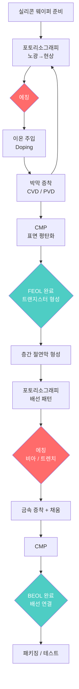
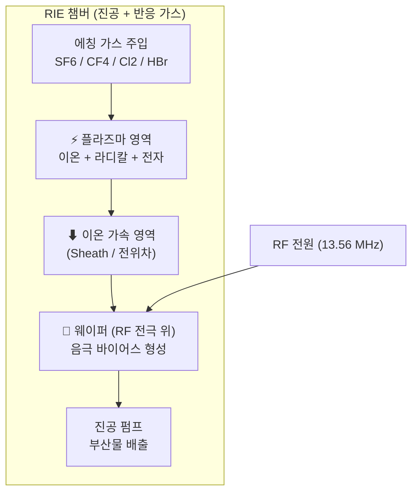
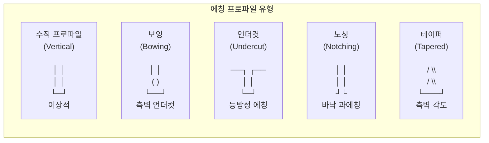

# 반도체 에칭 기술 완전 가이드

**작성**: Researcher 2 — 반도체 에칭 기술
**날짜**: 2026-03-25
**대상 독자**: 제조업 현장 엔지니어 및 비전공 교육생

---

## 들어가며

반도체 칩 하나에는 수십억 개의 트랜지스터가 들어간다. 이 미세한 구조물을 만들기 위해서는 "어디를 남기고 어디를 깎을 것인가"를 정밀하게 제어해야 한다. 이 "깎는" 공정이 바로 **에칭(Etching)**이다.

유리 공예에서 산(酸)으로 유리 표면에 그림을 새기듯, 반도체 에칭도 원리는 같다 — 단, 대상이 나노미터(nm, 머리카락 굵기의 10만 분의 1) 수준이고, 정밀도 요구가 수백 배 이상 높을 뿐이다.

---

## 1. 반도체 공정 흐름 속에서 에칭의 위치

### 1.1 전체 공정 흐름

반도체 제조는 크게 **프론트엔드(FEOL)** → **백엔드(BEOL)** → **패키징** 순서로 진행된다.



에칭은 공정 중 **수십 번** 반복된다. 포토리소그래피가 "어디를 깎을지 그림을 그리는" 단계라면, 에칭은 "실제로 깎는" 단계다.

### 1.2 포토리소그래피와 에칭의 관계

| 단계 | 역할 | 비유 |
|------|------|------|
| **노광(Exposure)** | 빛으로 포토레지스트(감광제) 경화/연화 | 사진 찍기 |
| **현상(Development)** | 불필요한 포토레지스트 제거 → 마스크 완성 | 암실에서 사진 현상 |
| **에칭(Etching)** | 마스크 없는 부분의 재료를 선택적으로 제거 | 스텐실로 페인트 칠하기 |
| **포토레지스트 제거** | 에칭 후 남은 마스크 벗겨내기 | 스텐실 제거 |

포토레지스트는 "보호막" 역할을 한다. 에칭 가스나 액체는 보호막이 없는 곳만 공격한다.

### 1.3 FEOL vs BEOL 에칭 차이

**FEOL(Front-End-of-Line, 공정 앞단)**: 트랜지스터(소자)를 만드는 단계
- 실리콘 게이트, 소스/드레인 영역 패터닝
- 다루는 재료: 실리콘(Si), 산화막(SiO₂), 질화막(Si₃N₄)
- 선폭 기준이 가장 엄격 → EUV 리소그래피 + 정밀 건식 에칭

**BEOL(Back-End-of-Line, 공정 뒷단)**: 트랜지스터를 배선으로 연결하는 단계
- 금속 배선, 비아(층 사이 연결 구멍) 형성
- 다루는 재료: 알루미늄(Al), 구리(Cu), 저유전율(Low-k) 절연막
- 다층 구조(수십 층)로 쌓아올림

| 구분 | FEOL | BEOL |
|------|------|------|
| 목적 | 트랜지스터 형성 | 배선 연결 |
| 주요 재료 | Si, SiO₂, Si₃N₄ | Cu, Al, Low-k 유전체 |
| 주요 에칭 | 게이트 에칭, 트렌치 | 비아 에칭, 다마신 |
| 요구 정밀도 | 극히 높음 (1~5 nm) | 높음 (10~100 nm 수준) |
| 온도 허용 범위 | 높음 | 낮음 (Cu 배선 손상 우려) |

> **핵심 요약**
> 에칭은 반도체 공정에서 수십 번 반복되는 핵심 단계다. 포토리소그래피가 "그림"을 그리면, 에칭이 그 그림대로 "깎는다". FEOL은 트랜지스터를 만들고, BEOL은 배선을 만든다 — 둘 다 에칭이 필수다.

---

## 2. 습식 에칭(Wet Etching) — 반도체에서의 역할

### 2.1 습식 에칭이란?

화학 액체(산, 염기)에 웨이퍼를 담가 재료를 녹이는 방식이다. 가장 단순하고 역사가 오래된 에칭 방법.

**비유**: 금속을 염산에 담그면 녹아 나오듯, 실리콘이나 산화막을 특정 산 용액에 담가 선택적으로 제거한다.

### 2.2 반도체에서 여전히 쓰이는 영역

건식 에칭이 주류가 됐지만, 습식 에칭은 여전히 중요한 곳에 쓰인다:

**1) RCA 클리닝 (세정 공정)**
- 웨이퍼 표면의 유기물, 금속 불순물, 파티클을 제거
- SC-1 (NH₄OH:H₂O₂:H₂O) → 유기물 + 파티클 제거
- SC-2 (HCl:H₂O₂:H₂O) → 금속 이온 제거
- HF 딥 (HF:H₂O) → 자연 산화막(native oxide) 제거
- 세정 공정에서는 정밀한 패터닝이 목적이 아니므로 습식으로 충분

**2) 산화막 제거 / 게이트 산화막 준비**
- 희석 HF(DHF) 로 얇은 자연 산화막을 균일하게 제거
- 반응: SiO₂ + 6HF → H₂SiF₆ + 2H₂O

**3) 사파이어(Al₂O₃) 및 화합물 반도체 에칭**
- GaN LED 제조, 화합물 반도체에서 여전히 사용

**4) MEMS 벌크 마이크로머시닝**
- KOH 용액으로 실리콘을 결정 방향 선택적으로 깎음 (이방성 습식 에칭)
- 마이크로 센서, 잉크젯 노즐 제작

### 2.3 습식 에칭의 한계 — 왜 건식으로 바뀌었나?

**핵심 문제: 등방성(Isotropic) 에칭**

습식 에칭은 모든 방향으로 균등하게 녹인다. 즉, 아래로만 깎이지 않고 옆으로도 깎인다. 이를 "언더컷(Undercut)"이라 부른다.

```
마스크 위에서 본 이상적인 에칭:    실제 습식 에칭:
┌──────────────────────┐        ┌────┐     ┌────┐
│  마스크  │  마스크  │        │마스크│ ↗ ← │마스크│
└──────────────────────┘        └────┘     └────┘
          아래로만 깎여야         ↓            ↓
                                옆으로도 침식됨
```

선폭이 수마이크로미터 이하로 내려가면, 언더컷으로 인해 패턴이 붕괴된다. 현재 반도체 선폭은 3~5 nm — 습식 에칭으로는 불가능하다.

**추가 한계**:
- 폐액 처리 (독성 화학물질, 환경 규제)
- 균일성 제어 어려움 (전체 웨이퍼에서 동일한 에칭 깊이 유지)
- 미세 구조물의 표면 장력으로 인한 손상

> **핵심 요약**
> 습식 에칭은 세정(RCA 클리닝)과 일부 특수 재료에 여전히 쓰인다. 그러나 "옆으로도 깎이는" 등방성 특성 때문에 나노미터 수준의 미세 패턴에는 사용할 수 없다 → 건식 에칭의 시대.

---

## 3. 건식 에칭(Dry Etching) — 현대 반도체의 핵심

### 3.1 플라즈마란 무엇인가?

플라즈마를 이해하면 건식 에칭의 절반을 이해한 것이다.

물질의 상태: 고체 → 액체 → 기체 → **플라즈마**

기체에 강한 에너지(전기, 마이크로파)를 가하면, 전자가 원자에서 떨어져 나온다. 이 "이온 + 전자 + 중성 입자"가 뒤섞인 상태가 **플라즈마**다.

**일상 예시**:
- 번개 = 자연 플라즈마
- 네온사인 = 유리관 안 플라즈마
- 태양 = 거대한 플라즈마 덩어리

반도체 에칭에서 플라즈마는 두 가지 역할을 동시에 한다:
1. **화학적 에칭**: 반응성 기체 라디칼(예: 불소 원자 F·)이 실리콘과 반응 → 휘발성 부산물(SiF₄) 생성 → 펌프로 제거
2. **물리적 스퍼터링**: 이온이 기판에 수직으로 충돌 → 기계적으로 원자를 날림

이 두 메커니즘의 비율을 조절함으로써 "얼마나 수직으로 깎을지"를 제어한다.

### 3.2 RIE — 반응성 이온 에칭 (Reactive Ion Etching)

**RIE는 현재 반도체 팹(fab)에서 가장 널리 쓰이는 건식 에칭 방식이다.**

#### 장비 구조



**핵심 원리**:
- 웨이퍼를 RF 전극(하부 전극) 위에 올림
- RF 전원을 가하면 웨이퍼 쪽에 음(-)의 자기 바이어스 전압 형성
- 플라즈마 중 양이온(+)이 이 전압에 끌려 **수직으로** 웨이퍼에 충돌
- 수직 충돌 → 에칭이 아래 방향으로만 진행 → 이방성(Anisotropy) 확보

**주요 공정 파라미터**:

| 파라미터 | 역할 | 조정 방향 |
|---------|------|----------|
| RF 파워 | 이온 에너지 및 플라즈마 밀도 | 높이면 에칭 속도↑, 손상↑ |
| 압력 | 이온 자유 이동 경로 | 낮추면 이방성↑ |
| 가스 종류 | 화학적 에칭 선택성 결정 | 재료별 최적 가스 선택 |
| 가스 유량 | 반응 물질 공급량 | 균일성에 영향 |
| 기판 온도 | 반응 속도, 패시베이션 제어 | 저온 → 측벽 보호 강화 |

### 3.3 DRIE와 보쉬 프로세스 — 깊이 파는 기술

**DRIE(Deep Reactive Ion Etching)**은 매우 깊고 수직인 구조를 만들기 위한 진화된 건식 에칭이다. 대표 방식이 **보쉬 프로세스(Bosch Process)**다.

보쉬 프로세스는 두 단계를 수백~수천 번 번갈아 반복한다:

**1단계 — 에칭 (SF₆ 가스 주입)**
```
SF₆ → F· 라디칼 → Si와 반응 → SiF₄(기체) 생성
방향: 등방성(위아래 + 옆으로)
```

**2단계 — 패시베이션 (C₄F₈ 가스 주입)**
```
C₄F₈ → 불소 폴리머(Teflon-like 막) 측벽에 코팅
목적: 측벽을 보호막으로 덮음
```

다음 에칭 사이클에서, 이온 충돌이 바닥의 보호막만 제거(수직 방향)하고 측벽은 남긴다 → 결과적으로 수직에 가까운 깊은 홀/트렌치 형성.

**보쉬 프로세스의 특징 — 스캘럽(Scallop)**
각 에칭 사이클이 측벽에 작은 물결 무늬(scallop)를 남긴다. 사이클을 짧게 하면 스캘럽이 줄어들지만 에칭 속도도 감소.

**DRIE 성능 지표**:
- 종횡비(Aspect Ratio): 최대 100:1 이상 달성 가능
- 에칭 깊이: 수십~수백 마이크로미터
- 대표 응용: MEMS 센서, TSV, 3D NAND

### 3.4 ICP 에칭 — 더 높은 밀도의 플라즈마

**ICP(Inductively Coupled Plasma, 유도결합 플라즈마)**는 RIE의 업그레이드 버전이다.

RIE의 단점: 플라즈마 밀도와 이온 에너지가 하나의 RF 전원으로 동시에 제어됨 → 플라즈마 밀도를 높이면 이온 에너지도 올라 손상 증가.

ICP의 해결책: **두 개의 전원을 분리**
- **코일(위부분) RF**: 플라즈마 밀도 독립 제어
- **하부 전극 RF**: 이온 에너지(바이어스) 독립 제어

결과: 고밀도 플라즈마 + 저에너지 이온 → 빠른 에칭 속도 + 낮은 손상

ICP는 DRIE의 핵심 플라즈마 소스로 사용된다. MEMS와 3D NAND 제조에 필수적이다.

### 3.5 ALE — 원자 한 층씩 깎는 기술

**ALE(Atomic Layer Etching, 원자층 에칭)**은 말 그대로 원자 한 층 단위로 제어하는 에칭이다.

ALD(원자층 증착)의 반대 개념. ALD가 "원자층씩 쌓는" 것이라면, ALE는 "원자층씩 제거"한다.

**ALE 사이클 (2단계 반복)**:

```
1단계: 표면 개질 (Surface Modification)
   반응 가스(Cl₂ 등) 흡착 → 최표면 원자층만 반응(화학 결합 변경)
   → 더 깊이 침투하지 않는 자기제한(Self-limiting) 반응
   가스 퍼지 (잔여 가스 제거)

2단계: 제거 (Removal)
   이온 또는 중성 빔 조사 → 개질된 층만 휘발
   → 아래층은 건드리지 않음
   가스 퍼지
```

**한 사이클에 제거되는 두께**: ~1 Å (0.1 nm)

ALE의 두 유형:
| 유형 | 방식 | 특징 | 적용 |
|------|------|------|------|
| **플라즈마 ALE** | 이온 강화 제거 | 이방성(수직) | 게이트 에칭, 고종횡비 구조 |
| **열적 ALE** | 열화학 반응 | 등방성, 손상 없음 | 3D 구조, 유전체 |

**왜 ALE가 중요한가?**
3nm 이하 반도체에서는 1~2 원자층의 오차가 소자 특성에 치명적이다. RIE로는 이 수준의 제어가 불가능하다. ALE는 현재 EUV 리소그래피와 함께 첨단 노드의 핵심 기술이 되었다.

> **핵심 요약**
> RIE는 이온의 수직 충돌로 이방성 에칭 → 현재 주력 기술. DRIE/보쉬 프로세스는 에칭-패시베이션 반복으로 깊은 구조 제작 가능. ICP는 플라즈마 밀도와 이온 에너지를 분리 제어. ALE는 원자층 단위 정밀 제어 → 3nm 이하 반도체의 필수 기술.

---

## 4. 핵심 개념들

### 4.1 선택비(Selectivity) — 뭘 깎고 뭘 안 깎을지

**선택비** = 목표 재료의 에칭 속도 ÷ 인접 재료(마스크, 기저층)의 에칭 속도

예) SiO₂ 에칭 속도 = 100 nm/min, 포토레지스트 마스크 에칭 속도 = 5 nm/min
→ 선택비 = 100/5 = **20:1**

높은 선택비가 중요한 이유:
- 마스크가 빨리 닳으면 패턴이 무너짐
- 아래 층(기저층)이 에칭되면 소자 손상
- BEOL Low-k 유전체 에칭: 선택비 20:1 이상 필요

**선택비를 높이는 방법**:
- 가스 종류 최적화 (CF₄ vs C₄F₈ 비율 조정)
- 온도 조절 (저온에서 측벽 보호막 형성 강화)
- 산소 또는 수소 첨가로 반응 경로 제어

### 4.2 균일성(Uniformity) — 웨이퍼 전체가 고르게

300mm 웨이퍼 전체에서 에칭 깊이 편차가 ±1% 이내여야 한다. 가장자리와 중앙의 에칭 속도 차이는 플라즈마 밀도 분포, 가스 흐름 패턴, 웨이퍼 척(chuck)의 온도 균일성에 따라 결정된다.

### 4.3 이방성(Anisotropy) — 수직으로만 깎기

이방성 = 특정 방향(수직)으로만 에칭이 진행되는 특성.

```
등방성 에칭 (Isotropic):         이방성 에칭 (Anisotropic):
┌────┐         ┌────┐           ┌────┐         ┌────┐
│마스크│         │마스크│           │마스크│         │마스크│
└────┘         └────┘           └────┘         └────┘
    ╲          ╱                    │           │
     ╲        ╱                     │           │
      ╲      ╱  ← 언더컷           │           │
       ──────                      └───────────┘
     밥그릇 모양                      수직 벽면
```

이방성이 높을수록: 수직 측벽 → 고밀도 패터닝 가능
측정: 에칭 프로파일의 수직벽 각도 (이상: 90°)

### 4.4 종횡비(Aspect Ratio)와 ARDE

**종횡비** = 구조물의 깊이 ÷ 너비

예) 깊이 1000 nm, 너비 100 nm → 종횡비 = 10:1

**ARDE(Aspect Ratio Dependent Etching, 종횡비 의존 에칭)**:
좁고 깊은 구멍일수록 에칭이 느려지는 현상. 이유:
- 반응성 가스가 좁은 구멍 바닥까지 잘 전달되지 않음
- 에칭 부산물이 배출되기 어려움
- 이온이 측벽에 충돌해 에너지 손실

실제 영향: 100 nm 홀과 500 nm 홀을 동시에 에칭하면 100 nm 홀이 훨씬 얕게 파임 → 균일한 깊이 확보가 어려움

3D NAND 제조에서 ARDE는 핵심 도전 과제다 (종횡비 100:1 이상).

### 4.5 에칭 프로파일 유형



| 프로파일 유형 | 원인 | 문제 | 대책 |
|-------------|------|------|------|
| **수직 (이상)** | 높은 이방성 | - | 이온 에너지, 압력 최적화 |
| **보잉 (Bowing)** | 측벽 보호막 부족, 이온 산란 | 홀 폭 확대, 단락 위험 | C₄F₈ 비율 증가, 저온 |
| **언더컷** | 등방성 에칭 | 마스크 아래 침식 | 이방성 강화 |
| **노칭 (Notching)** | 이온 반사, 바닥 과집중 | 바닥 손상 | 압력 제어, 가스 최적화 |
| **마이크로 로딩** | 패턴 밀도 차이 | 균일성 저하 | 더미 패턴, 플라즈마 밀도 조절 |

### 4.6 CD(Critical Dimension) 제어

CD = 트랜지스터 게이트 폭, 배선 폭 등 소자의 임계 치수.

에칭 공정이 CD에 미치는 영향:
- **CD 바이어스**: 에칭 전후 치수 차이 (목표값에서 얼마나 벗어났는가)
- 보잉이 발생하면 CD가 커짐
- 불충분한 에칭이면 CD가 작아짐

현재 최첨단 노드(3~5 nm)에서 허용 CD 오차: ±0.3 nm 이내.

> **핵심 요약**
> 선택비(무엇을 깎고 안 깎는지), 균일성(전체에 고르게), 이방성(수직으로만)이 에칭 품질의 3대 지표다. 종횡비가 높아질수록 ARDE 문제가 심화된다. 에칭 프로파일은 수직에 가까울수록 좋다.

---

## 5. 소재별 에칭

### 5.1 실리콘(Si) 에칭

**주요 가스**: SF₆, Cl₂, HBr (단독 또는 혼합)

| 가스 | 메커니즘 | 특징 | 적합 용도 |
|-----|---------|------|----------|
| **SF₆** | F 라디칼 → SiF₄ 생성 | 빠른 에칭, 등방성 강함 | DRIE 에칭 단계, 폴리실리콘 |
| **Cl₂** | Cl 라디칼 → SiCl₄ | 이방성 우수, 느린 속도 | 게이트 폴리실리콘 에칭 |
| **HBr** | Br 이온 + 측벽 보호 | 높은 선택비, 측벽 패시베이션 | Si/SiO₂ 선택 에칭 |
| **Cl₂ + HBr** | 복합 작용 | 이방성 + 선택비 균형 | DRAM 셀, FinFET |

**HBr의 역할**: HBr을 SF₆에 혼합하면 측벽에 SiBrₓ 보호막이 형성 → 측벽 에칭 억제 → 이방성 향상. 그러나 HBr은 스테인리스강 배관을 부식시키는 단점이 있어 장비 재질 관리가 필요하다.

[출처 평가: SF₆/Cl₂/HBr 가스 특성은 반도체 에칭 전문 문헌에 근거. 수치(에칭 속도)는 장비/조건에 크게 의존하므로 절대값 제시 없이 상대적 특성만 기술]

### 5.2 산화막(SiO₂) 에칭

SiO₂는 절연체로 사용되는 핵심 유전체. 트렌치, 게이트 절연막, 층간 절연막 등에 폭넓게 사용.

**주요 가스**: CF₄, C₄F₈, CHF₃, C₅F₈ (불소화탄소계, fluorocarbon)

**반응 원리**:
- 플라즈마에서 CFₓ 라디칼과 F 이온 생성
- CFₓ 라디칼이 SiO₂ 표면에 흡착 → Si-O 결합 파괴
- 반응 부산물: SiF₄(기체, 제거됨), CO₂, CO(기체)

**탄소-불소 비율(C/F ratio)**이 핵심:
- F가 많으면 → Si도 에칭됨 (선택비 저하)
- C가 많으면 → 폴리머 막이 너무 쌓임 (에칭 멈춤)
- 최적 비율 → SiO₂만 선택적으로 에칭

### 5.3 질화막(Si₃N₄) 에칭

질화막은 에칭 마스크, CMP 스톱 층, 스트레스 층 등으로 사용.

**주요 가스**: CHF₃ + O₂, CF₄ + O₂

SiO₂와 Si₃N₄의 선택적 에칭:
- Si₃N₄/SiO₂ 선택 에칭: 인산(H₃PO₄) 습식 에칭 (160°C) - 선택비 ~10:1
- 정밀 건식: CHF₃ 비율 조정으로 Si₃N₄ 우선 에칭 가능

### 5.4 금속 배선 에칭 — Al, Cu, W

**알루미늄(Al) 에칭**
- 가스: Cl₂ + BCl₃ (또는 Cl₂ + CHCl₃)
- Al은 염소 기반 플라즈마에서 AlCl₃(휘발성)로 변환 후 제거
- 주의: 노출 후 수분과 반응해 부식 → 에칭 후 즉시 포토레지스트 제거 필요

**구리(Cu) 에칭**
- Cu는 건식 에칭이 매우 어렵다. CuClₓ 등 부산물이 상온에서 비휘발성
- 해결책: **다마신(Damascene) 공정** — 트렌치 먼저 파고, Cu를 채운 후 CMP로 평탄화
- 즉, Cu 자체를 에칭하지 않고, 주변 유전체를 에칭

**텅스텐(W) 에칭**
- 가스: SF₆ + Ar (또는 NF₃)
- 비아 플러그, 게이트 전극에 사용
- WF₆로 변환되어 휘발

### 5.5 High-k / Low-k 유전체 에칭

**High-k 유전체** (HfO₂, ZrO₂ 등):
- 게이트 절연막으로 SiO₂를 대체
- 불소 기반 가스로 에칭하기 어려움 → BCl₃, Cl₂ 기반 가스 사용
- ALE로 정밀 제어하는 방향으로 발전 중

**Low-k 유전체** (다공성 SiCOH 등):
- BEOL 배선 간 기생 커패시턴스 감소 목적
- 다공성 구조로 인해 에칭 시 기공 손상 문제
- 플루오로카본 가스 + 이온 에너지 최소화 필요
- 선택비 요구: 20:1 이상

> **핵심 요약**
> 재료마다 "함께 반응하면 날아가는 가스"가 다르다. 실리콘엔 SF₆/HBr, 산화막엔 C₄F₈, 알루미늄엔 Cl₂. 구리는 건식 에칭이 어려워 다마신 공정으로 우회한다.

---

## 6. 응용 사례

### 6.1 로직 소자 에칭 — FinFET과 GAA

**FinFET (Fin Field-Effect Transistor)**
- 전통적인 평면 트랜지스터에서 지느러미(Fin) 모양의 3차원 구조로 진화
- 핵심 에칭: 실리콘 Fin 형성 — 높이 수십 nm, 폭 5~10 nm
- 요구 특성: 수직 측벽, 고선택비 (Si/SiO₂ 마스크)
- 사용 에칭: ICP-RIE + HBr/Cl₂ 기반

**GAA (Gate-All-Around)**
- 차세대 트랜지스터. 게이트가 채널을 사방에서 감쌈
- 내부 SiGe 층을 선택적으로 제거 (SiGe vs Si 선택 에칭) → 나노시트(nanosheet) 형성
- ALE가 필수적: 원자층 수준의 선택적 제거
- 삼성 3nm GAA, TSMC N2에 적용

### 6.2 3D NAND 고종횡비 에칭

**3D NAND의 구조와 도전**:
- 수십~수백 층의 산화막/질화막(ONON) 스택
- 직경 ~100 nm, 깊이 6 마이크로미터 이상의 홀 에칭
- 종횡비: 100:1 이상 (이는 머리카락 굵기의 홀을 6 m 깊이로 파는 것과 같은 비율)
- 300 mm 웨이퍼 1장에 약 100조(10¹⁴) 개의 홀

**핵심 기술**:
- **고전력 ICP-RIE** + C₄F₈/CF₄ 기반 가스
- **극저온 에칭 (Cryogenic Etching)**: -100°C 이하에서 에칭하면 측벽 보호막 형성이 강화되어 수직 프로파일 유지, 에칭 속도 2.5배 향상
- **펄스 플라즈마**: 이온과 라디칼의 비율을 시간에 따라 조절 → ARDE 억제

**ARDE 문제**: 홀이 깊어질수록 에칭이 느려지고, 홀마다 깊이 편차 발생 → 불량 메모리 셀 원인

### 6.3 MEMS 에칭

MEMS(Micro-Electro-Mechanical Systems, 초소형 기계·전자 시스템): 가속도계, 자이로스코프, 압력 센서, 마이크로폰 등

MEMS 에칭의 특징:
- 깊이 요구: 수십~수백 마이크로미터 (반도체 회로 에칭보다 훨씬 깊음)
- 선폭: 마이크로미터 단위 (반도체보다 크지만, 매우 깊어야 함)
- **DRIE/보쉬 프로세스가 핵심 기술**

응용 예:
- 스마트폰 가속도계: DRIE로 깊은 실리콘 빔 구조 제작
- MEMS 마이크로폰: 진동막 + 백플레이트 구멍 에칭
- 잉크젯 프린터 노즐: DRIE 또는 KOH 이방성 습식 에칭

### 6.4 TSV(Through Silicon Via) 에칭 — 3D 반도체 패키징

**TSV**: 실리콘 웨이퍼를 수직으로 관통하는 전기 연결 구멍
- 목적: 여러 개의 칩(메모리 + 로직)을 수직으로 쌓아 연결
- HBM(High Bandwidth Memory, 고대역폭 메모리)의 핵심 기술

**TSV 에칭 공정**:
1. DRIE/보쉬 프로세스로 수직 홀 형성 (직경 5 µm, 깊이 100 µm)
2. 산소 플라즈마로 측벽 폴리머 제거
3. SiO₂ 절연막 라이너 증착 (PECVD)
4. 구리 시드 층 + 전기도금으로 Cu 채움
5. 웨이퍼 박형화 → TSV 노출

**응용**: SK하이닉스 HBM3E, 엔비디아 GPU 메모리 적층

> **핵심 요약**
> FinFET/GAA는 3D 트랜지스터 구조를 위해 나노미터 수준의 정밀 에칭 필요. 3D NAND는 종횡비 100:1 이상의 극한 에칭 도전. MEMS는 깊고 수직인 구조가 핵심 → DRIE 활용. TSV는 칩을 수직 연결하는 관통 홀로 3D 패키징의 핵심.

---

## 7. 반증 탐색 및 비판적 검토

### 건식 에칭 만능론에 대한 반증

건식 에칭이 현대 반도체의 주력이지만, 한계도 명확히 인식해야 한다:

1. **비용**: 건식 에칭 장비(ICP-RIE, DRIE) 1대 가격 수억~수십억 원. 진공 유지, 가스 공급, 냉각 시스템 등 운영비도 높음 → 소량 생산이나 연구 목적에는 습식 에칭이 여전히 유리

2. **플라즈마 손상**: 고에너지 이온이 실리콘 격자를 손상시킬 수 있음 (표면 결함 형성) → 소자 성능 저하. 이를 최소화하기 위해 ALE, 저에너지 ICP 등 새로운 방식 개발 중

3. **ALE 생산성**: 원자층씩 제거하는 ALE는 1 Å/사이클로 생산 속도가 매우 느림. 100 nm를 제거하려면 1,000 사이클 필요 → 실제 양산에서는 RIE와 ALE를 전략적으로 조합

4. **반증 미발견**: "ALE가 기존 RIE를 완전 대체한다"는 주장에 대한 반증 - 현실적으로는 첨단 노드에서도 ALE는 특정 임계 단계에만 적용되고, 대부분 공정은 여전히 RIE 기반임

### 수치 투명성

- "종횡비 100:1" — 3D NAND 고종횡비 에칭 문헌에서 일관적으로 인용. 단, 제조사·세대별로 90:1~120:1 범위 존재. 130단 이상 3D NAND에서는 더 높아질 것으로 예측
- "ALE EPC ~1 Å/사이클" — 이 수치는 재료와 ALE 조건에 따라 0.5~3 Å까지 변동 가능. 도메인(반도체 소자)에서 직접 측정된 수치로 신뢰도 높음
- "FEOL 선택비 10:1+" — 공정 조건에 따라 5:1~100:1 이상까지 가변. 실제 목표값은 공정 마진에 따라 다름

---

## 8. 실행 연결 — 이 정보로 어떤 의사결정이 가능한가?

### 제조 현장 엔지니어를 위한 의사결정 가이드

| 상황 | 선택 기준 | 추천 방향 |
|------|----------|----------|
| 웨이퍼 세정이 목적 | 패터닝 정밀도 불필요 | 습식 에칭(RCA 클리닝) |
| 선폭 < 1 µm | 등방성 에칭 허용 불가 | 건식 에칭(RIE/ICP) |
| 깊이 > 10 µm 필요 | 고종횡비 구조 | DRIE / 보쉬 프로세스 |
| 원자층 수준 정밀도 | 손상 없는 정밀 제어 | ALE (Thermal 또는 Plasma) |
| 에칭 후 측벽이 기울어짐 | 이방성 부족 | 압력 낮추기, HBr 첨가, 온도 낮추기 |
| 서로 다른 크기 구멍의 깊이가 불균일 | ARDE 문제 | 보쉬 프로세스 사이클 최적화, 더미 패턴 추가 |
| Cu 배선 에칭 필요 | Cu 건식 에칭 불가 | 다마신 공정으로 전환 |

---

## 9. 관점 확장 — 결론을 바꿀 수 있는 인접 질문

**인접 질문 1**: "플라즈마 에칭 없는 차세대 패터닝이 등장하면?"
- EUV 리소그래피의 발전으로 에칭 횟수 자체를 줄이는 방향 연구 중
- 나노임프린트 리소그래피(NIL), 지향성 자기조립(DSA) 등이 에칭의 일부 역할을 대체할 수 있음
- 단, 2030년 이전 완전 대체는 어렵다는 것이 업계 컨센서스

**인접 질문 2**: "에칭이 아닌 증착으로 패턴을 만들면?"
- 선택적 증착(Selective Deposition) 기술 발전 중 → ALD를 응용해 특정 재료 위에만 막을 성장
- 에칭-증착의 경계가 흐려지는 방향 → "에칭 보완" 기술로 성장 예상

**[이질 도메인: 유체역학]** ARDE의 핵심 구조(좁은 채널에서 물질 전달 속도 저하)는 유체역학의 "층류 유동 내 물질 전달(diffusion-limited transport)"과 동일한 구조다. 미세 채널 생화학 반응기(microfluidic bioreactor) 설계에서 ARDE와 유사한 문제를 산소 농도 균일화로 해결한 사례가 있으며, 플라즈마 에칭에서의 가스 흐름 패턴 최적화에 차용 가능한 패턴이다.

**문제 재정의**: 이 분야의 더 적절한 핵심 질문은 "어떻게 깎는가"에서 "어떻게 원하는 형상을 정확히 얻는가"로 이동 중이다 — 에칭만이 아니라 에칭+증착+리소그래피의 복합 공정 최적화가 실제 문제의 본질이다.

---

## 참고 출처

1. Lam Research — "Etch Essentials: Semiconductor Manufacturing" (2024): https://newsroom.lamresearch.com/etch-essentials-semiconductor-manufacturing
2. Wevolver — "Dry Etching vs Wet Etching: A Comprehensive Comparison" (2023): https://www.wevolver.com/article/dry-etching-vs-wet-etching
3. SciPlasma — "How Plasma Dry Etching Works: A Step-by-Step Explanation" (2023): https://www.sciplasma.com/post/plasma-etching-overview-1
4. ChipEdge — "The Science of Etching Process in the Semiconductor Industry" (2023): https://www.chipedge.com/resources/the-science-of-etching-process-in-the-semiconductor-industry/
5. Micronit — "Etching Techniques: The Basics for Precision Manufacturing": https://micronit.com/expertise/manufacturing-expertise/dry-etching
6. Cadence — "Wet Etching vs. Dry Etching" (2024): https://resources.pcb.cadence.com/blog/2024-wet-etching-vs-dry-etching
7. Top Seiko — "Semiconductor Etching Processes" (2024): https://top-seiko.com/news/12181/
8. ASU Core Research Facilities — "Techniques: Dry Etch": https://cores.research.asu.edu/nanofabrication-and-cleanroom/techniques-dry-etch
9. Semicorex — "Understanding Dry Etching Technology in the Semiconductor Industry" (2024): https://www.semicorex.com/news-show-5162.html
10. JVST B (2022) — "Kun-Chieh Chien and Chih-Hao Chang: HBr etching profile improvement" (DOI: 10.1116/6.0002109)

---

*Researcher 2 산출물 — 반도체 에칭 기술 / 2026-03-25*
