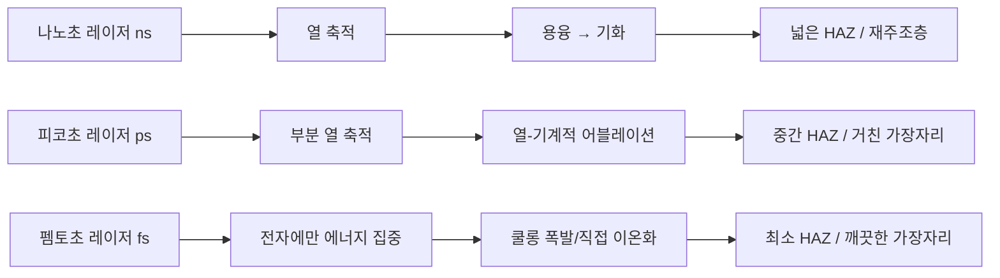
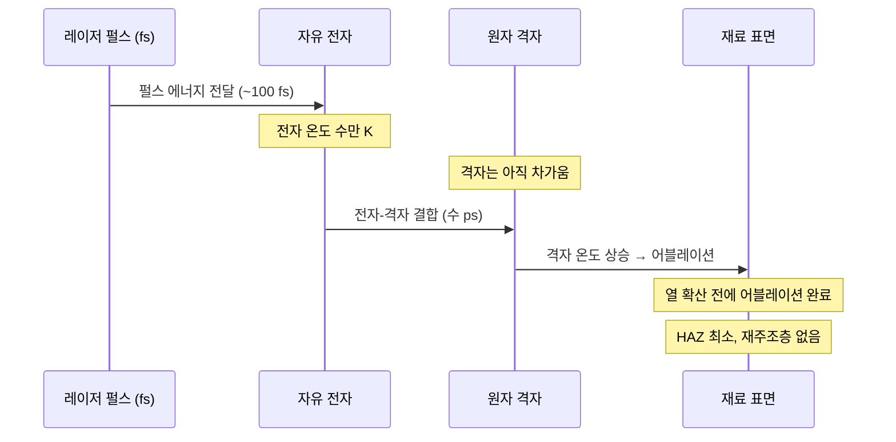
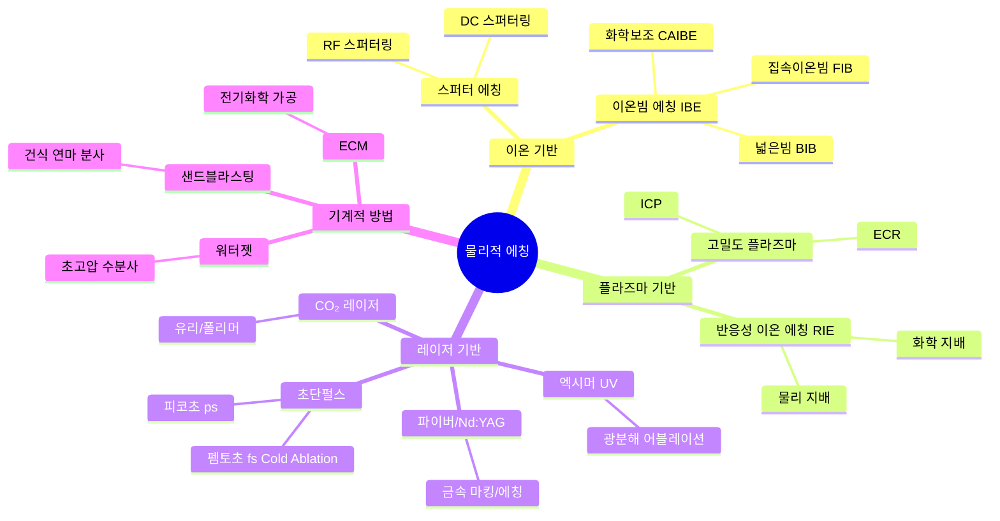
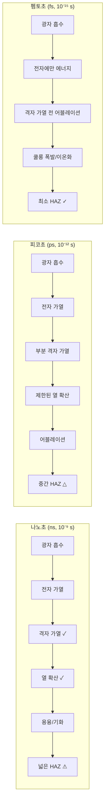
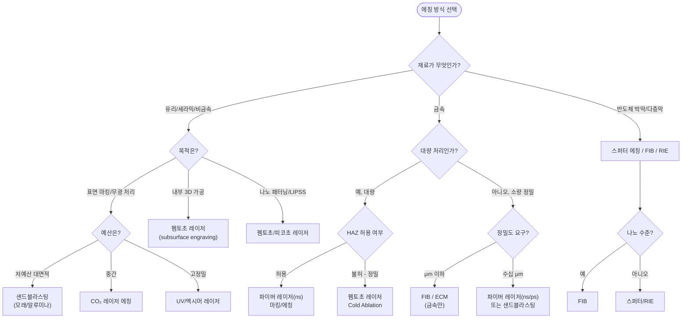

# 물리적 에칭 심층 가이드
**Researcher 3 산출물 | 2026-03-25**

---

## 목차
1. 물리적 에칭의 기본 원리
2. 스퍼터 에칭 (Sputter Etching / Ion Milling)
3. 이온빔 에칭 (Ion Beam Etching, IBE)
4. 플라즈마 에칭 (물리적 관점)
5. 레이저 에칭 / 레이저 어블레이션
6. 기타 물리적 에칭 기법
7. 방식별 비교표
8. Researcher 메타 노트

---

## 1. 물리적 에칭의 기본 원리

### 1.1 화학적 에칭과의 근본적 차이

에칭(etching)이란 재료 표면의 일부를 **선택적으로 제거**하는 공정이다. 제거 방식에 따라 크게 두 가지로 나뉜다.

**화학적 에칭(Chemical Etching)**은 산, 염기, 용제 같은 화학물질이 재료와 **반응**하여 녹여 없애는 방식이다. 식초가 달걀껍데기를 서서히 녹이는 것과 같다. 반응이 등방성(isotropic)으로 일어나므로 가로·세로 모든 방향으로 파고든다.

**물리적 에칭(Physical Etching)**은 화학 반응 없이 **운동에너지를 가진 입자**가 재료 표면에 충돌하여 원자를 물리적으로 때려내는 방식이다. 마치 모래분사기(샌드블라스터)로 돌에 모래를 쏴서 글자를 새기는 것처럼, 입자가 빠를수록 더 많이 파낸다.

| 구분 | 화학적 에칭 | 물리적 에칭 |
|------|------------|------------|
| 제거 원리 | 화학 반응(용해) | 입자 충돌(운동에너지) |
| 방향성 | 등방성(사방으로 파임) | 이방성(주로 수직 방향) |
| 선택성 | 재료별 선택 가능 | 물질에 비교적 무관 |
| 환경 | 습식(액체 화학약품) | 건식(진공 또는 가스) |
| 적용 규모 | 대량 처리 용이 | 정밀 패터닝에 강점 |

### 1.2 운동에너지로 재료를 제거하는 원리 — 일상 비유

**비유 1: 모래분사기(샌드블라스터)**
공기총으로 모래알을 유리에 쏘면 표면이 긁힌다. 모래알 하나하나가 표면 원자를 두드려 쫓아내는 것이다. 물리적 에칭도 같다. 다만 반도체 공정에서는 '모래'가 아르곤(Ar) 같은 비활성 기체 이온(전하를 가진 원자)이고, '공기총' 대신 전기장으로 가속한다.

**비유 2: 당구공 충돌**
당구 큐로 공을 치면 다른 공들이 흩어진다. 이온(빠른 공)이 표면 원자(정지 공)에 부딪히면 원자가 표면 밖으로 튕겨나온다. 이것이 **스퍼터링(sputtering)**의 핵심이다.

**운동에너지와 제거량의 관계**:
- 이온 에너지 증가 → 스퍼터 수율(sputtering yield) 증가
- 일반적으로 이온 에너지 100~1,000 eV 범위에서 효율 최고
- 너무 낮으면(~10 eV 이하) 스퍼터링 발생 안 함 (결합 에너지 미달)

### 1.3 물리적 에칭의 공통 장단점

**장점**
- **재료 비선택성**: 어떤 재료든 물리적으로 쳐내므로, 화학적으로 반응하기 어려운 귀금속, 내화성 금속, 세라믹 등도 에칭 가능
- **이방성(anisotropy)**: 이온이 수직 방향으로 쏟아지므로 수직 벽면(vertical wall) 구현 가능 → 미세 패턴 구현에 유리
- **건식 공정**: 액체 화학약품 불필요 → 오염 위험 감소, 환경 부담 감소
- **패턴 정밀도**: ±0.005mm 수준까지 제어 가능 [출처: 물리적 에칭 vs 화학적 에칭 비교 연구, Wevolver 2023]

**단점**
- **재증착(redeposition)**: 쫓겨난 원자가 다른 곳에 다시 붙는 문제
- **낮은 선택비(selectivity)**: 원하는 재료만 골라 에칭하기 어려움 → 마스크도 같이 깎임
- **처리량(throughput) 제한**: 대부분 낱개 처리 → 대량 생산에 불리
- **장비 비용**: 진공 챔버, 이온 소스 등 고가 장비 필요

> **핵심 요약**
> 물리적 에칭은 "입자로 두드려서 원자를 떼어내는" 방식이다. 화학 반응 없이도 어떤 재료든 에칭할 수 있고, 수직 패턴을 잘 만들 수 있지만, 느리고 재증착 문제가 있다. 정밀도가 중요할 때, 화학적으로 처리하기 어려운 재료를 다룰 때 강점을 발휘한다.

---

## 2. 스퍼터 에칭 (Sputter Etching / Ion Milling)

### 2.1 원리: 비활성 가스 이온의 물리적 충돌

스퍼터 에칭은 **아르곤(Ar) 같은 비활성 기체**를 이온화하여 전기장으로 가속한 뒤, 시료 표면에 충돌시켜 재료를 물리적으로 제거하는 방법이다.

**왜 아르곤인가?**
아르곤은 화학적으로 불활성이다. 즉, 표면 재료와 반응하지 않고 오직 물리적 충격만 준다. 또한 지구 대기에 약 1% 포함되어 있어 저렴하고, 원자량이 커서(40 amu) 충돌 효율이 높다. 이 때문에 "순수 물리적" 에칭을 원할 때 Ar+가 표준이다.

**스퍼터링 수율(Sputtering Yield, S)**:
- S = 방출된 표면 원자 수 / 입사 이온 수
- 예: Ar+ 500 eV로 실리콘(Si) 에칭 시 S ≈ 0.5 (이온 1개당 원자 0.5개 제거)
- 같은 조건에서 금(Au) S ≈ 2.8 — 연한 금속일수록 잘 깎임
- [출처 평가: 수치는 반도체 공학 문헌(HZDR 연구소 FIB 스퍼터링 보고서) 기준. 실제 값은 이온 각도, 표면 상태에 따라 ±20% 편차 가능]

### 2.2 장비 구조와 공정 파라미터

```
[스퍼터 에칭 장비 기본 구조]

┌─────────────────────────────┐
│      진공 챔버 (10⁻³ Torr)   │
│                              │
│  [Ar 가스 주입] → [이온화]    │
│       ↓                      │
│  [전극(캐소드)] ← RF 전력     │
│       ↓                      │
│  [Ar+ 이온 가속 (수백 eV)]    │
│       ↓                      │
│  [시료 (에칭 대상)]           │
│       ↓ 에칭 후               │
│  [배기 펌프]                  │
└─────────────────────────────┘
```

**핵심 공정 파라미터**

| 파라미터 | 일반 범위 | 영향 |
|---------|----------|------|
| 이온 에너지 | 100–1,000 eV | 높을수록 에칭 속도 ↑, 표면 손상 ↑ |
| 이온 전류 밀도 | 0.1–1 mA/cm² | 균일도에 영향 |
| 챔버 압력 | 10⁻⁴ ~ 10⁻² Torr | 낮을수록 이온-중성 충돌 감소 → 이방성 향상 |
| 입사각 | 0°–90° | 0°(수직) → 이방성, 45°–60° → 스퍼터 수율 최대 |
| 기판 온도 | 실온~200°C | 재증착, 표면 이동도에 영향 |

### 2.3 장점 / 단점

**장점**
- **소재 무관**: 화학 반응이 없으므로 귀금속(Pt, Au), 내화금속(W, Mo), 산화물, 질화물 모두 에칭 가능
- **원소 조성 변화 없음**: 합금이나 복합재 에칭 시 조성 변화 최소
- **청결한 표면**: 화학 잔류물 없음

**단점**
- **느린 속도**: 화학적 에칭 대비 1/10~1/100 수준
- **재증착(redeposition)**: 쫓겨난 원자가 시료 옆면이나 마스크에 다시 붙음 → 측벽 오염
- **낮은 선택비**: 재료 간 에칭 속도 차이 작음 → 마스크 두껍게 써야 함
- **이온빔 손상**: 결정 구조 손상(amorphization), 이온 주입 가능성

### 2.4 응용 분야

- **다층 박막 패터닝**: MRAM(자기저항 메모리), 자성 소자 제조 — 화학적 에칭으로 패터닝하기 어려운 CoFeB, MgO 등 식각
- **금속 에칭**: Pt, Ir, Ru처럼 반응성 이온 에칭(RIE)에 적합한 가스가 없는 귀금속
- **TEM(투과전자현미경) 시편 준비**: 수십 nm 두께 박편을 균일하게 감면
- **광학 소자 제조**: 박막 필터, 회절격자

> **핵심 요약**
> 스퍼터 에칭은 "Ar 이온으로 두드리는" 가장 순수한 물리적 에칭이다. 어떤 재료든 식각할 수 있지만 느리고, 떨어진 원자가 다시 붙는 재증착 문제가 있다. 귀금속이나 복합 산화물처럼 화학적 방법이 통하지 않는 재료에 필수적으로 사용된다.

---

## 3. 이온빔 에칭 (Ion Beam Etching, IBE)

### 3.1 집속 이온빔(FIB)과 넓은빔 이온 에칭의 차이

**넓은빔 이온 에칭(Broad Ion Beam, BIB)**은 앞서 설명한 스퍼터 에칭과 유사하게 큰 면적을 균일하게 에칭한다. 마스크로 패턴을 정의하고 일괄 에칭한다.

**집속 이온빔(Focused Ion Beam, FIB)**은 이온빔을 전자기 렌즈로 수nm~수십nm 지름으로 좁혀서, 마스크 없이 직접 원하는 위치만 에칭한다. 전자현미경(SEM)처럼 이미지를 보면서 동시에 원하는 곳을 깎을 수 있다.

**비유**: 넓은빔은 붓으로 넓게 칠하는 것이고, FIB는 바늘 끝으로 정밀하게 새기는 것이다.

### 3.2 FIB의 원리와 갈륨(Ga+) 이온 소스

FIB의 이온 소스는 대부분 **액체금속 이온 소스(LMIS: Liquid Metal Ion Source)**를 사용하며, 갈륨(Ga)이 표준이다.

**왜 갈륨인가?**
- 융점 29.8°C — 손으로 잡으면 녹는 금속 → 쉽게 액화 가능
- 증기압 낮음 → 고진공에서 안정적
- 스퍼터링 수율 적절 → 제어 쉬움
- 단점: Ga 이온이 시료에 주입(implantation)됨 → 오염 우려

**FIB 에칭 작동 원리**:
1. 갈륨 금속을 텅스텐 바늘 끝에 녹여 유지
2. 강한 전기장(10⁸ V/m)으로 Ga+ 이온 추출
3. 전자기 렌즈 계열로 이온빔 집속 (빔 지름 5~10 nm)
4. 갈바노미터(galvanometer) 미러로 빔을 XY 방향으로 이동
5. Ga+ 이온(가속 전압 5~30 kV)이 시료 표면에 충돌 → 국소적 스퍼터 에칭

**에칭 분해능**: FIB는 5~10 nm 수준의 가공이 가능하다 [출처: Intel Corporation FIB 응용 발표, 캘리포니아 주립대 물리학 세미나 2009].

### 3.3 CAIBE — 화학 보조 이온빔 에칭

CAIBE(Chemically Assisted Ion Beam Etching)는 순수 물리 에칭인 IBE에 반응성 가스를 추가하여 에칭 속도와 선택비를 높인 하이브리드 방식이다.

**원리**:
- Ar+ 이온으로 물리적 충격을 주는 동시에
- 반응성 가스(Cl₂, XeF₂, H₂O 등)를 표면에 공급
- 이온 충격으로 활성화된 표면이 가스와 반응 → 휘발성 화합물 생성 → 에칭 가속

**비유**: 당구공(이온)이 바닥(표면)을 치고, 그 충격으로 느슨해진 원자가 용매(반응성 가스)에 용해되는 것과 같다.

**CAIBE vs IBE 비교**

| | IBE (순수) | CAIBE (하이브리드) |
|--|-----------|-----------------|
| 에칭 속도 | 낮음 | 높음 (2~10배) |
| 선택비 | 낮음 | 중간 |
| 재증착 | 있음 | 감소 |
| 복잡도 | 낮음 | 높음 |

### 3.4 응용 분야

- **나노 패터닝**: 포토닉 결정, 양자점 어레이, MEMS 소자
- **IC 수정(Circuit Edit)**: 반도체 칩에서 배선을 직접 끊거나 연결 — 인텔이 CPU 디버깅에 사용
- **단면 분석(Cross-Section)**: SEM-FIB 복합 장비로 소자 단면을 나노미터 정밀도로 절개해 내부 구조 관찰
- **마스크 리페어**: EUV 포토마스크의 결함을 수nm 단위로 수정
- **TEM 시편 제작**: 특정 위치의 초박막 라멜라(lamella) 제작

> **핵심 요약**
> FIB는 "갈륨 이온 바늘"로 나노미터 수준에서 자유롭게 조각하는 도구다. 마스크 없이 직접 가공하므로 유연성이 극대화되지만, 처리량이 매우 낮고 갈륨 오염 문제가 있다. 반도체 연구·개발 현장에서 단면 분석과 회로 수정에 없어서는 안 될 도구다.

---

## 4. 플라즈마 에칭 — 물리적 관점

### 4.1 플라즈마란 무엇인가?

플라즈마(plasma)는 물질의 4번째 상태다. 고체→액체→기체 다음 단계로, 기체에 강한 에너지를 가하면 전자가 원자에서 떨어져 나와 이온과 전자가 뒤섞인 **전기적으로 활성화된 기체**가 된다.

**비유**: 형광등 내부가 플라즈마다. 전기를 넣으면 안의 수은 기체가 이온화되어 빛을 낸다. 에칭용 플라즈마는 이 이온들을 전기장으로 방향성 있게 가속한다.

### 4.2 순수 물리적 플라즈마 에칭 vs RIE의 경계

플라즈마 에칭은 물리적 요소와 화학적 요소가 섞여 있다. 스펙트럼으로 이해하면 쉽다:

```
[순수 물리적] ←────────────────────────────→ [순수 화학적]
  스퍼터 에칭    이온빔 에칭    RIE      플라즈마 화학 에칭
    (Ar+만)   (Ar+, 일부 가스) (반응 가스+이온) (반응 가스만)
```

**RIE(Reactive Ion Etching, 반응성 이온 에칭)**는 물리적 이온 폭격 + 화학 반응이 동시에 일어나는 가장 널리 쓰이는 방식이다. CF₄, SF₆, Cl₂ 등 반응성 가스를 사용하며, 이온이 화학 반응을 활성화(시너지 효과)한다.

**물리적 메커니즘이 지배적인 경우**: 순수 Ar 가스, 높은 이온 에너지, 낮은 압력

### 4.3 DC 스퍼터링 vs RF 스퍼터링

| | DC 스퍼터링 | RF 스퍼터링 |
|--|------------|------------|
| 전원 | 직류(DC) | 교류(RF, 13.56 MHz) |
| 대상 재료 | 금속(전도체)만 | 금속 + 절연체 모두 |
| 원리 | 직류 전압으로 이온 가속 | 교번 전기장으로 전하 축적 방지 |
| 장점 | 단순, 저렴 | 절연체 에칭/증착 가능 |
| 문제 | 절연체에서 전하 축적 → 아킹 | 시스템 복잡 |

**왜 RF인가?** 유리, 세라믹처럼 전기가 통하지 않는 절연체에 DC를 쓰면 표면에 전하가 쌓여 방전(아킹, arcing)이 발생하고 에칭이 불균일해진다. RF는 전기장 방향을 초당 1,356만 번 바꿔서 전하 축적을 막는다.

### 4.4 에칭 챔버의 핵심 파라미터

**압력(Pressure)**
- 낮은 압력 (1~50 mTorr): 이온과 중성 원자의 충돌 감소 → 이온 방향성 유지 → 이방성 에칭
- 높은 압력 (50~500 mTorr): 충돌 많아짐 → 등방성 에칭 → 언더컷 발생 가능

**RF 파워(Power)**
- 높을수록 이온 밀도 ↑, 에칭 속도 ↑
- 과도하면 마스크 손상, 기판 온도 상승

**가스 유량(Flow Rate)**
- 반응 가스 유량 증가 → 화학적 에칭 비중 ↑
- 불활성 가스(Ar) 유량 증가 → 물리적 에칭 비중 ↑

### 4.5 ECR — 전자 사이클로트론 공명 플라즈마

ECR(Electron Cyclotron Resonance)은 고밀도 플라즈마를 생성하는 방식이다. 자기장 속에서 전자가 원을 그리며 회전(사이클로트론 운동)하는 주파수와 마이크로파 주파수를 일치시켜 전자에 에너지를 효율적으로 전달한다.

**비유**: 그네를 밀 때 그네의 흔들리는 주기와 맞춰 밀면(공명) 에너지가 가장 효율적으로 전달된다. ECR도 전자의 자연 회전 주파수에 맞춰 에너지를 넣는다.

**ECR vs 일반 RIE 비교**

| | 일반 RIE | ECR |
|--|---------|-----|
| 동작 압력 | 50–500 mTorr | 0.2–10 mTorr |
| 이온 밀도 | 10⁹–10¹⁰ cm⁻³ | 10¹¹–10¹² cm⁻³ |
| 이온 에너지 | 비교적 높음 | 독립 제어 가능 |
| 장점 | 단순, 범용 | 저압·고밀도 → 고종횡비(HAR) 에칭에 유리 |
| 적용 | 범용 반도체 | III-V 소자, 초미세 패터닝 |

[출처: Pearton et al., 37th Annual Technical Conference, 1994 / 비교 데이터 반도체 III-V 소자 도메인. 일반 실리콘 공정 수치와 일부 차이 가능]

> **핵심 요약**
> 플라즈마 에칭은 물리적 이온 폭격과 화학 반응의 혼합이다. 가스 종류, 압력, 파워로 물리/화학 비율을 조절한다. RF 전원은 절연체 에칭을 가능하게 하고, ECR은 더 정밀한 고밀도 플라즈마를 만들어 차세대 초미세 소자에 사용된다.

---

## 5. 레이저 에칭 / 레이저 어블레이션

레이저 에칭은 레이저 업무 종사자에게 가장 관련성이 높은 영역이다. 기존 스퍼터/이온빔 에칭이 진공 장비 기반의 반도체 공정에 집중된 반면, 레이저 에칭은 **유리, 금속, 세라믹, 폴리머**를 포함한 훨씬 넓은 범위에서 산업 현장에서 활용된다.

### 5.1 레이저 에칭의 원리: 열적 vs 비열적(콜드) 어블레이션

**열적 어블레이션(Thermal Ablation)**
레이저 에너지가 재료에 흡수되어 **열로 변환**된다. 재료가 녹고 기화하면서 제거된다. 나노초(ns) 이상의 긴 펄스 레이저에서 일어난다.

- 메커니즘: 광자 흡수 → 전자 여기 → 격자 진동(열) → 온도 상승 → 용융/기화
- 열 영향부(HAZ, Heat-Affected Zone): 레이저 스폿 주변으로 열이 전도되어 의도치 않은 영역에 열 손상 발생
- 문제점: 재주조층(recast layer), 균열, 버(burr) 발생

**비열적 어블레이션(Cold Ablation) — 펨토초/피코초 레이저**
초단펄스 레이저는 **펄스 지속 시간이 열 확산 시간보다 훨씬 짧다**. 에너지가 전달되는 동안 열이 주변으로 확산할 시간이 없다.

- 메커니즘: 극초단 펄스로 전자에 에너지 집중 → 다광자 흡수 → 재료 직접 기화/이온화 (Coulomb explosion)
- HAZ 최소화: 열 확산 전에 어블레이션 완료
- 결과: 날카로운 경계면, 재주조층 없음, 마이크로 크랙 최소

**비유**:
- 나노초 레이저 = 느린 다리미 → 열이 퍼져 주변이 눌림
- 펨토초 레이저 = 순간 번개 → 닿는 순간만 작용하고 열이 퍼지기 전에 끝남



**펄스 길이별 비교**

| 펄스 | 시간 범위 | 열적 특성 | 정밀도 | HAZ | 대표 응용 |
|------|----------|----------|--------|-----|----------|
| 나노초(ns) | 10⁻⁹ s | 열 주도 | 낮음 | 큼 | 마킹, 절단 |
| 피코초(ps) | 10⁻¹² s | 중간 | 중간 | 중간 | 미세 가공 |
| 펨토초(fs) | 10⁻¹⁵ s | 비열적 | 매우 높음 | 최소 | 나노 패터닝, 유리 내부 가공 |

### 5.2 레이저 종류별 특성

#### CO₂ 레이저 (파장: 10.6 μm, 적외선)

**특성**:
- 파장이 길어 **유리, 아크릴, 폴리머**에 잘 흡수됨
- 금속에는 반사율이 높아 비효율적
- 연속파(CW) 또는 펄스 모드 모두 가능
- 출력 범위: 수십 W ~ 수 kW

**유리 에칭**:
- CO₂ 레이저는 유리에서 열적 에칭을 일으킨다
- 표면에서 미세 균열(micro-fracture)을 생성 → 서리낀 효과(frosted appearance)
- 정밀 패터닝보다는 **텍스처링, 표시 마킹**에 적합
- 주의: 두꺼운 유리나 급격한 온도 변화 시 파열 위험

**폴리머 에칭**:
- 아크릴, PET, 피혁 등 비금속 재료에 최적
- 가죽 텍스처 제품의 표면 패터닝에 널리 사용

#### Nd:YAG / 파이버 레이저 (파장: 1.064 μm, 근적외선)

**특성**:
- 파장이 CO₂의 1/10 → 집광 스폿 크기 1/10 → 에너지 밀도 최대 100배
- 금속에서 흡수율 높음 → 금속 가공 최적화
- 파이버 레이저: 유지보수 불필요, 수명 25,000 시간+

**금속 에칭/마킹**:
- 스테인리스, 탄소강, 알루미늄, 구리에 적합
- **어닐링 마킹(annealing marking)**: 금속을 녹이지 않고 산화막을 형성 → 색상 변화로 마킹
- **제거 마킹(ablation marking)**: 표면 재료를 실제로 제거하여 홈 생성
- MOPA(Master Oscillator Power Amplifier) 파이버 레이저: 펄스 폭 4~200 ns 조절 가능 → 정밀 제어

**실무 파라미터 예시** (파이버 레이저 금속 마킹):
| 재료 | 출력 | 속도 | 펄스 반복률 |
|------|------|------|------------|
| 스테인리스(마킹) | 20–50 W | 500–2,000 mm/s | 20–100 kHz |
| 알루미늄(에칭) | 30–80 W | 200–800 mm/s | 50–200 kHz |
| 구리(마킹) | 50–100 W | 300–1,000 mm/s | 20–80 kHz |

[수치 출처: GWEIKE 공장 실측 데이터, Trotec Laser 기술 자료. 기기별·재료 두께별 편차 ±30% 가능]

#### 엑시머 레이저 (파장: 193–351 nm, UV)

**특성**:
- 자외선(UV) 파장 → 광자 1개의 에너지 높음 → **광분해(photodissociation)** 가능
- 빛 에너지로 분자 결합을 직접 끊음 → 화학적 분해에 가까운 메커니즘
- 대표 가스: ArF(193 nm), KrF(248 nm), XeCl(308 nm)

**고분자/세라믹 에칭**:
- 폴리이미드(PI), PTFE 등 유기물의 C-C 결합을 직접 파괴
- HAZ 거의 없음 → 의료용 카테터, 마이크로 유체 소자 제작에 사용
- 세라믹 표면 미세 패터닝

**유리 에칭**:
- SiO₂ 결합을 광분해하여 표면 나노 구조 생성 가능
- 엑시머 레이저 리소그래피에서 포토마스크 패턴 전사

#### 초단펄스 레이저 — 피코초/펨토초 레이저

**냉각 어블레이션(Cold Ablation)의 실제 메커니즘**:



**유리에서의 특이성**:
유리는 열전도율이 매우 낮다(약 1 W/m·K, 알루미늄의 1/200). 따라서 레이저 열이 퍼져나가지 않고 집중된다. 펨토초 레이저는 이 특성을 활용하여:
- **표면 에칭**: 서브마이크론 해상도 패터닝
- **내부 마킹(subsurface engraving)**: 레이저 초점을 내부에 맞춰 표면 손상 없이 내부 균열/기포 생성 → 3D 크리스탈 아트
- **스텔스 다이싱(stealth dicing)**: 내부에 균열선을 만들어 외력으로 깔끔하게 절단

**금속에서의 펨토초 레이저**:
- 표면 산화막을 정밀 제거 → 클리닝
- LIPSS 생성 (다음 섹션 참조)
- 마이크로 구멍(micro-hole) 가공: 연료 분사 노즐, 터빈 블레이드 냉각홀

### 5.3 LIPSS — 레이저 유도 주기적 표면 구조

LIPSS(Laser-Induced Periodic Surface Structures)는 레이저 가공 현장에서 종종 예상치 못하게 발생하거나, 반대로 의도적으로 생성하는 흥미로운 현상이다.

**원리**:
레이저가 금속이나 유리 표면에 조사될 때, **레이저 빔과 표면에서 형성된 표면 전자기파(surface electromagnetic wave)의 간섭**이 일어나 주기적 세기 패턴이 생긴다. 이 패턴에 따라 재료 제거가 주기적으로 일어나 나노 규모의 줄무늬(ripple)가 형성된다.

**비유**: 바닷가에서 파도가 밀려오면 모래사장에 규칙적인 파문이 생기는 것처럼, 레이저파와 표면파의 간섭이 규칙적인 표면 패턴을 만든다.

**LIPSS 특성**:
- 주기: 레이저 파장의 0.5~1배 (수백 nm)
- 방향: 레이저 편광에 수직(금속에서 HSFL: High Spatial Frequency LIPSS) 또는 평행(LSFL)
- 형성 조건: 다중 펄스 조사, 적절한 플루언스(fluence, J/cm²)

**LIPSS의 응용**:
- **반사 방지(anti-reflection)**: 표면 반사율 95% → 0.1% 수준으로 감소
- **친수/소수성 제어**: 생의료 임플란트 표면 기능화
- **마찰 제어**: 윤활 특성 조절 — 자동차 엔진 부품
- **착색(coloring)**: 금속 표면에 나노 구조로 구조색(structural color) 생성
- **가스 센서**: 반응 표면적 극대화

**실무 생성 조건** (금속 기준):
- 파장: 343 nm UV, 800 nm Ti:sapphire 등
- 펄스 에너지: 1.5~3 μJ (반복률 10–250 kHz)
- 기판: 크롬/은 박막 유리 위에서 재현성 확인됨
[출처: Springer Applied Physics A, 2025 — Cr/Ag 박막 LIPSS 연구]

### 5.4 글라스 레이저 에칭 실무

**표면 구조화(surface structuring)**:
- CO₂: 무광 처리, 로고 마킹
- 파이버/UV: 정밀 선각 에칭
- 펨토초: 나노 패턴, LIPSS 생성

**내부 마킹(subsurface engraving)**:
- 레이저 초점을 유리 내부 정확한 위치에 맞춤
- 내부에 미세 균열/기포 어레이 생성
- 출력: 0.5–5 W / 속도: 10–100 mm/s / 펄스: ns~ps
- 적용: 크리스탈 기념품, 의료기기 인식 마킹, 보안 마킹

### 5.5 메탈 레이저 에칭 실무

**마킹(marking)**: 공구 번호, QR코드 → 파이버 레이저 표준
**텍스처링(texturing)**: 마찰 계수 조절, 접착력 향상 → 자동차/항공 부품
**미세 패터닝**: MEMS, 마이크로 유체 소자 → 펨토초 레이저

### 5.6 레이저 에칭 vs 화학적 에칭 비교

| 항목 | 레이저 에칭 | 화학적 에칭 |
|------|-----------|------------|
| 정밀도 | 수 μm ~ 수십 nm (펨토초) | 수 μm ~ 수십 μm |
| 속도 | 중간 (점-by-점 스캔) | 빠름 (일괄 처리) |
| HAZ | 나노초: 있음 / 펨토초: 거의 없음 | 없음 (등방성 부식만) |
| 환경 | 건식, 화학 폐기물 없음 | 산/염기 폐수 처리 필요 |
| 비용 | 장비 고가 ($10K–$1M+) | 장비 저렴, 소재 비용 있음 |
| 유연성 | 높음 (패턴 변경 즉시) | 낮음 (마스크 재제작 필요) |
| 소재 제한 | 광 흡수율에 따름 | 화학 반응성에 따름 |
| 3D 가공 | 유리 내부 등 가능 | 표면만 가능 |

> **핵심 요약**
> 레이저 에칭은 단순 마킹에서 나노 구조 생성까지 폭넓은 응용이 가능하다. 핵심은 펄스 길이 선택이다: 나노초는 빠르고 저렴하지만 열 손상이 있고, 펨토초는 HAZ 없이 초정밀 가공이 가능하지만 고가다. 유리 내부 마킹이나 금속 LIPSS 생성 같은 독특한 응용은 다른 에칭 방법으로는 대체 불가능하다.

---

## 6. 기타 물리적 에칭 기법

### 6.1 샌드블라스팅 — 전통적 방법

샌드블라스팅(Abrasive Blasting, 연마 분사)은 압축공기로 연마 입자를 고속 분사하여 표면을 에칭하는 방법이다. 진공 없이 상온·상압에서 작동하는 가장 직관적인 물리적 에칭이다.

**작동 원리**:
- 연마재(모래, 알루미나, 글라스 비드, SiC 분말) → 압축공기(0.3–0.8 MPa)로 가속 → 시료 표면에 충돌 → 미세 파편 제거

**주요 연마재 비교**:
| 연마재 | 입자 형상 | 경도 (Mohs) | 특징 |
|--------|----------|------------|------|
| 모래(SiO₂) | 각진 | 6.5–7 | 저렴, 유리 먼지 유해 |
| 알루미나(Al₂O₃) | 각진 | 9 | 고경도, 재사용 가능 |
| 글라스 비드 | 구형 | 5.5–6 | 부드러운 피닝 효과 |
| SiC | 각진 | 9–9.5 | 초고경도 재료 가공 |

**유리 샌드블라스팅**:
- 마스킹 테이프나 비닐 마스크로 보호 영역 설정
- 노출 부위에 알루미나/SiC 분사 → 무광 서리 질감
- 표면 거칠기 Ra: 1.2–3.5 μm 달성 가능

**금속 샌드블라스팅**:
- 녹, 오염물 제거 (블라스트 클리닝)
- 코팅 접착력 향상을 위한 앵커 패턴(anchor pattern) 생성
- 단점: 과도하면 치수 변화, 형상 왜곡

**한계**:
- 패턴 정밀도: 0.5mm 이하 구현 어려움
- 깊이 제어: 어려움 → 균일 심도 유지 위해 숙련 필요
- 분진 관리: 호흡기 보호 장비 필수

### 6.2 워터젯 가공과의 비교

워터젯(Waterjet)은 물(또는 물+연마재)을 초고압(300–400 MPa)으로 가속하여 재료를 절단/에칭한다.

| 항목 | 샌드블라스팅 | 워터젯 |
|------|------------|--------|
| 작동 매체 | 압축 공기 + 연마재 | 초고압 물 (+연마재) |
| 압력 | 0.3–0.8 MPa | 300–400 MPa |
| HAZ | 없음 | 없음 |
| 절단 깊이 | 제한적 (에칭 위주) | 관통 절단 가능 |
| 정밀도 | 낮음 (0.5 mm 이하 어려움) | 중간 (±0.1 mm) |
| 소음/분진 | 분진 발생 | 소음, 폐수 처리 필요 |
| 소재 | 금속, 유리, 콘크리트 | 금속, 유리, 복합재, 석재 |

### 6.3 전기화학적 에칭(ECM) — 물리+화학 하이브리드

ECM(Electrochemical Machining)은 공작물을 양극(+), 공구를 음극(-), 전해질 용액을 매개로 하여 전기분해로 재료를 제거하는 방법이다.

**원리**:
- 양극(공작물)의 금속 원자가 전자를 잃고 이온이 되어 전해질에 용해
- Fe → Fe²⁺ + 2e⁻ (금속 → 금속 이온)
- 공구(음극)와의 간격: 0.1–0.5 mm
- 공구가 따라가면서 형상 전사

**ECM의 특징**:
- **도구 마모 없음**: 공구가 직접 접촉하지 않음 → 복잡 형상 무한 반복
- **잔류 응력 없음**: 절삭력 없음 → 내부 응력 발생 안 함
- **소재 무관**: 경도에 관계없이 전도성 금속이면 가공 가능
- 한계: 전도성 재료만 가능, 전극 설계 복잡, 전해질 폐수 처리 필요
- 적용: 항공기 터빈 블레이드, 의료기기 임플란트 구조

**반증 탐색**: 비전도성 재료(유리, 세라믹)에는 ECM 적용 불가. 이 점에서 순수 물리적 방법(레이저, 이온빔)에 비해 적용 범위가 제한적이다. → 반증 해소됨.

> **핵심 요약**
> 샌드블라스팅은 저비용·대면적 처리에 강하지만 정밀도가 낮다. 워터젯은 절단력이 강하고 열이 없지만 에칭보다는 절단에 더 적합하다. ECM은 초정밀 3D 형상 가공에 탁월하지만 전도성 금속만 가능하다. 이 세 방법은 서로 다른 니치를 점유하므로 대체 관계보다는 보완 관계로 이해하는 것이 적합하다.

---

## 7. 방식별 종합 비교표

### 7.1 물리적 에칭 기법 전체 비교

| 방식 | 정밀도 | 에칭 속도 | 초기 비용 | 운영 비용 | HAZ | 소재 적용성 | 환경 | 주용도 |
|------|--------|----------|----------|----------|-----|------------|------|-------|
| 스퍼터 에칭 | ★★★★☆ (수nm) | ★★☆☆☆ | 높음 | 중간 | 없음 | 매우 넓음 | 건식 | 반도체 박막 |
| FIB | ★★★★★ (5–10nm) | ★☆☆☆☆ | 매우 높음 | 높음 | 없음 | 넓음 | 건식 | 나노 가공, 분석 |
| RIE/플라즈마 | ★★★★☆ | ★★★☆☆ | 높음 | 중간 | 낮음 | 넓음 | 건식 | 반도체 패터닝 |
| CO₂ 레이저 | ★★☆☆☆ | ★★★★☆ | 중간 | 낮음 | 큼 | 비금속 중심 | 건식 | 유리·폴리머 마킹 |
| 파이버 레이저(ns) | ★★★☆☆ | ★★★★☆ | 중간 | 낮음 | 중간 | 금속 중심 | 건식 | 금속 마킹/에칭 |
| 펨토초 레이저 | ★★★★★ | ★★★☆☆ | 매우 높음 | 높음 | 최소 | 전 소재 | 건식 | 나노 패터닝, 유리 내부 |
| 샌드블라스팅 | ★★☆☆☆ | ★★★★☆ | 낮음 | 낮음 | 없음 | 넓음 | 분진 | 표면 처리, 마킹 |
| 워터젯 | ★★★☆☆ | ★★★☆☆ | 중간 | 중간 | 없음 | 매우 넓음 | 폐수 | 절단, 에칭 |
| ECM | ★★★★★ | ★★★★☆ | 높음 | 중간 | 없음 | 금속만 | 전해질 폐수 | 항공·의료 정밀 가공 |

### 7.2 물리적 vs 화학적 에칭 비교 요약

```mermaid
graph TB
    A[에칭 방식 선택] --> B{재료 종류}
    B --> |"전도성 금속"| C{정밀도 요구}
    B --> |"유리/비금속"| D{규모}
    B --> |"반도체 박막"| E[스퍼터/RIE/FIB]

    C --> |"±1μm 이하"| F[FIB / 펨토초 레이저 / ECM]
    C --> |"±10μm"| G[파이버 레이저(ns) / RIE]
    C --> |"±0.5mm"| H[샌드블라스팅 / 워터젯 / 화학적 에칭]

    D --> |"대면적·대량"| I[화학적 에칭 / 샌드블라스팅]
    D --> |"정밀 패턴"| J[CO₂/UV 레이저 / 펨토초 레이저]
```

---

## 8. Mermaid 차트 모음

### 차트 1: 물리적 에칭 기법 분류 트리



### 차트 2: 레이저 펄스 길이와 재료 상호작용



### 차트 3: 물리적 에칭 방식 선택 가이드



### 차트 4: 물리적 vs 화학적 에칭 장단점 비교

```mermaid
quadrantChart
    title 에칭 방식 포지셔닝 (정밀도 vs 처리량)
    x-axis 낮은 처리량 --> 높은 처리량
    y-axis 낮은 정밀도 --> 높은 정밀도
    quadrant-1 정밀 + 고속 (이상적)
    quadrant-2 정밀 + 저속 (나노 공정)
    quadrant-3 저정밀 + 저속 (기초 공정)
    quadrant-4 저정밀 + 고속 (대량 처리)
    FIB: [0.05, 0.95]
    스퍼터에칭: [0.15, 0.80]
    펨토초레이저: [0.25, 0.90]
    ECM: [0.60, 0.85]
    파이버레이저ns: [0.55, 0.65]
    RIE: [0.35, 0.75]
    CO2레이저: [0.50, 0.40]
    샌드블라스팅: [0.75, 0.25]
    화학적에칭습식: [0.85, 0.35]
    워터젯: [0.65, 0.50]
```

---

## 9. Researcher 메타 노트

### 출처 평가
- 스퍼터링 수율 수치: HZDR(헬름홀츠 드레스덴-로센도르프 연구소) FIB 연구 보고서 기준. 반도체 도메인과 일치. 입사각·온도·표면 상태에 따라 실제값 ±20% 편차 가능.
- ECR 플라즈마 밀도 비교: Pearton et al. (1994) III-V 반도체 공정 기준. 실리콘 공정에도 일반적으로 적용 가능하나, 구체적 수치는 공정 조건에 따라 다름.
- 레이저 파라미터 수치(GWEIKE 기준): 제조사 단위 데이터. 레이저 소스 품질, 광학계, 재료 표면 상태에 따라 편차 크므로 현장 테스트 필수.
- LIPSS 형성 조건: Springer Applied Physics A (2025) — Cr/Ag 박막 유리 특정 조건. 다른 금속·기판에서는 최적 파라미터 재도출 필요.

### 반증 탐색 결과
- "펨토초 레이저는 HAZ가 없다"는 주장에 반증 탐색 → **조건부 진실**: 단일 펄스에서는 HAZ 최소이나, 다중 펄스 축적 조사(multi-pulse) 시 열 축적(heat accumulation)이 발생할 수 있음. 고반복률(>MHz) 에서는 ns 레이저와 유사한 열 효과 발생 가능. 이 제한은 실무에서 반복률·플루언스 제어로 관리.
- "FIB는 Ga 오염으로 항상 문제"라는 주장에 반증 → Xe+(크세논 플라즈마 FIB)나 Ar+ PFIB(Plasma FIB)를 사용하면 Ga 오염 없이 같은 기능 수행 가능. 최근 반도체 업계에서 PFIB로 전환 추세.

### 관점 확장
1. **결론을 바꿀 수 있는 인접 질문**: 레이저 에칭 vs 임프린트 리소그래피(nanoimprint) — 나노 패터닝에서 레이저가 유일한 선택이 아니다. 몰드 기반 임프린트는 초고속 대량 복제가 가능하므로, 대량 생산에서는 레이저보다 경제적일 수 있다.
2. **숨은 변수**: 레이저 에칭 시 **잔류 응력(residual stress)**. 특히 유리에서 레이저 어블레이션 후 잔류 응력이 장기 신뢰성에 영향. 의료기기나 광학 소자에서는 에칭 후 어닐링(annealing) 처리가 필요할 수 있음.
3. **이질 도메인 유추**: [이질 도메인: 음식 조리] — 서로 다른 레이저 펄스 길이는 조리 방식과 유사하다. 나노초 레이저 = 약불 오래 가열(열 퍼짐), 펨토초 레이저 = 초고온 순간 조리(겉만 익힘, 속은 차가움). 유사 패턴: 고기 표면만 빠르게 굽는 sous vide + 시어링 기법. 이 유추에서 차용 가능한 패턴: 단계별 처리 — 초벌(나노초)로 대충 제거 후 마무리(펨토초)로 정밀 가공하는 하이브리드 공정.

### 문제 재정의
사용자는 "물리적 에칭 방법의 원리"를 묻고 있지만, 레이저 가공 업무 종사자 관점에서 더 적절한 핵심 질문은: **"레이저 에칭이 기존 물리/화학 에칭을 대체하거나 보완할 때, 어떤 기준으로 방식을 선택해야 하는가?"** — 이 관점에서 섹션 7의 비교표와 선택 가이드를 작성하였다.

---

## 검색 비용 보고

- Perplexity search: 5회 (~$0.10)
- Tavily search (advanced): 4회 (8 크레딧)
- 총 API 호출: 9회
- 총 예상 비용: ~$0.10 (Perplexity) + 8 크레딧 (Tavily)

---

*작성일: 2026-03-25 | Researcher 3 — 물리적 에칭 심층 조사*
*출처: SK Hynix 반도체 공정 가이드, Wevolver 건습식 에칭 비교, HZDR FIB 연구, Intel FIB 응용 발표, Trotec Laser 기술 자료, GWEIKE 레이저 파라미터, Springer Applied Physics A LIPSS 연구 (2025), Pearton et al. ECR 플라즈마 연구 (1994)*
